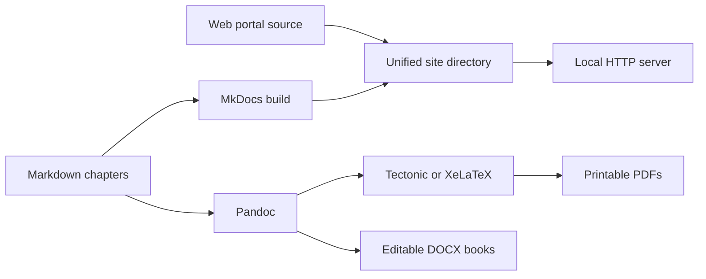

# Local development

This repository supports three outputs from one source tree:

- The web portal at `/`
- The searchable MkDocs handbook at `/docs/`
- Printable PDF and editable DOCX books under `output/`

## One-command macOS setup

```bash
make bootstrap
```

The bootstrap checks Homebrew and Apple command-line tools, installs any missing
Python, Java 21, Node.js, GitHub CLI, Pandoc, and Tectonic commands, creates `.venv`,
and installs the pinned Python requirements. It is safe to run again.

Inspect the environment without changing it:

```bash
make doctor
```

## Validate and build everything

```bash
make validate
make build-all
```

`make validate` checks repository layout, Markdown structure and links, all Java
examples, and portal metadata. `make build-all` creates the portal, documentation
site, individual and combined PDFs, and individual and combined DOCX files.

PDF generation automatically prefers `xelatex` when installed and otherwise uses
the lightweight `tectonic` engine. To select an installed engine explicitly:

```bash
PDF_ENGINE=tectonic make build-pdf
```

## Open the complete local web experience

```bash
make serve-web
```

Open these addresses after the server starts:

- Portal: <http://127.0.0.1:8000/>
- Searchable docs: <http://127.0.0.1:8000/docs/>
- Backend SDE-2 track: <http://127.0.0.1:8000/docs/backend-interview/>
- Downloads: <http://127.0.0.1:8000/downloads/>

Stop the server with `Ctrl+C`.

## Output flow



## GitHub Actions status

Remote builds are intentionally disabled until local output is approved. Workflow
definitions are retained under `.github/workflows-disabled/`; GitHub does not run
files from that directory. Move them back to `.github/workflows/` only when remote
automation is explicitly approved.
