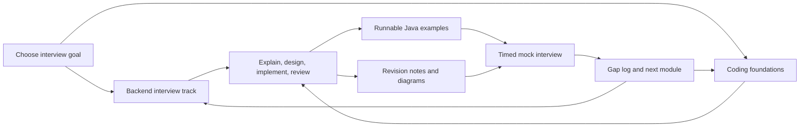

# SDE-2 Interview Handbook

[](LICENSE)
[](LICENSE-CONTENT.md)
[](examples/java/README.md)

A local-first, open-source preparation system for SDE-2 backend interviews. It combines a structured backend interview track, 19 coding-foundation modules, runnable Java examples, searchable MkDocs documentation, a responsive learning portal, and printable PDF/DOCX builds.

> **Current delivery status:** local builds are the source of truth. GitHub Actions and public Pages deployment are intentionally disabled until the local product is approved. A version-controlled Vercel static-build contract is ready for preview deployment, but this repository does not claim that a production URL is live.

## Choose Your Path

| Goal | Start here | Outcome |
|---|---|---|
| Prepare end-to-end for an SDE-2 backend loop | [Backend interview track](docs/backend-interview/index.md) | Programming, LLD, HLD, databases, distributed systems, reliability, cloud, security, and leadership |
| Rebuild algorithm and Java fundamentals | [Coding foundations](docs/coding-foundations/index.md) | A repeatable 19-module sequence with theory, diagrams, drills, and runnable examples |
| Run and extend the code | [Java examples](examples/README.md) | Independently compilable examples organized by interview topic |
| Understand the repository before contributing | [Repository structure](docs/community/repository-structure.md) | Clear source ownership and naming rules |
| Pick a useful contribution | [Project roadmap](ROADMAP.md) | Prioritized work without duplicating completed modules |
| Create a hosted preview | [Vercel deployment guide](DEPLOYMENT.md) | Reproducible static build without GitHub Actions |

## Learning Architecture



The curriculum uses progressive disclosure: overview first, detailed theory second, code and diagrams next, then interview prompts, trade-offs, and a revision loop.

## Run Locally

### macOS one-command setup

```bash
make bootstrap
make doctor
make validate
make serve-web
```

Open [http://127.0.0.1:8000/](http://127.0.0.1:8000/) after the server starts.

### Manual setup

```bash
python3 -m venv .venv
make install
make doctor
make validate
make serve-web
```

Use `make serve` when you only need the MkDocs handbook. Use `make serve-web` for the complete portal with the handbook mounted under `/docs/`. See [LOCAL_DEVELOPMENT.md](LOCAL_DEVELOPMENT.md) for prerequisites, output paths, and troubleshooting.

## Repository Map

```text
.
|-- .github/                    GitHub ownership, issue forms, Dependabot, disabled workflows
|-- docs/
|   |-- backend-interview/      Primary SDE-2 backend preparation track
|   |-- coding-foundations/     Ordered Java, DSA, and problem-solving modules
|   |-- community/              Architecture and contribution documentation
|   |-- examples/               Documentation-side code index
|   +-- assets/                 Diagrams and documentation assets
|-- examples/                   Runnable source code, separated from prose
|   +-- java/
|-- overrides/                  MkDocs Material theme customizations
|-- scripts/                    Build and validation entry points
|-- templates/                  PDF and DOCX rendering inputs
|-- web/                        Standalone learning-portal shell and metadata
|-- vercel.json                 Hosted static-build contract
|-- requirements-web.txt       Minimal website-only Python dependencies
|-- mkdocs.yml                  Documentation navigation and rendering configuration
|-- Makefile                    Stable local commands
+-- requirements.txt            Pinned Python documentation toolchain
```

The root-level license, governance, security, support, citation, contribution, and build-entry files are intentionally kept at the root so GitHub and new contributors can discover them without custom tooling.

## Quality Gate

```bash
make validate
make build-site
```

The validation suite checks repository layout, MkDocs navigation, internal links, Java compilation and smoke execution, portal metadata, local assets, and JavaScript syntax. Printable outputs are available through `make build-pdf`, `make build-docx`, or `make build-all`.

`make validate-deployment` checks the committed Vercel contract. See [DEPLOYMENT.md](DEPLOYMENT.md) before importing the repository into Vercel.

Generated files belong in ignored `site/` and `output/` directories. Do not commit generated books, compiled classes, virtual environments, or caches.

## Contributing

Start with [CONTRIBUTING.md](CONTRIBUTING.md), then use the issue form that matches the change. Keep prose and runnable code synchronized when a concept includes an implementation. Small, focused contributions are easier to review than mixed content, design, and tooling changes.

Project conduct and stewardship are documented in [CODE_OF_CONDUCT.md](CODE_OF_CONDUCT.md), [GOVERNANCE.md](GOVERNANCE.md), [SECURITY.md](SECURITY.md), and [SUPPORT.md](SUPPORT.md).

## Licensing

Source code is available under the [MIT License](LICENSE). Handbook prose, diagrams, and other educational content are available under [CC BY 4.0](LICENSE-CONTENT.md). Contributions are accepted under the applicable license for the files changed.
