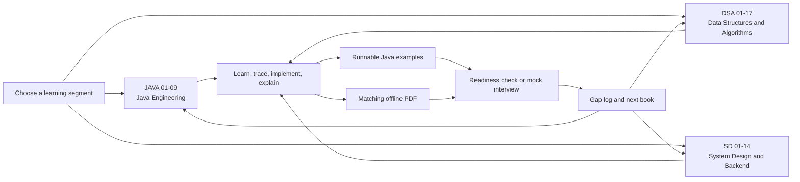

# SDE-2 Interview Handbook

[](LICENSE)
[](LICENSE-CONTENT.md)
[](examples/java/README.md)
[](https://github.com/vinayreddykalluri/SDE2-Interview-Handbook/releases/latest)

A local-first, open-source preparation system for Java SDE-2 interviews. Its 40-book learning library is divided into Java Engineering, Data Structures and Algorithms, and System Design and Backend. The same canonical sources power 173 web documents and 42 downloadable PDFs, alongside runnable Java examples and searchable reference material.

> **Canonical source:** the public `master` branch owns the book sources, web catalog, validation tooling, and reviewed PDFs. The web library and downloadable editions are generated from the same publishing manifest so their titles, status, counts, and ordering remain synchronized.

[Open the learning library](https://vinayreddykalluri.github.io/SDE2-Interview-Handbook/) · [Browse all web books](https://vinayreddykalluri.github.io/SDE2-Interview-Handbook/books/) · [Open the PDF index](books/java-sde2-interview-preparation-series/dist/Java-SDE2-Interview-Preparation-Series-Index.pdf) · [Contribute](.github/CONTRIBUTING.md)

## Choose Your Learning Segment

| Goal | Start here | Outcome |
|---|---|---|
| Learn or rebuild Java | [JAVA 01 - Java Foundations](https://vinayreddykalluri.github.io/SDE2-Interview-Handbook/books/01-java-foundations-for-problem-solving/) | Language basics, Git, Maven/Gradle, core libraries, JVM, concurrency, performance, and revision |
| Prepare for coding rounds | [DSA 01 - Time and Space Complexity](https://vinayreddykalluri.github.io/SDE2-Interview-Handbook/books/02-time-and-space-complexity/) | Complexity, math, implementation patterns, data structures, algorithms, and problem solving |
| Prepare for backend and architecture rounds | [SD 01 - Backend and Design Foundations](https://vinayreddykalluri.github.io/SDE2-Interview-Handbook/books/18f-design-backend-testing-and-security/) | Databases, Hibernate, Spring, Kafka, Redis, distributed systems, and system design |
| Browse every book and PDF | [Published Java SDE-2 book library](docs/books.md) | The complete segmented catalog, roadmap editions, code indexes, and individual PDFs |
| Run and extend the code | [Java examples](examples/README.md) | Independently compilable examples organized by interview topic |
| Understand the repository before contributing | [Repository structure](docs/community/repository-structure.md) | Clear source ownership and naming rules |
| Review the latest organization audit | [July 2026 repository audit](docs/community/repository-audit-2026-07.md) | Migration map, synchronization contracts, and open book backlog |
| Pick a useful contribution | [Project roadmap](docs/project/roadmap.md) | Prioritized work without duplicating completed modules |
| Expand a focused DSA book | [Book contribution backlog](docs/community/book-contribution-backlog.md) | Claim a chapter, diagram, Java example, exercise set, or complete module |
| Create a hosted preview | [Vercel deployment guide](docs/project/deployment.md) | Reproducible static build without GitHub Actions |

## Learning Architecture


```mermaid
flowchart LR
    Start["Choose a learning segment"] --> Java["JAVA 01-09<br/>Java Engineering"]
    Start --> DSA["DSA 01-17<br/>Data Structures and Algorithms"]
    Start --> Design["SD 01-14<br/>System Design and Backend"]
    Java --> Practice["Learn, trace, implement, explain"]
    DSA --> Practice
    Design --> Practice
    Practice --> Code["Runnable Java examples"]
    Practice --> PDF["Matching offline PDF"]
    Code --> Mock["Readiness check or mock interview"]
    PDF --> Mock
    Mock --> Review["Gap log and next book"]
    Review --> Java
    Review --> DSA
    Review --> Design
```

Choose only one segment initially. Inside it, use the book numbers as the prerequisite order. The curriculum uses progressive disclosure: beginner intuition first, Java mechanics and examples next, then practice, trade-offs, and readiness checks.

## Published Java SDE-2 Book Series

[](books/java-sde2-interview-preparation-series/dist/Java-SDE2-Interview-Preparation-Series-Index.pdf)

The consolidated repository includes 40 focused books, a 17-page series index, and a 616-page master book. The focused books contain 2,269 pages; the complete 42-PDF library contains 2,902 pages.

| Publication status | Books | Meaning |
|---|---:|---|
| Full edition | 28 | Developed instructional content with examples, practice, navigation, and technical validation |
| Roadmap edition | 12 | Published scope, prerequisites, chapter plan, interview outcomes, and completion gate; expanded one book at a time |

Roadmap editions are intentionally labeled on the website, PDF cover, reader index, and catalog. They are not presented as finished publication-depth instruction.

[Browse all web books and roadmaps](https://vinayreddykalluri.github.io/SDE2-Interview-Handbook/books/), [download the latest tagged release](https://github.com/vinayreddykalluri/SDE2-Interview-Handbook/releases/latest), or [open the individual-PDF reading order](books/java-sde2-interview-preparation-series/dist/00-START-HERE.md).

### Java Engineering — JAVA 01 to JAVA 09

Start with [JAVA 01: Java Foundations](books/java-sde2-interview-preparation-series/dist/Java-SDE2-DSA-03-Java-Foundations-for-Problem-Solving.pdf), then continue through:

`Git and GitHub → Maven and Gradle → Language/OOP/Modern Java → Collections/Streams/I/O → JVM → Concurrency → Performance → Interview Revision`

New roadmap PDFs: [Git and GitHub](books/java-sde2-interview-preparation-series/dist/Java-SDE2-JAVA-02-Git-and-GitHub.pdf) · [Maven and Gradle](books/java-sde2-interview-preparation-series/dist/Java-SDE2-JAVA-03-Maven-and-Gradle.pdf)

### Data Structures and Algorithms — DSA 01 to DSA 17

Start with [DSA 01: Time and Space Complexity](books/java-sde2-interview-preparation-series/dist/Java-SDE2-DSA-02-Time-and-Space-Complexity.pdf), then continue through:

`Number Systems → Interview Workbook → Bit Manipulation → Loops → Arrays → Strings → Hashing → Recursion → Linked Lists → Stacks/Queues → Binary Search → Trees → Heaps → Graphs → Greedy → Dynamic Programming`

### System Design and Backend — SD 01 to SD 14

Start with [SD 01: Backend and Design Foundations](books/java-sde2-interview-preparation-series/dist/Java-SDE2-ADV-18F-Design-Backend-Testing-and-Security.pdf), then continue through databases, persistence, Spring, messaging, caching, and distributed-system design.

New roadmap PDFs: [MySQL](books/java-sde2-interview-preparation-series/dist/Java-SDE2-SD-02-MySQL.pdf) · [Hibernate and JPA](books/java-sde2-interview-preparation-series/dist/Java-SDE2-SD-03-Hibernate-and-JPA.pdf) · [Spring Framework](books/java-sde2-interview-preparation-series/dist/Java-SDE2-SD-04-Spring-Framework.pdf) · [Spring Boot](books/java-sde2-interview-preparation-series/dist/Java-SDE2-SD-05-Spring-Boot.pdf) · [Spring Data](books/java-sde2-interview-preparation-series/dist/Java-SDE2-SD-06-Spring-Data.pdf) · [MongoDB](books/java-sde2-interview-preparation-series/dist/Java-SDE2-SD-07-MongoDB.pdf) · [Redis](books/java-sde2-interview-preparation-series/dist/Java-SDE2-SD-08-Redis.pdf) · [Apache Kafka and Spring Kafka](books/java-sde2-interview-preparation-series/dist/Java-SDE2-SD-09-Apache-Kafka-and-Spring-Kafka.pdf) · [Spring Ecosystem Extensions](books/java-sde2-interview-preparation-series/dist/Java-SDE2-SD-10-Spring-Ecosystem-Extensions.pdf) · [Spring AI](books/java-sde2-interview-preparation-series/dist/Java-SDE2-SD-11-Spring-AI.pdf)

Stable legacy identifiers remain in existing filenames and URLs. Reader-facing segment codes appear on the website, covers, index, and generated folders.

## Run Locally

### macOS one-command setup

```bash
make bootstrap
make doctor
make validate
make serve-web
```

Open [http://127.0.0.1:8000/](http://127.0.0.1:8000/) after the server starts.

### Manual setup

```bash
python3 -m venv .venv
make install
make doctor
make validate
make serve-web
```

Use `make serve` when you only need the MkDocs handbook. Use `make serve-web` for the complete portal with the handbook mounted under `/docs/`. See the [local-development guide](docs/project/local-development.md) for prerequisites, output paths, and troubleshooting.

## Repository Map

```text
.
|-- .github/                    Community policies, ownership, issue forms, and CI
|-- apps/
|   +-- portal/                Standalone learning portal and synchronized book catalog
|-- books/                     Canonical sources and versioned PDFs for published books
|-- docs/
|   |-- backend-interview/      Primary SDE-2 backend preparation track
|   |-- coding-foundations/     Ordered Java, DSA, and problem-solving modules
|   |-- community/              Architecture, authorship, and governance
|   |-- project/                Roadmap, deployment, and local-development guides
|   |-- examples/               Documentation-side code index
|   +-- assets/                 Diagrams and documentation assets
|-- examples/                   Runnable source code, separated from prose
|   +-- java/
|-- tooling/
|   |-- automation/             Repository-wide build and validation entry points
|   |-- mkdocs-overrides/       MkDocs Material presentation overrides
|   |-- publishing-templates/   Root PDF and DOCX rendering inputs
|   +-- requirements/           Authoring and portal dependency manifests
|-- vercel.json                 Hosted static-build contract
|-- mkdocs.yml                  Documentation navigation and rendering configuration
|-- Makefile                    Stable contributor commands
+-- README.md                   Repository entry point
```

Only universal entry points and tool-required configuration remain at the root. GitHub community-health files live in `.github/`; human-facing project guides and stewardship records live in `docs/`; implementation and build concerns are grouped by purpose.

## Quality Gate

```bash
make validate
make build-site
```

The validation suite checks repository layout, MkDocs navigation, internal links, Java compilation and smoke execution, portal metadata, local assets, and JavaScript syntax. Printable outputs are available through `make build-pdf`, `make build-docx`, or `make build-all`.

Published-book changes also run:

```bash
cd books/java-sde2-interview-preparation-series
python3 scripts/validate_book.py --source-only
python3 scripts/validate_series.py --source-only
```

`make validate-deployment` checks the committed Vercel contract. See the [deployment guide](docs/project/deployment.md) before importing the repository into Vercel.

Generated files belong in ignored `site/` and root `output/` directories. Do not commit compiled classes, virtual environments, caches, or temporary render workspaces. The reviewed PDFs under `books/java-sde2-interview-preparation-series/dist/` and the master book PDF are intentional versioned release artifacts.

## Contributing

Start with the [contribution guide](.github/CONTRIBUTING.md), then use the issue form that matches the change. Keep prose and runnable code synchronized when a concept includes an implementation. Small, focused contributions are easier to review than mixed content, design, and tooling changes.

High-value book contributions include accuracy corrections, clearer beginner explanations, compiling edge-case examples, diagrams, exercises, solution improvements, accessibility fixes, and PDF layout reports. Accepted original work is credited to the individual contributor in the [authorship record](docs/community/authors.md), Git history, and pull requests.

The current public book backlog is coordinated in [issue #27](https://github.com/vinayreddykalluri/SDE2-Interview-Handbook/issues/27). Contributors can improve existing full editions or help turn one roadmap edition into a complete, validated learning volume. Large expansions should begin with an issue so prerequisites, examples, exercises, diagrams, and acceptance criteria remain coherent.

Project conduct and stewardship are documented in the [Code of Conduct](.github/CODE_OF_CONDUCT.md), [governance model](docs/community/governance.md), [security policy](.github/SECURITY.md), and [support guide](.github/SUPPORT.md).

## Editorial Leadership and Authorship

**Vinay Reddy Kalluri** is the project creator, founding author, **Editor-in-Chief**, and **Chief Auditor**. The Editor-in-Chief owns curriculum sequence, scope, voice, and publication decisions. The Chief Auditor owns Java accuracy, evidence, validation, PDF quality, attribution, and release readiness.

Individual contributors retain credit for their accepted original work. See the [authorship record](docs/community/authors.md) and [governance model](docs/community/governance.md) for the complete model.

## Licensing

Source code is available under the [MIT License](LICENSE). Handbook prose, diagrams, and other educational content are available under [CC BY 4.0](LICENSE-CONTENT.md). Contributions are accepted under the applicable license for the files changed.
