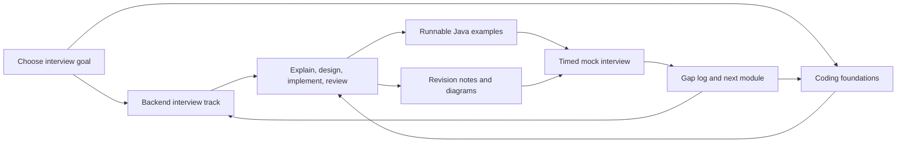

# SDE-2 Interview Handbook

[](LICENSE)
[](LICENSE-CONTENT.md)
[](examples/java/README.md)
[](https://github.com/vinayreddykalluri/SDE2-Interview-Handbook/releases/latest)

A local-first, open-source preparation system for SDE-2 backend interviews. It combines a structured backend interview track, 19 coding-foundation modules, runnable Java examples, searchable MkDocs documentation, a responsive learning portal, printable PDF/DOCX builds, and a publication-ready Java and DSA book series.

> **Current delivery status:** the public `master` branch is the consolidated source of truth. Dedicated book validation runs in GitHub Actions. Website deployment and the legacy root book workflow remain disabled pending their own approval; the Vercel static-build contract remains available for preview deployments.

## Choose Your Path

| Goal | Start here | Outcome |
|---|---|---|
| Prepare end-to-end for an SDE-2 backend loop | [Backend interview track](docs/backend-interview/index.md) | Programming, LLD, HLD, databases, distributed systems, reliability, cloud, security, and leadership |
| Rebuild algorithm and Java fundamentals | [Coding foundations](docs/coding-foundations/index.md) | A repeatable 19-module sequence with theory, diagrams, drills, and runnable examples |
| Read or download the publication-ready books | [Published Java SDE-2 book series](docs/books.md) | Individual PDFs from Java basics through DSA and advanced backend engineering |
| Run and extend the code | [Java examples](examples/README.md) | Independently compilable examples organized by interview topic |
| Understand the repository before contributing | [Repository structure](docs/community/repository-structure.md) | Clear source ownership and naming rules |
| Review the latest organization audit | [July 2026 repository audit](docs/community/repository-audit-2026-07.md) | Migration map, synchronization contracts, and open book backlog |
| Pick a useful contribution | [Project roadmap](ROADMAP.md) | Prioritized work without duplicating completed modules |
| Create a hosted preview | [Vercel deployment guide](DEPLOYMENT.md) | Reproducible static build without GitHub Actions |

## Learning Architecture


```mermaid
flowchart LR
    Start["Choose interview goal"] --> Backend["Backend interview track"]
    Start --> Foundations["Coding foundations"]
    Backend --> Practice["Explain, design, implement, review"]
    Foundations --> Practice
    Practice --> Code["Runnable Java examples"]
    Practice --> Notes["Revision notes and diagrams"]
    Code --> Mock["Timed mock interview"]
    Notes --> Mock
    Mock --> Review["Gap log and next module"]
    Review --> Backend
    Review --> Foundations
```

The curriculum uses progressive disclosure: overview first, detailed theory second, code and diagrams next, then interview prompts, trade-offs, and a revision loop.

## Published Java SDE-2 Book Series

[](books/java-sde2-interview-preparation-series/dist/Java-SDE2-Interview-Preparation-Series-Index.pdf)

The consolidated repository includes 28 focused topic books, a 13-page series index, and a 616-page master book. The focused release contains 1,836 pages and preserves every module as an individually navigable PDF.

[Download the latest release](https://github.com/vinayreddykalluri/SDE2-Interview-Handbook/releases/latest) or start directly:

- [Java Foundations for Problem Solving](books/java-sde2-interview-preparation-series/dist/Java-SDE2-DSA-03-Java-Foundations-for-Problem-Solving.pdf)
- [Time and Space Complexity for Java Interviews](books/java-sde2-interview-preparation-series/dist/Java-SDE2-DSA-02-Time-and-Space-Complexity.pdf)
- [Number Systems and Math Foundations](books/java-sde2-interview-preparation-series/dist/Java-SDE2-DSA-01-Number-Systems-and-Math-Foundations.pdf)
- [Number Systems Interview Workbook](books/java-sde2-interview-preparation-series/dist/Java-SDE2-DSA-01B-Number-Systems-Interview-Workbook.pdf)
- [Bit Manipulation in Java](books/java-sde2-interview-preparation-series/dist/Java-SDE2-DSA-04-Bit-Manipulation-in-Java.pdf)
- [Loop Mastery, Patterns, and Index Calculations](books/java-sde2-interview-preparation-series/dist/Java-SDE2-DSA-05-Loop-Mastery-and-Index-Calculations.pdf)
- [Complete 616-page master book](books/java-sde2-interview-preparation-series/dist/java-sde2-interview-book.pdf)

The recommended route is Java Foundations → Time and Space Complexity → Number Systems → Bit Manipulation → Loop Mastery → remaining DSA modules → Advanced Java. Stable PDF numbers are retained for filenames; learning-step labels inside the books show the intended order.

## Run Locally

### macOS one-command setup

```bash
make bootstrap
make doctor
make validate
make serve-web
```

Open [http://127.0.0.1:8000/](http://127.0.0.1:8000/) after the server starts.

### Manual setup

```bash
python3 -m venv .venv
make install
make doctor
make validate
make serve-web
```

Use `make serve` when you only need the MkDocs handbook. Use `make serve-web` for the complete portal with the handbook mounted under `/docs/`. See [LOCAL_DEVELOPMENT.md](LOCAL_DEVELOPMENT.md) for prerequisites, output paths, and troubleshooting.

## Repository Map

```text
.
|-- .github/                    Ownership, issue forms, book CI, and disabled deployment workflows
|-- docs/
|   |-- backend-interview/      Primary SDE-2 backend preparation track
|   |-- coding-foundations/     Ordered Java, DSA, and problem-solving modules
|   |-- community/              Architecture and contribution documentation
|   |-- examples/               Documentation-side code index
|   +-- assets/                 Diagrams and documentation assets
|-- examples/                   Runnable source code, separated from prose
|   +-- java/
|-- books/                      Canonical sources and versioned PDFs for published books
|-- overrides/                  MkDocs Material theme customizations
|-- scripts/                    Build and validation entry points
|-- templates/                  PDF and DOCX rendering inputs
|-- web/                        Standalone learning-portal shell and metadata
|-- vercel.json                 Hosted static-build contract
|-- requirements-web.txt       Minimal website-only Python dependencies
|-- mkdocs.yml                  Documentation navigation and rendering configuration
|-- Makefile                    Stable local commands
+-- requirements.txt            Pinned Python documentation toolchain
```

The root-level license, governance, security, support, citation, contribution, and build-entry files are intentionally kept at the root so GitHub and new contributors can discover them without custom tooling.

## Quality Gate

```bash
make validate
make build-site
```

The validation suite checks repository layout, MkDocs navigation, internal links, Java compilation and smoke execution, portal metadata, local assets, and JavaScript syntax. Printable outputs are available through `make build-pdf`, `make build-docx`, or `make build-all`.

Published-book changes also run:

```bash
cd books/java-sde2-interview-preparation-series
python3 scripts/validate_book.py --source-only
python3 scripts/validate_series.py --source-only
```

`make validate-deployment` checks the committed Vercel contract. See [DEPLOYMENT.md](DEPLOYMENT.md) before importing the repository into Vercel.

Generated files belong in ignored `site/` and root `output/` directories. Do not commit compiled classes, virtual environments, caches, or temporary render workspaces. The reviewed PDFs under `books/java-sde2-interview-preparation-series/dist/` and the master book PDF are intentional versioned release artifacts.

## Contributing

Start with [CONTRIBUTING.md](CONTRIBUTING.md), then use the issue form that matches the change. Keep prose and runnable code synchronized when a concept includes an implementation. Small, focused contributions are easier to review than mixed content, design, and tooling changes.

High-value book contributions include accuracy corrections, clearer beginner explanations, compiling edge-case examples, diagrams, exercises, solution improvements, accessibility fixes, and PDF layout reports. Accepted original work is credited to the individual contributor in [AUTHORS.md](AUTHORS.md), Git history, and pull requests.

Project conduct and stewardship are documented in [CODE_OF_CONDUCT.md](CODE_OF_CONDUCT.md), [GOVERNANCE.md](GOVERNANCE.md), [SECURITY.md](SECURITY.md), and [SUPPORT.md](SUPPORT.md).

## Editorial Leadership and Authorship

**Vinay Reddy Kalluri** is the project creator, founding author, **Editor-in-Chief**, and **Chief Auditor**. The Editor-in-Chief owns curriculum sequence, scope, voice, and publication decisions. The Chief Auditor owns Java accuracy, evidence, validation, PDF quality, attribution, and release readiness.

Individual contributors retain credit for their accepted original work. See [AUTHORS.md](AUTHORS.md) and [GOVERNANCE.md](GOVERNANCE.md) for the complete model.

## Licensing

Source code is available under the [MIT License](LICENSE). Handbook prose, diagrams, and other educational content are available under [CC BY 4.0](LICENSE-CONTENT.md). Contributions are accepted under the applicable license for the files changed.
