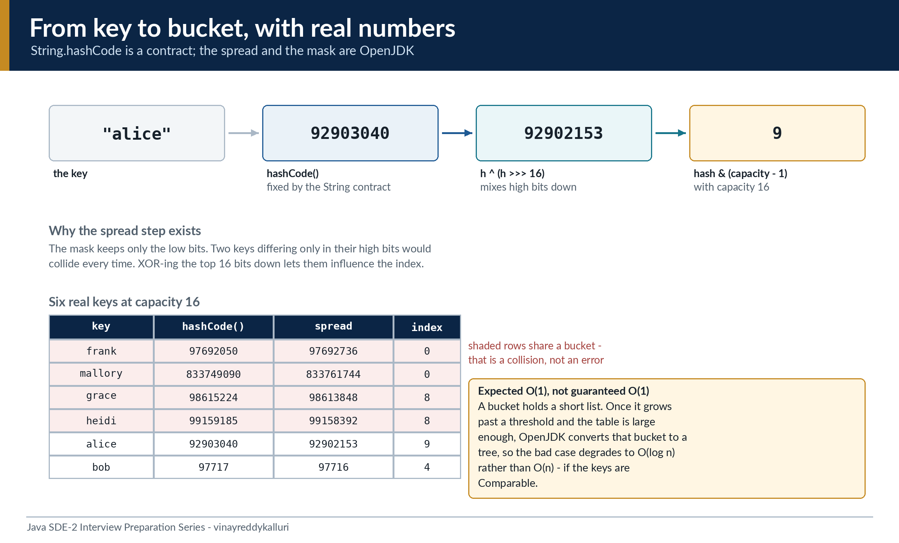
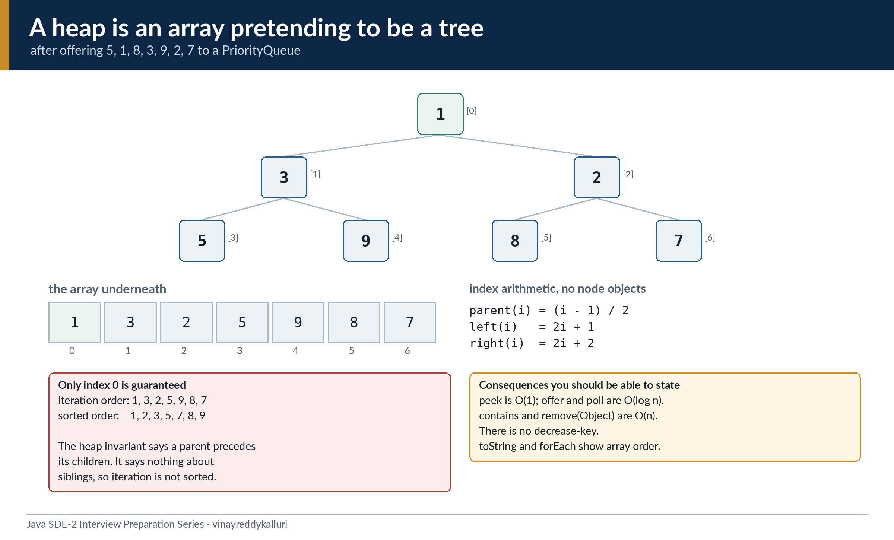
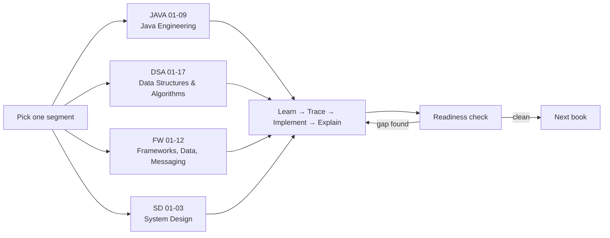

<div align="center">

# SDE-2 Interview Handbook

**41 books. 4,254 pages. Free, open source, no signup.**

[**→ Start reading**](https://sde-2-interview-handbook.vercel.app) &nbsp;·&nbsp;
[Browse all books](https://sde-2-interview-handbook.vercel.app/books/) &nbsp;·&nbsp;
[Download the PDFs](https://github.com/vinayreddykalluri/SDE2-Interview-Handbook/releases/latest) &nbsp;·&nbsp;
[Contribute](.github/CONTRIBUTING.md)

[](LICENSE)
[](LICENSE-CONTENT.md)
[](examples/java/README.md)
[](https://github.com/vinayreddykalluri/SDE2-Interview-Handbook/releases/latest)

</div>

---

## Here is what's inside. Judge it in thirty seconds.

Sort a three-element list. Get the same list back, in the wrong order:

```java
Comparator<Integer> fuzzy = (a, b) ->
        Math.abs(a - b) <= 10 ? 0 : Integer.compare(a, b);   // "within 10 is a tie"

List<Integer> scores = new ArrayList<>(List.of(15, 5, 0));
scores.sort(fuzzy);
System.out.println(scores);      // [15, 5, 0]  - nothing moved
```

Most Java material tells you a comparator must be transitive. This one shows you the
sort that quietly lies, measures how often it happens — **10,454 of 20,000 random
lists came out misordered** — and then admits something uncomfortable:

> When I first checked this, I compared *adjacent* pairs of the output, found zero
> violations, and would have cleared the comparator. The defect only shows across
> non-adjacent pairs. That mistake is in the chapter, because it is the mistake you
> would make too.

That is the standard the whole library is written to. Every number is computed before
it is printed. Where I got something wrong in a draft, the correction is in the text
rather than quietly deleted.

---

## It explains with pictures, not just paragraphs

Most books say "the hash is spread and masked to find a bucket." This one gives you
the arithmetic for real keys, so you can do it by hand in an interview:



And when a chapter claims iteration order is not priority order, it shows you the
actual array a real `PriorityQueue` holds:



Those figures are generated by a script that reimplements `String.hashCode`,
OpenJDK's spreading function, and `PriorityQueue.siftUp` — so a diagram physically
cannot drift away from the arithmetic the chapter states.

---

## Pick one route. Ignore the rest.

The fastest way to waste a month is to read everything at once. Choose the round
you are actually preparing for:

| If you are… | Start here | You'll come out able to |
|---|---|---|
| Rebuilding Java from the ground up | [**JAVA 01** — Java Foundations](https://sde-2-interview-handbook.vercel.app/books/java-01-java-foundations-for-problem-solving/) | Explain source-to-CPU execution, the memory model, collections, and concurrency without hand-waving |
| Facing coding rounds | [**DSA 01** — Time and Space Complexity](https://sde-2-interview-handbook.vercel.app/books/dsa-01-time-and-space-complexity/) | State an invariant before you code, and defend the complexity after |
| Interviewing for Java backend | [**FW 01** — MySQL](https://sde-2-interview-handbook.vercel.app/books/fw-01-mysql/) | Defend a Spring service, a persistence strategy, and a distributed workflow |
| Facing an architecture round | [**SD 01** — Design, Backend, Testing, Security](https://sde-2-interview-handbook.vercel.app/books/sd-01-design-backend-testing-and-security/) | Draw boundaries, name failure modes, and survive the follow-ups |
| Facing an **AI / LLM design round** | [**SD 03** — Generative AI System Design](https://sde-2-interview-handbook.vercel.app/books/sd-03-generative-ai-system-design/) | Budget tokens and latency, bound an agent, and say where authorization sits in a RAG query |

Inside a segment, the book numbers *are* the prerequisite order.


```mermaid
flowchart LR
    Start["Pick one segment"] --> Java["JAVA 01-09<br/>Java Engineering"]
    Start --> DSA["DSA 01-17<br/>Data Structures & Algorithms"]
    Start --> FW["FW 01-12<br/>Frameworks, Data, Messaging"]
    Start --> SD["SD 01-03<br/>System Design"]
    Java --> Loop["Learn → Trace → Implement → Explain"]
    DSA --> Loop
    FW --> Loop
    SD --> Loop
    Loop --> Gate["Readiness check"]
    Gate -->|gap found| Loop
    Gate -->|clean| Next["Next book"]
```

---

## Why this exists

I have sat on both sides of the SDE-2 loop, and the same thing happens every time.
A candidate can use `HashMap` daily for four years and still not be able to say what
happens when a key mutates after insertion. Not because they are careless — because
almost everything written about collections is a restatement of the Javadoc.

So the rule here is: **if a chapter makes a claim, it has to show it.** A `HashMap`
entry that is present in `size()` and in iteration but unreachable by key. Two
`BigDecimal`s into a `TreeSet` and one comes out. A loop that is linear over
`ArrayList` and quadratic over `LinkedList` — 24,995,000 link hops against 10,000.

And the discipline that took the longest to get right: separating what the
**specification guarantees** from what **OpenJDK happens to do**. Confidently
over-specific answers are the classic senior-level failure, and every chapter labels
the difference explicitly.

---

## What you get

<table>
<tr><td><b>41 focused books</b></td><td>3,579 pages, each independently readable and printable</td></tr>
<tr><td><b>1 master reference</b></td><td>658 pages, 58 chapters, 7 appendices</td></tr>
<tr><td><b>43 PDFs</b></td><td>4,254 pages total, page counts and SHA-256 verified at build time</td></tr>
<tr><td><b>176 Java files</b></td><td>compiled and smoke-tested in CI, not just pasted into prose</td></tr>
<tr><td><b>28 diagrams</b></td><td>generated from the same arithmetic the chapters use</td></tr>
<tr><td><b>Zero signup</b></td><td>no account, no email, no paywall, no tracking beyond page views</td></tr>
</table>

Every count above is generated rather than hand-maintained: `dist/manifest.json`
records the page count, byte size, and SHA-256 of each PDF at build time, and
`scripts/validate_pdfs.py` fails the build if a file on disk no longer matches.

**Segments:** Java Engineering (9) · Data Structures and Algorithms (17) ·
Frameworks, Data, and Messaging (12) · System Design (3)

Canonical PDFs live under `00-start-here`, `01-java`, `02-dsa`, `03-frameworks`, and
`04-system-design`. Filenames, covers, web routes, and segment positions all use the
same `JAVA` / `DSA` / `FW` / `SD` codes.

---

## Run it locally

```bash
make bootstrap     # macOS only; sets up the toolchain
make install       # venv + authoring dependencies
make doctor        # environment preflight
make serve-web     # the full portal with the handbook mounted at /docs/
```

Then open <http://127.0.0.1:8000/>. Use `make serve` if you only want the MkDocs
handbook. Everything routes through `make` — see the
[local-development guide](docs/project/local-development.md) for prerequisites and
troubleshooting.

**Markdown is the single source of truth.** The website, the 43 PDFs, and the DOCX
are all generated from it. Never hand-edit anything under `dist/` or `site/`.

---

## Quality gate

```bash
make validate      # layout, navigation, links, Java, portal metadata, assets
make validate-all  # the strict path CI uses, including PDF integrity
make build-site
```

The suite checks repository layout, MkDocs navigation, internal links, Java
compilation and smoke execution, portal metadata, local assets, JavaScript syntax,
and — unusually — the PDFs themselves: page counts against declared bands, manifest
agreement, blank pages, and pages with no extractable text. Every validator here has
been fault-injected to prove it actually fails on bad input.

Published-book changes also run:

```bash
cd books/java-sde2-interview-preparation-series
python3 scripts/validate_book.py --source-only
python3 scripts/validate_series.py --source-only
```

---

## Repository map

```text
.
|-- .github/                    Community policies, ownership, issue forms, and CI
|-- apps/portal/                Standalone learning portal and synchronized catalog
|-- books/                      Canonical book sources and versioned PDFs
|-- docs/
|   |-- backend-interview/      Primary SDE-2 backend preparation track
|   |-- coding-foundations/     Ordered Java, DSA, and problem-solving modules
|   |-- community/              Architecture, authorship, and governance
|   +-- project/                Roadmap, deployment, and local-development guides
|-- examples/java/              Runnable source, separated from prose
|-- tooling/
|   |-- automation/             Repository-wide build and validation entry points
|   |-- mkdocs-overrides/       MkDocs Material presentation overrides
|   +-- requirements/           Authoring and portal dependency manifests
|-- vercel.json                 Hosted static-build contract
|-- mkdocs.yml                  Documentation navigation and rendering
+-- Makefile                    Stable contributor commands
```

Only universal entry points and tool-required configuration sit at the root.

---

## Contributing

The most valuable contribution is not a new chapter — it is **finding a place where
the book is wrong, or where an explanation did not land.** Both are real bugs here.

Good first contributions:

- an accuracy correction, with the reproduction
- a paragraph that confused you, rewritten so it wouldn't have
- a compiling edge-case example that breaks a claim
- a diagram for something currently explained only in prose
- a PDF layout defect, with the page number

Start with the [contribution guide](.github/CONTRIBUTING.md) and use the issue form
that matches the change. Keep prose and runnable code in sync. Accepted original work
is credited to you in the [authorship record](docs/community/authors.md), the Git
history, and the pull request.

The public backlog is coordinated in
[issue #27](https://github.com/vinayreddykalluri/SDE2-Interview-Handbook/issues/27).
All 41 books are publication editions, so contributions now deepen an existing volume
rather than adding a parallel roadmap. Large expansions should start with an issue.

Conduct and stewardship: [Code of Conduct](.github/CODE_OF_CONDUCT.md) ·
[Governance](docs/community/governance.md) · [Security](.github/SECURITY.md) ·
[Support](.github/SUPPORT.md)

---

## Author

**Vinay Reddy Kalluri** writes and edits the series, sets its learning sequence, and
performs the final technical and publication review. Individual contributors retain
credit for their accepted original work — see the
[authorship record](docs/community/authors.md).

## Licensing

Book prose, exercises, diagrams, and PDFs are **CC BY 4.0**. Source code and
publishing tooling are **MIT**. Use it, teach from it, fork it — attribution is all
that is asked.

<div align="center">

**[Start reading →](https://sde-2-interview-handbook.vercel.app)**

If this helped you land the offer, a ⭐ helps someone else find it.

</div>
