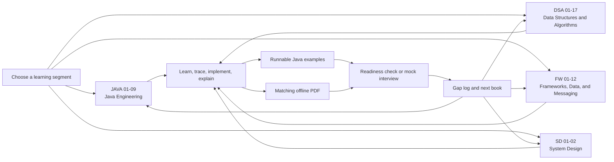

# SDE-2 Interview Handbook

[](LICENSE)
[](LICENSE-CONTENT.md)
[](examples/java/README.md)
[](https://github.com/vinayreddykalluri/SDE2-Interview-Handbook/releases/latest)

A local-first, open-source preparation system for Java SDE-2 interviews. Its 40-book learning library is divided into Java Engineering, Data Structures and Algorithms, Frameworks/Data/Messaging, and System Design. The same canonical sources power the web books and 42 downloadable PDFs, alongside runnable Java examples and searchable reference material.

> **Canonical source:** the public `master` branch owns the book sources, web catalog, validation tooling, and reviewed PDFs. The web library and downloadable editions are generated from the same publishing manifest so their titles, status, counts, and ordering remain synchronized.

[Open the learning library](https://vinayreddykalluri.github.io/SDE2-Interview-Handbook/) · [Browse all web books](https://vinayreddykalluri.github.io/SDE2-Interview-Handbook/books/) · [Open the PDF index](books/java-sde2-interview-preparation-series/dist/00-start-here/Java-SDE2-Interview-Preparation-Series-Index.pdf) · [Contribute](.github/CONTRIBUTING.md)

## Choose Your Learning Segment

| Goal | Start here | Outcome |
|---|---|---|
| Learn or rebuild Java | [JAVA 01 - Java Foundations](https://vinayreddykalluri.github.io/SDE2-Interview-Handbook/books/java-01-java-foundations-for-problem-solving/) | Language basics, Git, Maven/Gradle, core libraries, JVM, concurrency, performance, and revision |
| Prepare for coding rounds | [DSA 01 - Time and Space Complexity](https://vinayreddykalluri.github.io/SDE2-Interview-Handbook/books/dsa-01-time-and-space-complexity/) | Complexity, math, implementation patterns, data structures, algorithms, and problem solving |
| Prepare for Java backend rounds | [FW 01 - MySQL](https://vinayreddykalluri.github.io/SDE2-Interview-Handbook/books/fw-01-mysql/) | SQL, Hibernate/JPA, Spring, data stores, Redis, Kafka, and production framework reasoning |
| Prepare for architecture rounds | [SD 01 - Backend and Design Foundations](https://vinayreddykalluri.github.io/SDE2-Interview-Handbook/books/sd-01-design-backend-testing-and-security/) | Service boundaries, reliability, security, and distributed-system design |
| Browse every book and PDF | [Published Java SDE-2 book library](docs/books.md) | The complete four-segment catalog, source and code indexes, and individual PDFs |
| Run and extend the code | [Java examples](examples/README.md) | Independently compilable examples organized by interview topic |
| Understand the repository before contributing | [Repository structure](docs/community/repository-structure.md) | Clear source ownership and naming rules |
| Review the latest organization audit | [July 2026 repository audit](docs/community/repository-audit-2026-07.md) | Migration map, synchronization contracts, and open book backlog |
| Pick a useful contribution | [Project roadmap](docs/project/roadmap.md) | Prioritized work without duplicating completed modules |
| Improve a focused DSA book | [Book contribution backlog](docs/community/book-contribution-backlog.md) | Claim an accuracy fix, diagram, Java example, adversarial test, exercise set, or accessibility repair |
| Create a hosted preview | [Vercel deployment guide](docs/project/deployment.md) | Reproducible static build without GitHub Actions |

## Learning Architecture


```mermaid
flowchart LR
    Start["Choose a learning segment"] --> Java["JAVA 01-09<br/>Java Engineering"]
    Start --> DSA["DSA 01-17<br/>Data Structures and Algorithms"]
    Start --> Frameworks["FW 01-12<br/>Frameworks, Data, and Messaging"]
    Start --> Design["SD 01-02<br/>System Design"]
    Java --> Practice["Learn, trace, implement, explain"]
    DSA --> Practice
    Frameworks --> Practice
    Design --> Practice
    Practice --> Code["Runnable Java examples"]
    Practice --> PDF["Matching offline PDF"]
    Code --> Mock["Readiness check or mock interview"]
    PDF --> Mock
    Mock --> Review["Gap log and next book"]
    Review --> Java
    Review --> DSA
    Review --> Frameworks
    Review --> Design
```

Choose only one segment initially. Inside it, use the book numbers as the prerequisite order. The curriculum uses progressive disclosure: beginner intuition first, Java mechanics and examples next, then practice, trade-offs, and readiness checks.

## Published Java SDE-2 Book Series

[](books/java-sde2-interview-preparation-series/dist/00-start-here/Java-SDE2-Interview-Preparation-Series-Index.pdf)

The consolidated repository includes 40 published focused books, an 18-page series index, and a 616-page master reference. The focused books contain 3,372 pages; the complete 42-PDF library contains 4,006 pages. The publishing manifest declares 403 source entries that resolve to 396 unique mapped Markdown documents.

| Publication status | Books | Meaning |
|---|---:|---|
| Publication edition | 40 | Prerequisite-aware instruction with examples, practice, answered interview rounds, navigation, and executable validation |

Every focused volume now has publication content. Future contributions improve accuracy, explanations, examples, exercises, tests, accessibility, and visual quality inside the existing books.

[Browse all web books](https://vinayreddykalluri.github.io/SDE2-Interview-Handbook/books/), [download the latest tagged release](https://github.com/vinayreddykalluri/SDE2-Interview-Handbook/releases/latest), or [open the individual-PDF reading order](books/java-sde2-interview-preparation-series/dist/00-start-here/README.md).

### Java Engineering — JAVA 01 to JAVA 09

Start with [JAVA 01: Java Foundations](books/java-sde2-interview-preparation-series/dist/01-java/Java-SDE2-JAVA-01-Java-Foundations-for-Problem-Solving.pdf), then continue through:

`Git and GitHub → Maven and Gradle → Language/OOP/Modern Java → Collections/Streams/I/O → JVM → Concurrency → Performance → Interview Revision`

Publication-depth tooling books: [Git and GitHub](books/java-sde2-interview-preparation-series/dist/01-java/Java-SDE2-JAVA-02-Git-and-GitHub.pdf) · [Maven and Gradle](books/java-sde2-interview-preparation-series/dist/01-java/Java-SDE2-JAVA-03-Maven-and-Gradle.pdf)

### Data Structures and Algorithms — DSA 01 to DSA 17

Start with [DSA 01: Time and Space Complexity](books/java-sde2-interview-preparation-series/dist/02-dsa/Java-SDE2-DSA-01-Time-and-Space-Complexity.pdf), then continue through:

`Number Systems → Interview Workbook → Bit Manipulation → Loops → Arrays → Strings → Hashing → Recursion → Linked Lists → Stacks/Queues → Binary Search → Trees → Heaps → Graphs → Greedy → Dynamic Programming`

### Frameworks, Data, and Messaging — FW 01 to FW 12

Start with [FW 01: MySQL](books/java-sde2-interview-preparation-series/dist/03-frameworks/Java-SDE2-FW-01-MySQL.pdf), then continue through Hibernate/JPA, Spring, MongoDB, Redis, persistence/caching, Kafka, Spring extensions, and Spring AI.

Publication-depth framework books include [Spring Framework](books/java-sde2-interview-preparation-series/dist/03-frameworks/Java-SDE2-FW-03-Spring-Framework.pdf), [Spring Boot](books/java-sde2-interview-preparation-series/dist/03-frameworks/Java-SDE2-FW-04-Spring-Boot.pdf), and [Spring Data](books/java-sde2-interview-preparation-series/dist/03-frameworks/Java-SDE2-FW-06-Spring-Data.pdf), with executable behavior labs and production failure playbooks.

All twelve books are publication editions; see the [Frameworks PDF folder](books/java-sde2-interview-preparation-series/dist/03-frameworks/) for the complete set.

### System Design — SD 01 to SD 02

Start with [SD 01: Backend and Design Foundations](books/java-sde2-interview-preparation-series/dist/04-system-design/Java-SDE2-SD-01-Design-Backend-Testing-and-Security.pdf), then continue to [SD 02: Distributed Systems and System Design](books/java-sde2-interview-preparation-series/dist/04-system-design/Java-SDE2-SD-02-Distributed-Systems-and-System-Design.pdf).

Canonical repository PDFs now live in `00-start-here`, `01-java`, `02-dsa`, `03-frameworks`, and `04-system-design`. Their filenames, covers, website routes, and segment positions use the same `JAVA`, `DSA`, `FW`, and `SD` codes.

## Run Locally

### macOS one-command setup

```bash
make bootstrap
make doctor
make validate
make serve-web
```

Open [http://127.0.0.1:8000/](http://127.0.0.1:8000/) after the server starts.

### Manual setup

```bash
python3 -m venv .venv
make install
make doctor
make validate
make serve-web
```

Use `make serve` when you only need the MkDocs handbook. Use `make serve-web` for the complete portal with the handbook mounted under `/docs/`. See the [local-development guide](docs/project/local-development.md) for prerequisites, output paths, and troubleshooting.

## Repository Map

```text
.
|-- .github/                    Community policies, ownership, issue forms, and CI
|-- apps/
|   +-- portal/                Standalone learning portal and synchronized book catalog
|-- books/                     Canonical sources and versioned PDFs for published books
|-- docs/
|   |-- backend-interview/      Primary SDE-2 backend preparation track
|   |-- coding-foundations/     Ordered Java, DSA, and problem-solving modules
|   |-- community/              Architecture, authorship, and governance
|   |-- project/                Roadmap, deployment, and local-development guides
|   |-- examples/               Documentation-side code index
|   +-- assets/                 Diagrams and documentation assets
|-- examples/                   Runnable source code, separated from prose
|   +-- java/
|-- tooling/
|   |-- automation/             Repository-wide build and validation entry points
|   |-- mkdocs-overrides/       MkDocs Material presentation overrides
|   |-- publishing-templates/   Root PDF and DOCX rendering inputs
|   +-- requirements/           Authoring and portal dependency manifests
|-- vercel.json                 Hosted static-build contract
|-- mkdocs.yml                  Documentation navigation and rendering configuration
|-- Makefile                    Stable contributor commands
+-- README.md                   Repository entry point
```

Only universal entry points and tool-required configuration remain at the root. GitHub community-health files live in `.github/`; human-facing project guides and stewardship records live in `docs/`; implementation and build concerns are grouped by purpose.

## Quality Gate

```bash
make validate
make build-site
```

The validation suite checks repository layout, MkDocs navigation, internal links, Java compilation and smoke execution, portal metadata, local assets, and JavaScript syntax. Printable outputs are available through `make build-pdf`, `make build-docx`, or `make build-all`.

Published-book changes also run:

```bash
cd books/java-sde2-interview-preparation-series
python3 scripts/validate_book.py --source-only
python3 scripts/validate_series.py --source-only
```

`make validate-deployment` checks the committed Vercel contract. See the [deployment guide](docs/project/deployment.md) before importing the repository into Vercel.

Generated files belong in ignored `site/` and root `output/` directories. Do not commit compiled classes, virtual environments, caches, or temporary render workspaces. The reviewed PDFs under `books/java-sde2-interview-preparation-series/dist/` and the master book PDF are intentional versioned release artifacts.

## Contributing

Start with the [contribution guide](.github/CONTRIBUTING.md), then use the issue form that matches the change. Keep prose and runnable code synchronized when a concept includes an implementation. Small, focused contributions are easier to review than mixed content, design, and tooling changes.

High-value book contributions include accuracy corrections, clearer beginner explanations, compiling edge-case examples, diagrams, exercises, solution improvements, accessibility fixes, and PDF layout reports. Accepted original work is credited to the individual contributor in the [authorship record](docs/community/authors.md), Git history, and pull requests.

The current public book backlog is coordinated in [issue #27](https://github.com/vinayreddykalluri/SDE2-Interview-Handbook/issues/27). All 40 focused books are publication editions, so contributions now deepen an existing volume through accuracy fixes, clearer explanations, adversarial examples, exercises, diagrams, validation, accessibility, or layout repair. Large expansions should begin with an issue so prerequisites, examples, exercises, diagrams, and acceptance criteria remain coherent.

Project conduct and stewardship are documented in the [Code of Conduct](.github/CODE_OF_CONDUCT.md), [governance model](docs/community/governance.md), [security policy](.github/SECURITY.md), and [support guide](.github/SUPPORT.md).

## Author

**Vinay Reddy Kalluri** writes and edits the series, sets its learning sequence, and performs the final technical and publication review.

Individual contributors retain credit for their accepted original work. See the [authorship record](docs/community/authors.md) and [governance model](docs/community/governance.md) for the complete model.

## Licensing

Source code is available under the [MIT License](LICENSE). Handbook prose, diagrams, and other educational content are available under [CC BY 4.0](LICENSE-CONTENT.md). Contributions are accepted under the applicable license for the files changed.
