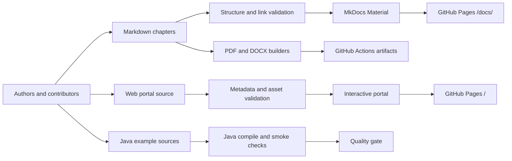

# SDE2 Interview Handbook

[](https://github.com/vinayreddykalluri/SDE2-Interview-Handbook/actions/workflows/build-books.yml)
[](https://github.com/vinayreddykalluri/SDE2-Interview-Handbook/actions/workflows/deploy-pages.yml)
[](LICENSE)
[](LICENSE-CONTENT.md)
[](examples/java/README.md)

A detailed, printable, and fully open-source interview preparation system for Java, JVM internals, data structures, algorithms, and SDE-2 engineering judgment.

Explore the [interactive learning portal](https://vinayreddykalluri.github.io/SDE2-Interview-Handbook/) or open the [complete searchable handbook](https://vinayreddykalluri.github.io/SDE2-Interview-Handbook/docs/).

## Start here

| Goal | Best entry point |
| --- | --- |
| Study in order | [Getting Started](docs/getting-started.md) and [Study Plan](docs/study-plan.md) |
| Explore learning paths and track progress | [Interactive portal](https://vinayreddykalluri.github.io/SDE2-Interview-Handbook/) |
| Search concepts and diagrams | [Complete documentation](https://vinayreddykalluri.github.io/SDE2-Interview-Handbook/docs/) |
| Practice Java implementations | [Java examples](examples/java/README.md) |
| Download PDF or DOCX books | [GitHub Actions artifacts](https://github.com/vinayreddykalluri/SDE2-Interview-Handbook/actions/workflows/build-books.yml) |
| Improve the project | [Contributing guide](CONTRIBUTING.md) |

## What is included

- 19 ordered volumes from Java execution fundamentals through dynamic programming.
- First-principles explanations, interviewer perspective, production trade-offs, exercises, and revision sheets.
- Mermaid architecture, memory, control-flow, and algorithm diagrams.
- Semantically named Java examples in a standard source layout.
- Interactive curriculum, learning paths, local progress tracking, theme controls, and keyboard search.
- Searchable MkDocs Material site with mobile and print-friendly styles.
- Automated structure, link, Java compilation, site, PDF, and DOCX checks.
- GitHub Pages deployment and downloadable book artifacts.

## System architecture



## Quick setup

Prerequisites:

- Python 3.11 or newer
- JDK 17 or newer
- Pandoc and XeLaTeX for printable books
- GNU Make

```bash
git clone https://github.com/vinayreddykalluri/SDE2-Interview-Handbook.git
cd SDE2-Interview-Handbook
make install
make serve-web
```

Open `http://127.0.0.1:8000` for the portal or `http://127.0.0.1:8000/docs/` for the complete handbook. Use `make serve` when developing only the MkDocs documentation.

### macOS

```bash
brew install python pandoc mactex-no-gui openjdk@17
make install
make validate
make build-all
```

### Ubuntu or Debian

```bash
sudo apt-get update
sudo apt-get install -y python3 python3-pip pandoc texlive-xetex openjdk-17-jdk make
make install
make validate
make build-all
```

## Quality commands

| Command | Purpose |
| --- | --- |
| `make serve-web` | Build and serve the portal plus complete docs |
| `make serve` | Run only the MkDocs documentation server |
| `make validate` | Validate structure, links, Java sources, and web metadata |
| `make validate-web` | Validate portal assets and docs/code metadata alignment |
| `make validate-code` | Compile all Java examples and run smoke checks |
| `make build-site` | Build the production website |
| `make build-pdf` | Generate individual and combined PDFs |
| `make build-docx` | Generate individual and combined DOCX books |
| `make build-all` | Run the full publication pipeline |

## Repository map

```text
docs/                  Handbook chapters, diagrams, and reader guides
web/                   Interactive portal source, styles, scripts, and metadata
examples/java/         Independently compilable Java source and smoke tests
scripts/               Validation and book-generation automation
templates/             Print and document templates
.github/workflows/     CI, artifact generation, and GitHub Pages deployment
.github/ISSUE_TEMPLATE Structured contributor intake forms
output/                Generated local artifacts (not committed)
site/                  Generated portal plus docs deployment artifact
```

## Generated artifacts

- `output/pdf/Volume-XX-Topic.pdf`
- `output/docx/Volume-XX-Topic.docx`
- `output/combined/SDE2-Interview-Handbook.pdf`
- `output/combined/SDE2-Interview-Handbook.docx`

Generated books are intentionally excluded from Git. Every successful handbook workflow publishes them as downloadable GitHub Actions artifacts.

## Open-source model

- Source code, automation, and configuration are licensed under the [MIT License](LICENSE).
- Handbook prose, diagrams, and learning material are licensed under [Creative Commons Attribution 4.0](LICENSE-CONTENT.md).
- Contributions are accepted under the license that applies to the files being changed.

See [Governance](GOVERNANCE.md), [Security](SECURITY.md), [Support](SUPPORT.md), and the [Code of Conduct](CODE_OF_CONDUCT.md) for project-wide expectations.
