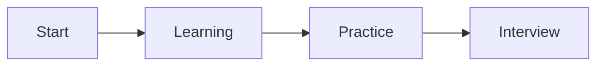

# Chapter Title

## Why This Matters

## Learning Objectives

## Core Concept

## Internal Working

## Architecture or Memory Diagram



## Code Example

```java
public class ChapterExample {
    public static void main(String[] args) {
        System.out.println("Interview-ready Java patterns");
    }
}
```

## Step-by-Step Execution

## Interviewer Perspective

## Common Mistakes

## Production Perspective

## Must Know for DSA

## Interview Questions and Answers

## Practice Exercises

## Revision Checklist

## One-Page Summary
