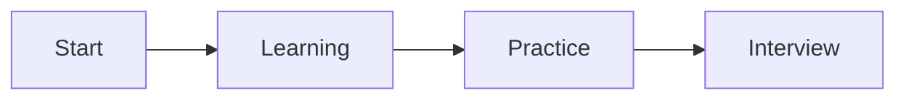

# Chapter Title

## Why This Matters

## Learning Objectives

## Core Concept

## Internal Working

## Architecture or Memory Diagram

## Code Example

Canonical source path: `examples/java/src/main/java/io/github/vinayreddykalluri/interviewhandbook/volumeXX/ConceptName.java`

Replace the pattern above with a working GitHub link after adding the source file. State the input contract, invariant, output contract, and time/space complexity before walking through the implementation. Keep the canonical implementation in the separate Java source tree.

## Step-by-Step Execution

## Interviewer Perspective

## Common Mistakes

## Production Perspective

## Must Know for DSA

## Interview Questions and Answers

## Practice Exercises

## Revision Checklist

## One-Page Summary
