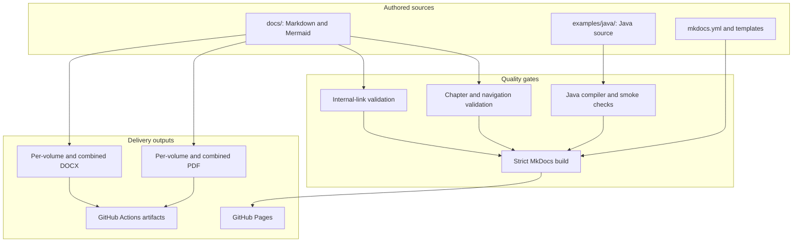

# Project Architecture

The project separates educational source, executable examples, validation, and generated outputs so each concern can evolve without duplicating content.

## Repository layers

## Source of truth

- Markdown is the source of truth for educational content.
- Java files under `examples/java/src/main/java` are the source of truth for implementations.
- `mkdocs.yml` is the source of truth for website navigation.
- Generated `site/` and `output/` files are disposable build results.

## Why code is separate

Large source blocks make a chapter harder to scan and allow copied snippets to drift. A separate source tree provides semantic filenames, standard packages, compilation, behavior checks, direct GitHub review, and a stable link from each explanation.

## Publication sequence

1. A contributor changes Markdown, diagrams, code, or tooling.
2. CI validates structure, links, code, and the website.
3. The Pages workflow publishes the static site from `master`.
4. The handbook workflow generates PDF and DOCX bundles.
5. Readers download artifacts or browse the searchable site.
