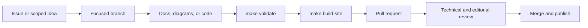

# Contributor Guide

The repository welcomes focused improvements to technical accuracy, depth, diagrams, examples, exercises, accessibility, and publishing automation.

## Contribution flow

## Before editing

- Search existing issues and pull requests.
- Identify the exact chapter, example, or build behavior affected.
- For major structural changes, open an issue before investing in a large patch.
- Read the root [CONTRIBUTING.md](https://github.com/vinayreddykalluri/SDE2-Interview-Handbook/blob/master/CONTRIBUTING.md).

## Definition of done

A contribution is complete when the explanation is accurate, terminology is consistent, diagrams render, code compiles, links resolve, required chapter sections remain present, and the pull request states how the change was checked.

## Good content changes

Strong changes explain why the concept matters, derive behavior from first principles, show an invariant or internal model, include realistic failure modes, connect to production engineering, and state the complexity or trade-off explicitly.

## Good code changes

Strong examples have semantic names, narrow responsibilities, explicit assumptions, meaningful edge-case handling, no unnecessary dependencies, and a matching smoke check when behavior changes.
