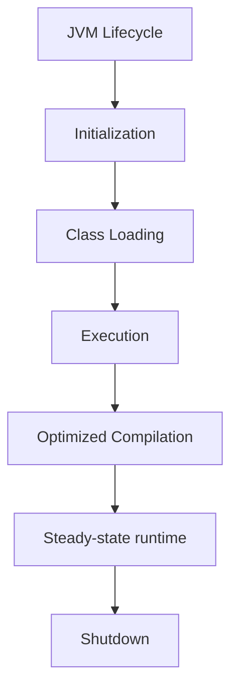

# Chapter 2: JVM Architecture

## Why This Matters

Interviewers ask JVM architecture because it tests systems thinking: can you map memory, execution, and runtime behavior into a coherent model.

## Learning Objectives

- Describe JVM subsystems and responsibilities.
- Distinguish HotSpot, OpenJ9, and GraalVM trade-offs.
- Relate JVM life cycle to startup, warm-up, and steady execution.
- Explain how throughput and latency differ.
- Connect JVM architecture to production incidents.

## Core Concept

A JVM can be viewed in modules:

- **Class Loader Subsystem** (type metadata and class bytes)
- **Runtime Data Areas** (heap, stack, metaspace, method metadata)
- **Execution Engine** (interpreter, JIT, GC interfaces)
- **JNI/Native Interface**
- **Native Method Stack and OS threads**

## Internal Working

The lifecycle starts with initialization, loads core classes, and executes bootstrap code. The JVM continuously runs management threads (like GC and compiler threads) while also scheduling your application threads.

HotSpot is the default dominant implementation in most production JDKs and optimizes heavily through tiered JIT. OpenJ9 emphasizes startup and footprint in some workloads. GraalVM focuses on advanced optimization, native-image and polyglot integration.

## Architecture or Memory Diagram

## Code Example

[Code Example 1 in detail (external file)](../examples/java/volume-01-java-fundamentals/02-jvm-architecture-01.java)

## Step-by-Step Execution

1. Launcher starts JVM with selected flags.
2. Core bootstrap classes are loaded and verified.
3. Your classpath/module path is resolved.
4. Main method starts in non-daemon thread.
5. Execution engine interprets and may delegate hot methods to JIT.
6. Runtime threads execute GC and profiling in parallel.

## Interviewer Perspective

Interviewers look for architecture vocabulary, not VM trivia:
- subsystem names,
- throughput/latency interpretation,
- failure scenarios (e.g., OOM, startup timeouts).

## Common Mistakes

- Confusing JVM with JVM language implementations.
- Forgetting to separate process memory from JVM memory.
- Assuming JVM internals are identical across JVM vendors.

## Production Perspective

Architecture choices affect startup and latency SLAs. For containerized workloads with tight budgets, JVM choice and flag strategy can be deciding factors.

## Must Know for DSA

When interviewers discuss performance, candidates should map algorithm cost to JVM runtime overhead (allocation, JIT time, GC pauses) instead of only asymptotic complexity.

## Interview Questions and Answers

- **Q: Explain JVM lifecycle phases.**
  - **Answer:** Initialize, load and verify classes, execute, run management threads, eventually shut down.
  - **Follow-up:** "How can lifecycle phase impact latency?" → cold start cost appears before compilation and profile-driven optimizations.
- **Q: Compare HotSpot vs OpenJ9.**
  - **Answer:** HotSpot generally prioritizes throughput and mature ecosystem; OpenJ9 prioritizes startup/footprint in some profiles.
  - **Follow-up:** "When would you switch?" → Memory-sensitive services or container startup constraints.

## Practice Exercises

1. Create a JVM architecture diagram and label execution path.
2. Explain startup and warm-up difference for a REST service.
3. Give one production incident for each: throughput regression, startup delay, GC spike.
4. Write a script to collect memory and thread stats for first 5 minutes of app start.

## Revision Checklist

- [x] Can enumerate JVM subsystems.
- [x] Can explain vendor differences.
- [x] Can explain JVM lifecycle impact on interview and production.

## One-Page Summary

JVM architecture is an orchestrated system of class loading, memory management, and execution optimization. Interview mastery comes from describing these parts and their trade-offs under realistic workloads.
