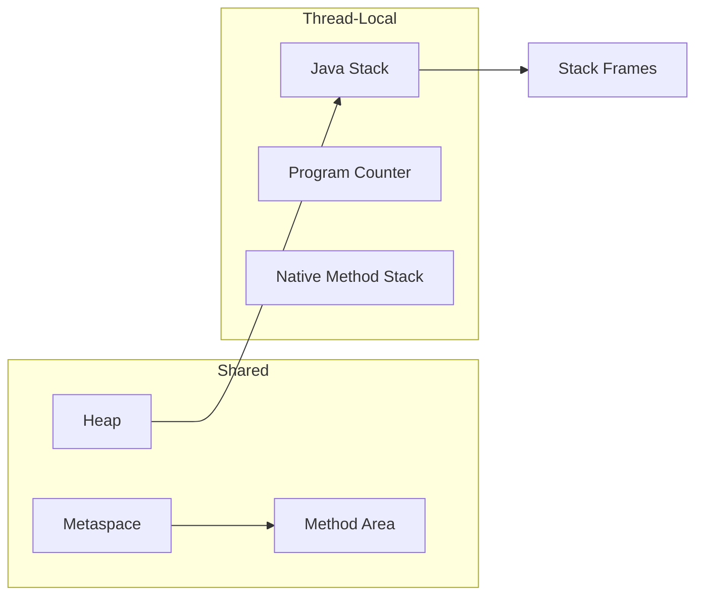

# Chapter 4: Runtime Data Areas

## Why This Matters

Memory questions in interviews often blur JVM terms. Clear mapping of thread-local and shared memory is a major differentiator between good and average candidates.

## Learning Objectives

- Separate stack, heap, and metaspace roles.
- Explain frame internals: local variables, operand stack, dynamic linking, return values.
- Identify overflow and out-of-memory conditions.
- Relate thread-local memory behavior to stack traces.

## Core Concept

Runtime memory has both **shared** regions (heap, metaspace, runtime constant pool) and **thread-local** regions (program counter, Java stack, native stack). Shared memory holds objects and metadata; thread-local memory holds execution state.

## Internal Working

Each thread has its own Java stack containing frames per method. A frame includes locals, operand stack, and return info. Heap stores objects and arrays. Metaspace stores class metadata.

## Architecture or Memory Diagram



## Code Example

```java
public class DataAreaWalk {
    private static int value = 10;

    public static void main(String[] args) {
        int local = 5;
        Integer boxed = local; // boxing allocation semantics
        recursive(local);
        System.out.println(value + boxed);
    }

    private static void recursive(int n) {
        if (n <= 0) return;
        recursive(n - 1);
    }
}
```

## Step-by-Step Execution

1. `main` frame created with local slots.
2. Static field `value` referenced from class metadata.
3. Boxing creates `Integer` object on heap (or cache hit for small values).
4. Recursive calls create nested frames.
5. After recursion, frames unwind; objects without references become GC candidates.

## Interviewer Perspective

Strong answers connect this with stack traces, recursion depth, and OOM/StackOverflow scenarios.

## Common Mistakes

- Attributing every memory issue to heap.
- Missing that local variable tables are per frame.
- Assuming strings are always immutable objects in stack.

## Production Perspective

Thread stack size and heap sizing interact. Excess recursion depth causes stack overflow; object churn drives GC frequency.

## Must Know for DSA

Most recursion and DFS solutions are validated by understanding stack usage. Tail recursion discussions should mention stack frame impact.

## Interview Questions and Answers

- **Q: Why can deep recursion crash?**
  - **Answer:** Each call adds a frame, exhausting thread stack.
  - **Follow-up:** "How to avoid it?" → Iteration, explicit stack, or tuned stack/algorithm.
- **Q: What is the StackOverflowError signal?**
  - **Answer:** JVM cannot grow stack for a thread.
  - **Follow-up:** "How is it different from OOM?" → Stack vs heap allocation failure region.

## Practice Exercises

1. Predict stack vs heap usage for nested method calls.
2. Explain where `String` literals live and what that means.
3. Create a recursion that triggers stack overflow intentionally.
4. Describe an OutOfMemoryError scenario.

## Revision Checklist

- [x] Can diagram runtime memory areas.
- [x] Can explain stack frame fields.
- [x] Can distinguish stack overflow and heap OOM.

## One-Page Summary

Thread-local memory (stack/PC/native stack) and shared memory (heap/metaspace) interact through frames, object allocation, and GC reachability. This model anchors performance and crash explanations.
