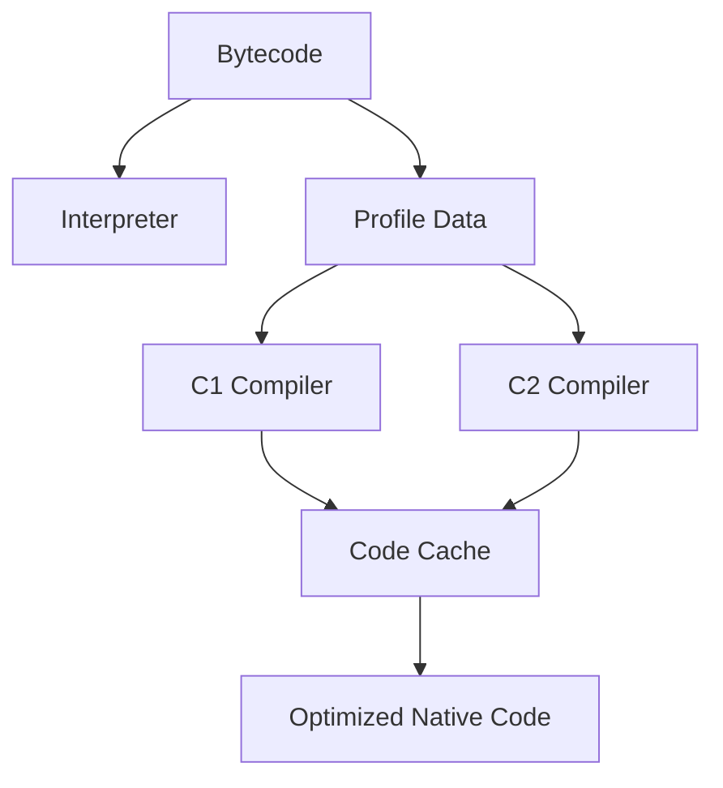

# Chapter 5: Execution Engine and JIT

## Why This Matters

Interviewers assess whether you understand why Java may run slower in the first seconds and become faster later. This topic influences performance interviews and real-world JVM tuning.

## Learning Objectives

- Distinguish interpreter and JIT behavior.
- Explain C1/C2, code cache, and profile-based compilation.
- Describe inlining, escape analysis, and deoptimization.
- Discuss benchmark pitfalls.

## Core Concept

The interpreter executes bytecode quickly to start, while JIT compiles frequently used methods into optimized machine code. HotSpot typically uses a tiered pipeline: C1 for fast compilation, C2 for aggressive optimization.

## Internal Working

JIT receives profile feedback: invocation counts, branch outcomes, type profiles. Hot methods become compilation candidates. If speculative assumptions become invalid, deoptimization reverts to interpreted code or less optimized compiled code.

## Architecture or Memory Diagram

## Code Example

[Code Example 1 in detail (external file)](../examples/java/volume-01-java-fundamentals/05-execution-engine-jit-01.java)

## Step-by-Step Execution

1. First iterations interpreted.
2. Profile counters increment for `compute`.
3. C1 compiles faster version once thresholds reached.
4. C2 may recompile with deeper optimizations.
5. Optimized method runs from code cache.

## Interviewer Perspective

A common question is not "what is JIT" but why timings vary between first run and repeated run. Mention class loading, compilation overhead, and branch behavior.

## Common Mistakes

- Benchmarking a single run.
- Assuming JIT always improves every call.
- Ignoring code deoptimization for debugging edge paths.

## Production Perspective

Code cache sizing and compilation strategy influence tail latency. Poor warmup in short request bursts can produce unstable p95 results.

## Must Know for DSA

Performance tuning in coding interviews may mention JIT when discussing micro-benchmarks and algorithm comparisons.

## Interview Questions and Answers

- **Q: Why does JVM have both C1 and C2?**
  - **Answer:** C1 provides quick initial compilation, C2 performs advanced optimizations.
  - **Follow-up:** "How does tiered compilation affect benchmarking?" → Need warmup.
- **Q: What is deoptimization?**
  - **Answer:** Revert compiled assumptions when runtime behavior changes.
  - **Follow-up:** "Why does it matter?" → Can cause short execution hiccups.

## Practice Exercises

1. Compare execution with and without `-XX:+PrintCompilation` in small experiment.
2. Find methods that trigger heavy compilation after warmup.
3. Explain inlining benefits and risks.
4. Add `-Xmx` constraints and observe behavior changes.

## Revision Checklist

- [x] Can explain why Java may look slow initially.
- [x] Can define C1/C2 and code cache.
- [x] Can discuss deoptimization.

## One-Page Summary

Execution uses interpreter at startup and JIT for hot code. A tiered strategy gives speed while balancing startup time. Profiling and warm-up are essential for trustworthy performance claims.
