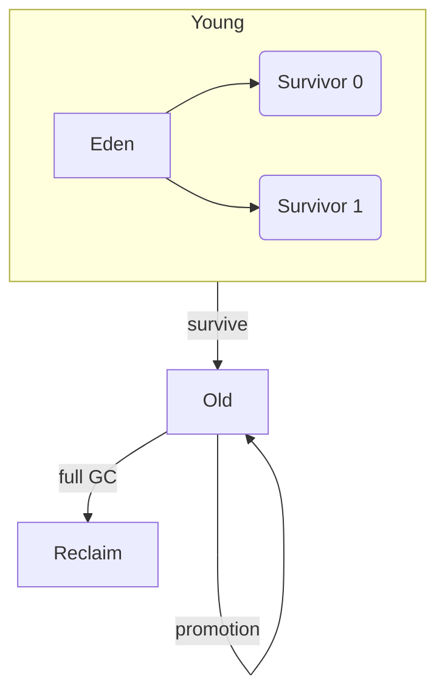

# Chapter 6: Garbage Collection

## Why This Matters

GC is one of the highest-impact backend topics in interviews and production. Explainability around GC behavior can be decisive in system design and debugging rounds.

## Learning Objectives

- Explain reachability and GC roots.
- Name generational collections and pauses.
- Compare G1, ZGC, and Shenandoah.
- Read GC log patterns.
- Tie memory leaks to managed runtime behavior.

## Core Concept

A GC determines unreachable objects by tracing from roots and reclaiming memory while trying to minimize pause and throughput impact.

## Internal Working

Most JVMs use generational hypotheses:

- **Young** for short-lived allocations (Eden + survivors)
- **Old** for long-lived objects

GC variants change pause profiles, collector threads, and region management.

## Architecture or Memory Diagram

## Code Example

[Code Example 1 in detail (external file)](https://github.com/vinayreddykalluri/SDE2-Interview-Handbook/blob/master/examples/java/src/main/java/io/github/vinayreddykalluri/interviewhandbook/volume01/GcExample.java)

## Step-by-Step Execution

1. Allocate many byte arrays into young generation.
2. Minor GC moves surviving objects to survivors.
3. Long-lived objects move to old generation.
4. Logs record pause time, reclaim counts, and region transitions.

## Interviewer Perspective

Candidates are expected to discuss trade-offs: throughput vs latency, pauses, memory overhead, and predictability.

## Common Mistakes

- Treating GC as "auto magic" with no tuning.
- Ignoring object churn from temporary allocations.
- Assuming one GC type is universally best.

## Production Perspective

GC behavior shapes API latency, memory budget, and autoscaling cost. In JVM services, memory leaks and pressure are often visible before failures through log patterns.

## Must Know for DSA

Unrelated directly to algorithmic complexity, but useful for resource estimation and practical production-aware answers.

## Interview Questions and Answers

- **Q: What is the role of GC roots?**
  - **Answer:** They are starting points for reachability.
  - **Follow-up:** "How are threads involved?" → Thread stacks and static fields provide root paths.
- **Q: When is a full GC triggered?**
  - **Answer:** When old generation lacks sufficient reclaimable space and compaction is needed.
  - **Follow-up:** "Why is it expensive?" → It touches larger memory regions.

## Practice Exercises

1. Run JVM with GC logs and identify a minor GC.
2. Trigger high minor GC with allocation loop.
3. Compare G1 and ZGC logs for simple service under load.
4. Inspect thread dump for references preventing cleanup.

## Revision Checklist

- [x] Can explain root reachability.
- [x] Can describe Eden/Survivor/Old behavior.
- [x] Can discuss G1 and ZGC use cases.

## One-Page Summary

GC is reachability-based memory reclamation with generational optimization. Strong interview answers connect collector choice, pause profile, memory pressure, and leak investigation.
