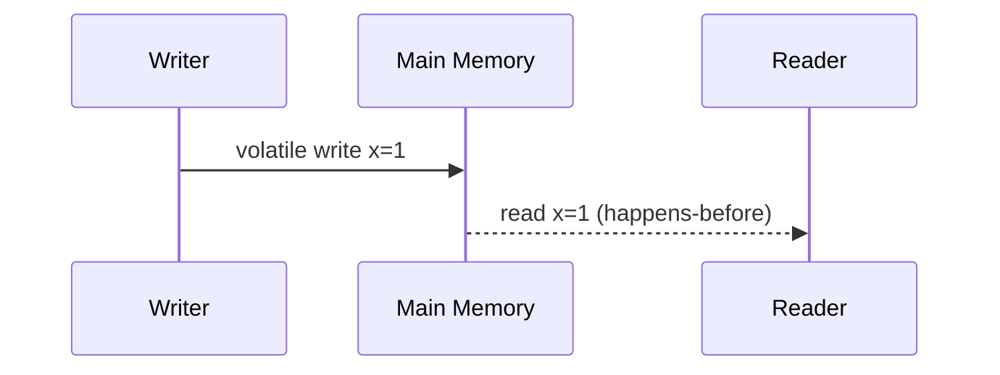

# Chapter 7: Java Memory Model

## Why This Matters

The Java Memory Model underpins interview questions on concurrency correctness. Many candidates memorize locks but miss the visibility and ordering details.

## Learning Objectives

- Explain visibility, atomicity, and ordering.
- Use volatile and synchronized correctly.
- Understand happens-before and race conditions.
- Reason about final-field guarantees and safe publication.

## Core Concept

The JMM defines what values shared threads may observe and when. Without happens-before edges, one thread might see stale values even after assignment.

## Internal Working

Volatile writes create happens-before relations with subsequent reads. `synchronized` establishes mutual exclusion and memory visibility around critical sections.

## Architecture or Memory Diagram

## Code Example

[Code Example 1 in detail (external file)](https://github.com/vinayreddykalluri/SDE2-Interview-Handbook/blob/master/examples/java/src/main/java/io/github/vinayreddykalluri/interviewhandbook/volume01/JmmDemo.java)

## Step-by-Step Execution

1. Writer stores `value` then `ready` with volatile.
2. JMM establishes happens-before from volatile write to following volatile read.
3. Reader seeing `ready=true` also sees prior write to `value` in this pattern.

## Interviewer Perspective

Interviewers probe if you understand not only "works on my machine" but why it works and when it fails.

## Common Mistakes

- Assuming `volatile` makes compound atomic operations safe.
- Using non-final fields without safe publication.
- Using busy waits without backoff and visibility guarantees.

## Production Perspective

In lock-free and actor-like designs, memory model correctness avoids subtle production data races and stale reads.

## Must Know for DSA

Concurrency interview questions on shared state and thread-safe counters require JMM correctness concepts.

## Interview Questions and Answers

- **Q: What does volatile guarantee?**
  - **Answer:** Visibility and ordering for that variable.
  - **Follow-up:** "Does it make increment atomic?" → No.
- **Q: What is happens-before?**
  - **Answer:** A rule that orders memory effects between threads.
  - **Follow-up:** "Which Java constructs create it?" → volatile, synchronized, thread start/join, final fields.

## Practice Exercises

1. Write a producer-consumer example with volatile and explain correctness.
2. Break ordering with stale read and fix.
3. Compare synchronized and explicit lock semantics.

## Revision Checklist

- [x] Can explain visibility vs atomicity.
- [x] Can define happens-before.
- [x] Can reason about volatile correctly.

## One-Page Summary

The JMM defines inter-thread visibility and ordering. Correct concurrent Java relies on established happens-before edges through volatile, synchronization, and safe publication discipline.
