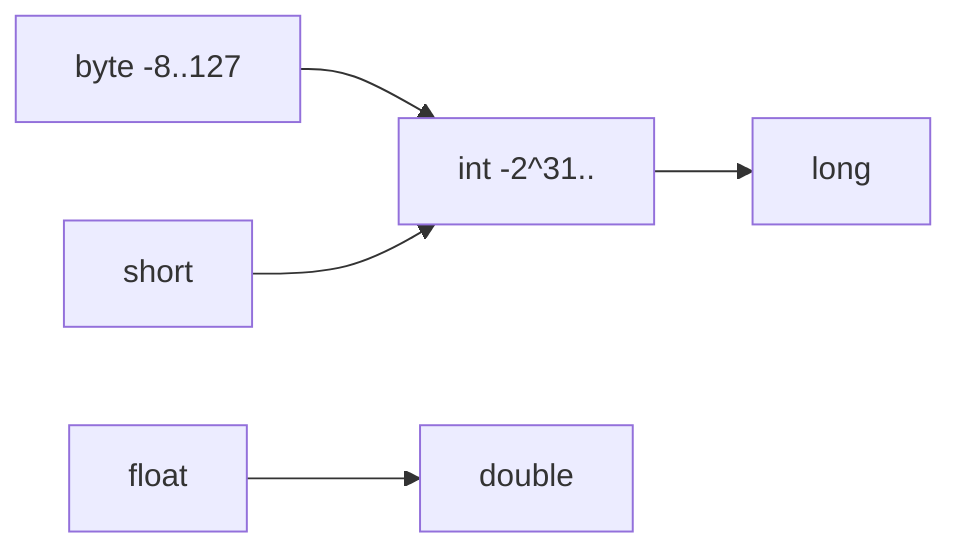

# Chapter 8: Primitive Types

## Why This Matters

Primitive handling appears everywhere in interview code and system interviews. Strong candidates should explain overflow, storage, and comparisons precisely.

## Learning Objectives

- Describe Java primitive widths and ranges.
- Explain promotions and implicit casts.
- Handle overflow and loss of precision cases.
- Use primitives effectively in loops and arithmetic.

## Core Concept

Java primitives include numeric types (`byte`, `short`, `int`, `long`, `float`, `double`, `char`, `boolean`). They are value types, not references.

## Internal Working

The JVM stores fixed-size primitive values in local variables or fields directly. Wider numeric conversions can overflow if bounds are crossed.

## Architecture or Memory Diagram



## Code Example

```java
public class PrimitiveDemo {
    public static void main(String[] args) {
        int a = 2_000_000_000;
        int b = 1_000_000_000;
        int c = a + b;
        System.out.println(c); // overflow risk

        long safe = (long) a + b;
        System.out.println(safe);
    }
}
```

## Step-by-Step Execution

1. `a + b` computed in `int` domain causes wrap-around.
2. Casting to `long` promotes first and preserves exact sum.
3. Result prints overflow behavior and safe version.

## Interviewer Perspective

This is a frequent "small" trap. Interviewers test whether you can anticipate overflow and apply widening conversions.

## Common Mistakes

- Assuming math on integers is "safe" by default.
- Forgetting floating rounding behavior.
- Overusing `double` for money calculations.

## Production Perspective

Overflow is common in counters and timestamps. Use `long` and strict checks where needed.

## Must Know for DSA

Array indexing and arithmetic loops rely on type correctness and bounds.

## Interview Questions and Answers

- **Q: Why does Java overflow not throw by default?**
  - **Answer:** It wraps modulo 2^N.
  - **Follow-up:** "What is practical mitigation?" → Use `long`, `Math.addExact`, constraints.
- **Q: Why avoid float for monetary values?**
  - **Answer:** Binary floating point is not exact for decimal fractions.

## Practice Exercises

1. Find overflow in a counter implementation and fix it.
2. Compare promotion rules for `byte + short`.
3. Implement safe average of two large ints.

## Revision Checklist

- [x] Can explain range and promotion.
- [x] Can detect overflow risk.
- [x] Can apply safer numeric conversions.

## One-Page Summary

Primitives are fast but bounded. Predicting overflow and conversion behavior is critical in interviews and production arithmetic.
