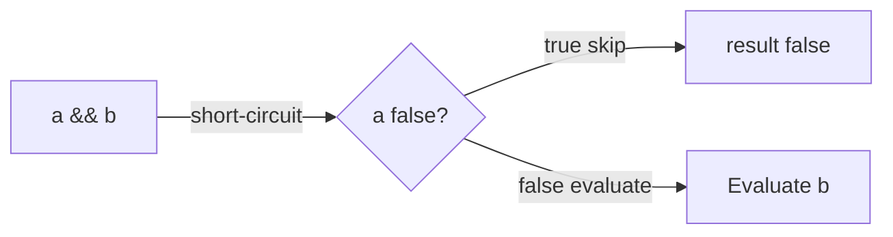

# Chapter 9: Operators

## Why This Matters

Operators are small, but wrong assumptions around precedence, division behavior, and short-circuit logic cause subtle bugs in interviews and codebases.

## Learning Objectives

- Apply numeric, relational, logical, and bitwise operators.
- Explain precedence and associativity.
- Use short-circuit operators in control flow.
- Debug expression evaluation order.

## Core Concept

Java operators include arithmetic, comparison, boolean, bitwise, and conditional constructs. Parentheses remain the safest way to encode intent.

## Internal Working

Expression evaluation follows precedence rules and left-to-right associativity for equal precedence groups. Short-circuit boolean operators can skip evaluation.

## Architecture or Memory Diagram



## Code Example

```java
public class OperatorDemo {
    public static void main(String[] args) {
        int a = 10;
        int b = 3;
        boolean safe = b != 0 && a / b > 1;
        System.out.println(safe);
        System.out.println(a & 3);
    }
}
```

## Step-by-Step Execution

1. `b != 0` is evaluated.
2. Since true, JVM evaluates `a / b > 1`.
3. Bitwise `&` returns masked value.

## Interviewer Perspective

You should mention short-circuiting to prevent exceptions and unnecessary work.

## Common Mistakes

- Forgetting parentheses in mixed arithmetic/boolean expressions.
- Confusing bitwise `&` and logical `&&` in boolean context.
- Integer division truncation surprises.

## Production Perspective

Micro-conditions in performance code often depend on short-circuit and null-safe checks.

## Must Know for DSA

Operator precedence and bit operators are core for low-level and optimization-oriented DSA questions.

## Interview Questions and Answers

- **Q: What's the difference between `&` and `&&` for booleans?**
  - **Answer:** `&` evaluates both sides; `&&` short-circuits.
  - **Follow-up:** "Why it matters for NPE?" → `obj != null && obj.isValid()` prevents dereference.

## Practice Exercises

1. Rewrite complex conditions with clear precedence using parentheses.
2. Build expressions that show short-circuit and evaluate side effects.
3. Convert arithmetic with `/` into exact and float variants.

## Revision Checklist

- [x] Can list operator categories.
- [x] Can explain precedence and associativity.
- [x] Can apply short-circuit safely.

## One-Page Summary

Operator correctness is correctness correctness. Correct expression semantics prevent bugs in control flow, null safety, and math computations.
