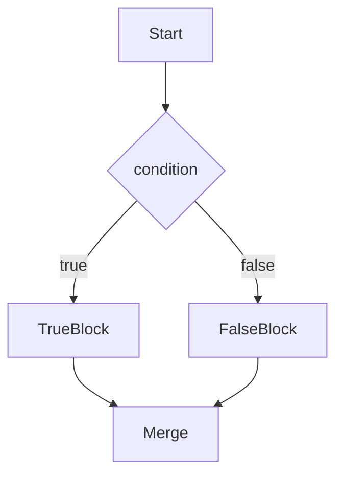

# Chapter 10: Control Flow

## Why This Matters

Control structures are used in all interviews. Strong candidates optimize logic and predict branch complexity instead of brute forcing every condition.

## Learning Objectives

- Use branching and loops effectively.
- Handle nested branches without losing clarity.
- Explain branch prediction implications conceptually.
- Write readable and testable control structures.

## Core Concept

Control flow uses `if`, `else`, `switch`, and conditional expressions to guide execution paths.

## Internal Working

The JVM bytecode uses jumps and labels for conditionals and loops. Well-structured branch code reduces accidental complexity and errors.

## Architecture or Memory Diagram

## Code Example

[Code Example 1 in detail (external file)](../examples/java/volume-01-java-fundamentals/10-control-flow-01.java)

## Step-by-Step Execution

1. Method checks `%` checks in order.
2. First matching condition returns.
3. Remaining checks are skipped due to early return.

## Interviewer Perspective

Interviewers ask about readability, early exits, and edge-case handling. Mention reducing nested complexity with guard clauses.

## Common Mistakes

- Deep nesting with repeated logic.
- Misordered conditions causing wrong precedence.
- Overcomplicated switch alternatives when simple checks exist.

## Production Perspective

Predictability in control flow reduces bugs and helps testability.

## Must Know for DSA

Branching logic appears in many binary decisions and simulation problems.

## Interview Questions and Answers

- **Q: When prefer return early?**
  - **Answer:** To reduce nesting and clarify exceptional paths.
  - **Follow-up:** "Does it hurt performance?" → Usually not significant; clarity often improves maintainability.

## Practice Exercises

1. Rewrite nested branching into guard clauses.
2. Convert a `switch` to `if` and compare readability.
3. Implement FizzBuzz with all edge cases.

## Revision Checklist

- [x] Can explain condition ordering.
- [x] Can avoid deep nesting.
- [x] Can reason about complexity by branch tree.

## One-Page Summary

Control flow design affects correctness and clarity. Order conditions carefully and keep logic linear and testable.
