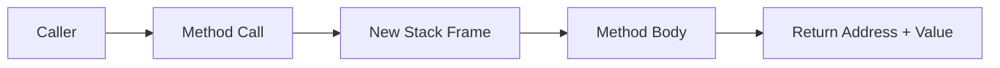

# Chapter 11: Methods

## Why This Matters

Methods define API boundaries in interview code. Strong answers connect signature design, call cost, pass-by-value, and recursion shape.

## Learning Objectives

- Write purpose-built methods with strong contracts.
- Explain Java pass-by-value with references.
- Overload and compose methods without ambiguity.
- Trace stack usage with method calls.

## Core Concept

Methods package behavior into reusable units. Java passes arguments by value: primitives by value, object references by value of references.

## Internal Working

Each invocation creates a stack frame with local variables and return state. Reference variables copy the pointer, enabling mutation of object state outside method.

## Architecture or Memory Diagram

## Code Example

[Code Example 1 in detail (external file)](https://github.com/vinayreddykalluri/SDE2-Interview-Handbook/blob/master/examples/java/src/main/java/io/github/vinayreddykalluri/interviewhandbook/volume01/MethodsDemo.java)

## Step-by-Step Execution

1. `append` called with `sb` reference copy.
2. Inside method, same object is mutated.
3. Returned to caller with updated content.
4. Pass-by-reference misconception corrected: reference itself copied.

## Interviewer Perspective

In interviews, explain method boundaries, immutability choices, and side effects.

## Common Mistakes

- Confusing reference passing with pass-by-reference.
- Overloading methods with unclear parameter order.
- Making methods too long with multiple responsibilities.

## Production Perspective

Method signatures influence API stability and test surface. Immutability and side effects matter for concurrency and reuse.

## Must Know for DSA

Recursion and decomposition rely on clean method contracts and boundary conditions.

## Interview Questions and Answers

- **Q: Can Java pass objects by reference?**
  - **Answer:** No, object references are copied by value.
  - **Follow-up:** "Why can caller still see mutation?" → Copy points to same object.

## Practice Exercises

1. Refactor a long method into three smaller methods.
2. Implement method overloading with clear semantics.
3. Trace a recursive method stack and return points.

## Revision Checklist

- [x] Can explain passing model precisely.
- [x] Can design method contracts with edges and contracts.
- [x] Can reason about recursion with stack frames.

## One-Page Summary

Methods are more than reusable code—they define contracts, readability, and execution structure. In Java, references are copied by value, not passed by reference.
