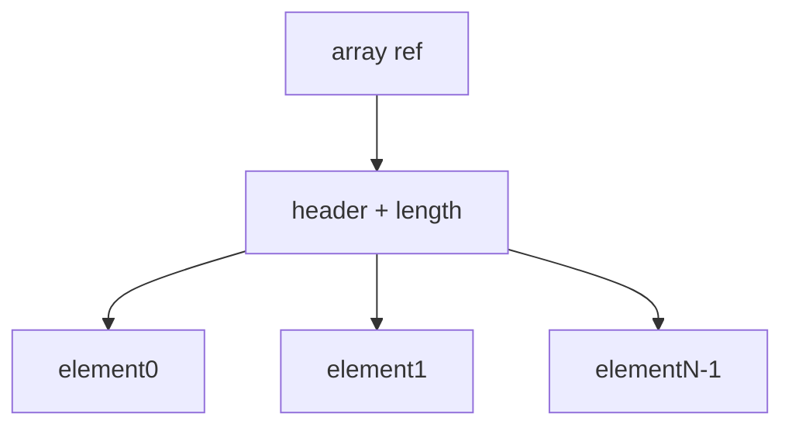

# Chapter 12: Arrays from a Java Perspective

## Why This Matters

Arrays are ubiquitous in DSA interviews and production service code. Correct indexing and memory expectations separate strong from weak candidates.

## Learning Objectives

- Declare, allocate, and initialize arrays.
- Explain contiguous storage and index validation.
- Handle bounds, aliasing, and copy behavior.
- Use arrays in algorithmic loops efficiently.

## Core Concept

Java arrays are fixed-size objects with zero-based indexing, length metadata, and runtime bounds checking.

## Internal Working

Array references hold object identity; each array has header plus contiguous elements. Primitive arrays and object arrays differ in element representation (values vs references).

## Architecture or Memory Diagram

## Code Example

[Code Example 1 in detail (external file)](../examples/java/volume-01-java-fundamentals/12-arrays-java-perspective-01.java)

## Step-by-Step Execution

1. JVM allocates array object on heap.
2. `for-each` loop reads each index from `0` to `length - 1`.
3. Bounds checks are inserted for each access.

## Interviewer Perspective

Interviewers target mistakes: off-by-one, aliasing after assign, and copy-vs-reference.

## Common Mistakes

- Using wrong boundary condition for `for` loops.
- Forgetting array copy when immutability needed.
- Ignoring aliasing across references.

## Production Perspective

Array layout and bounds checks shape throughput in numeric pipelines and low-latency code.

## Must Know for DSA

All complexity analysis begins with array indexing and iteration behavior.

## Interview Questions and Answers

- **Q: Are Java arrays covariant?**
  - **Answer:** Yes for reference types, with runtime caveats.
  - **Follow-up:** "What is runtime risk?" → ArrayStoreException.

## Practice Exercises

1. Find and fix off-by-one in a sliding window style loop.
2. Clone behavior: explain deep vs shallow copy for arrays.
3. Compare manual copy loop with `System.arraycopy`.

## Revision Checklist

- [x] Can explain indexing and bounds semantics.
- [x] Can avoid array aliasing mistakes.
- [x] Can describe memory layout basics.

## One-Page Summary

Arrays are fixed-size contiguous structures with strong bounds guarantees. Precision in indexing and copying is essential in both algorithm and production contexts.
