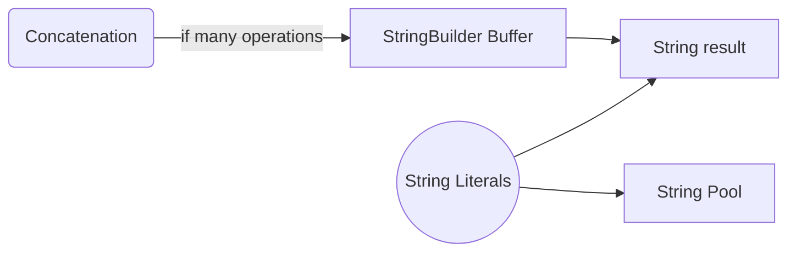

# Chapter 13: Strings

## Why This Matters

String handling frequently appears in interview coding questions and API design. Candidates lose points when they cannot reason about immutability and memory.

## Learning Objectives

- Explain `String` immutability and string pool.
- Compare `String`, `StringBuilder`, `StringBuffer`.
- Avoid quadratic concatenation traps.
- Use standard library APIs correctly.

## Core Concept

`String` is immutable, enabling sharing and safe use in maps. StringBuilder is mutable and optimized for local assembly.

## Internal Working

The JVM stores string literals in a string pool for reuse. Each `String` value has final character data semantics (implementation has varied internals across versions). StringBuilder and StringBuffer use mutable buffers and reduce repeated allocations.

## Architecture or Memory Diagram

## Code Example

[Code Example 1 in detail (external file)](https://github.com/vinayreddykalluri/SDE2-Interview-Handbook/blob/master/examples/java/src/main/java/io/github/vinayreddykalluri/interviewhandbook/volume01/StringDemo.java)

## Step-by-Step Execution

1. Literal `a` resolves in pool.
2. `new String("hello")` creates a distinct object on heap.
3. Equality operator compares references; `.equals` compares content.
4. `StringBuilder` mutates a buffer; final `toString()` creates final `String`.

## Interviewer Perspective

Strong candidates mention immutability, pooling, and when to use `StringBuilder` for repeated modifications.

## Common Mistakes

- Using `==` for content comparison.
- Repeated concatenation in loops.
- Expecting pooled behavior for all runtime-created strings.

## Production Perspective

String misuse can cause memory spikes in logging, JSON assembly, and request parsing.

## Must Know for DSA

String algorithms are common: pattern matching, palindrome checks, and sliding window.

## Interview Questions and Answers

- **Q: Why is `String` immutable?**
  - **Answer:** Enables caching, thread-safety, and predictable hash behavior.
  - **Follow-up:** What is trade-off?
  - **Weak answer:** "Because it is old design."
  - **Strong SDE-2 answer:** "Immutability avoids aliasing surprises but requires builder strategies for heavy mutation.

- **Q: When use `StringBuilder`?**
  - **Answer:** in loops and dynamic composition.
  - **Follow-up:** Why not `StringBuffer`?
  - **Weak answer:** "StringBuffer is old." 
  - **Strong SDE-2 answer:** "StringBuffer is synchronized and slower; use it only for cross-thread mutable string contexts.

## Practice Exercises

1. Compare `String`, `StringBuilder`, and `StringBuffer` behavior for 1,000 concatenations.
2. Reverse a string without built-in reverse.
3. Check if two anagrams are equal with frequency array.

## Revision Checklist

- [x] Can explain immutability and pooling.
- [x] Can choose the right string type.
- [x] Can compare strings correctly.

## One-Page Summary

Use `String` for values, `StringBuilder` for local mutation, and avoid expensive repeated concatenation in hot code. Correct equality and API use are mandatory.
