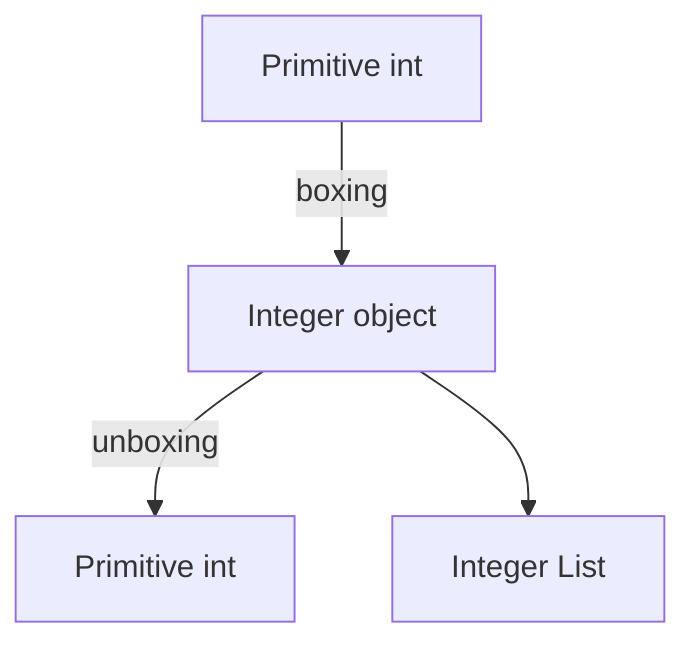

# Chapter 14: Wrapper Classes

## Why This Matters

Wrapper classes connect primitives to APIs that require objects. Interviewers frequently probe subtle caching behavior, null handling, and performance impact.

## Learning Objectives

- Name boxing and unboxing usage.
- Explain Integer cache behavior.
- Avoid accidental NPE from boxing in collections and generics.
- Understand autoboxing performance implications.

## Core Concept

Java auto-converts between primitive types and wrapper objects when required by API signatures. This is convenient but may introduce allocations and identity surprises.

## Internal Working

Autoboxing converts values to wrapper objects; unboxing converts back. For some types (`Integer`, `Long`, etc.), small values are cached via object pooling. Equality semantics differ between `==` and `.equals()`.

## Architecture or Memory Diagram



## Code Example

```java
public class WrapperDemo {
    public static void main(String[] args) {
        Integer a = 100;
        Integer b = 100;
        Integer c = 200;
        Integer d = 200;

        System.out.println(a == b); // true due to Integer cache
        System.out.println(c == d); // usually false
        System.out.println(a.equals(b));
    }
}
```

## Step-by-Step Execution

1. `100` is boxed to cached Integer objects, so reference equality can be true.
2. `200` likely creates distinct objects in default cache range behavior.
3. `.equals` checks value equality and returns true for same numeric value.

## Interviewer Perspective

Candidates should explain that caching is implementation-defined in some range and that `==` compares references for objects.

## Common Mistakes

- Using `==` between boxed types.
- Unboxing null and causing `NullPointerException`.
- Ignoring performance from repeated boxing in hot loops.

## Production Perspective

Wrapper-heavy APIs and collections can increase allocation pressure; prefer primitives in performance-critical loops and use `int`-based structures where possible.

## Must Know for DSA

Understand when to use `List<Integer>` and when custom primitive structures are better for runtime.

## Interview Questions and Answers

- **Q: Why does `Integer.valueOf(100) == Integer.valueOf(100)` sometimes differ from 200?**
  - **Answer:** Cache range for frequently used small values.
  - **Follow-up:** "What is correct equality check?" → `.equals()`.

## Practice Exercises

1. Compare equality semantics across primitive, wrapper, and string conversions.
2. Build a small benchmark for boxing overhead.
3. Replace boxing-heavy implementation with primitive arrays.

## Revision Checklist

- [x] Can explain autoboxing/unboxing flow.
- [x] Can explain wrapper cache and identity.
- [x] Can apply equality rules correctly.

## One-Page Summary

Wrappers are essential for object-only APIs but must be used carefully to avoid identity bugs and allocation overhead. Use `.equals`, null checks, and primitive alternatives when performance matters.
