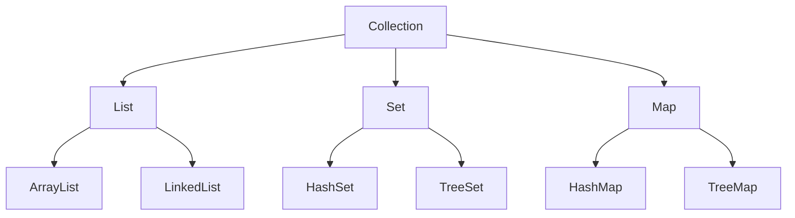

# Chapter 15: Collections Overview

## Why This Matters

Collections represent the practical data structure language in Java. Interviewers test depth of trade-offs, not just names.

## Learning Objectives

- Identify `List`, `Set`, `Map`, `Queue` contracts.
- Compare ArrayList, LinkedList, HashSet, TreeSet, HashMap.
- Explain fail-fast behavior and complexity assumptions.
- Pick proper collection for workload and ordering needs.

## Core Concept

The `java.util` collection framework provides interfaces plus concrete implementations optimized for insertion, lookup, iteration, and ordering characteristics.

## Internal Working

Collections expose iteration and mutability semantics. Hash-based implementations rely on hashing/equality contracts and internal resizing. Sorted versions maintain order through comparators/tree structures.

## Architecture or Memory Diagram

## Code Example

[Code Example 1 in detail (external file)](https://github.com/vinayreddykalluri/SDE2-Interview-Handbook/blob/master/examples/java/src/main/java/io/github/vinayreddykalluri/interviewhandbook/volume01/CollectionsOverview.java)

## Step-by-Step Execution

1. `HashMap` creates internal table.
2. Key hash determines bucket.
3. `merge` retrieves prior value and applies adder function.
4. Updated value is stored and map size remains stable.

## Interviewer Perspective

Good responses include complexity per operation and ordering consequences. For example, `HashMap` is usually O(1) average but not guaranteed under collision patterns.

## Common Mistakes

- Mutating keys used in hash-based maps without stable `hashCode`.
- Ignoring thread safety for shared collections.
- Overusing sorted collections when ordering is never needed.

## Production Perspective

Selection impacts CPU and memory drastically in large services and caches.

## Must Know for DSA

Collections map directly to problem choices: queues for BFS, sets for dedupe, maps for counting and memoization.

## Interview Questions and Answers

- **Q: When choose `ArrayList` over `LinkedList`?**
  - **Answer:** Frequent index access and lower overhead favor ArrayList.
  - **Follow-up:** "When prefer LinkedList?" → For frequent queue/deque-like edge behavior if API demands and random updates at ends.

## Practice Exercises

1. Benchmark insert/lookup difference between ArrayList and HashSet.
2. Explain `equals` and `hashCode` contract using custom keys.
3. Implement LRU with `LinkedHashMap`.

## Revision Checklist

- [x] Can choose structure by query pattern.
- [x] Can state complexity expectations.
- [x] Can spot mutable hash-key bugs.

## One-Page Summary

Collections are strategic choices: match API shape and access pattern. Understand contract and complexity to avoid both correctness bugs and production regressions.
