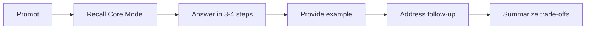

# Chapter 16: Interview Questions

## Why This Matters

This chapter simulates the pressure and depth of real SDE-2 interviews. Each question ties direct answers to explanation quality, example quality, and follow-up handling.

## Learning Objectives

- Deliver direct answers and supporting examples.
- Handle follow-up probing with consistency.
- Avoid weak, incomplete responses.
- Build confidence in rapid recall.

## Core Concept

This chapter is an execution system for interview communication, not a trivia dump. Each question is a signal about architectural thinking, edge-case framing, and practical trade-off reasoning.

## Internal Working

Strong interviews evaluate how fast you can map a question to a model, verify assumptions, and answer within constraints. Repeated rehearsal builds this pipeline.

## Architecture or Memory Diagram



## Code Example

```java
public final class InterviewFrame {
    public String answer(String question) {
        return question == null ? "Need clarification" : "Model + example + trade-off";
    }
}
```

## Step-by-Step Execution

1. Restate the interviewer prompt with your interpretation.
2. State the one sentence direct answer.
3. Add a concise internal mechanism explanation.
4. Mention one practical edge case and one production tie-in.
5. If asked follow-up, answer with boundary conditions first, then optimization angle.

## Interviewer Perspective

Interviewers expect clarity and correctness under pressure. A strong answer shows:
- A base model in one sentence.
- A correctness argument with at least one boundary condition.
- A practical cost/benefit statement.

## Common Mistakes

- Reciting memorized lines without understanding.
- Ignoring question intent (e.g., confusing class loading with classpath class resolution).
- Forgetting to include trade-offs or constraints.

## Production Perspective

Interview reasoning should transfer to real systems: GC behavior, JIT tuning, and concurrency constraints are often discussed from lived production incidents, not textbook abstractions.

## Must Know for DSA

Question quality improves when you connect complexity and data structure behavior to JVM and memory constraints.

## Interview Questions and Answers

## Questions 1 to 100

## Q1: What is the role of the JVM in Java execution?
- **Direct Answer:** The JVM executes Java bytecode on different platforms via platform-specific runtime implementations.
- **Explanation:** It loads classes, manages memory, executes bytecode through interpreter/JIT, and runs GC and threading services.
- **Example:** Compile `Demo.java` with `javac`, run `java Demo`, observe startup and runtime behavior.
- **Follow-up:** How does bytecode help portability and security?
- **Weak Answer:** "It runs Java programs."
- **Strong SDE-2 Answer:** "The JVM is a managed runtime layer that virtualizes CPU/platform differences, adds memory management, verifies bytecode, and optimizes hot code with JIT." 

## Q2: Why is JDK different from JRE?
- **Direct Answer:** JDK includes development tooling in addition to runtime.
- **Explanation:** JDK has compiler and debugging/build tools, JRE contains runtime components.
- **Example:** `javac` is in JDK; runtime classes and launcher are in JRE.
- **Follow-up:** What tools become critical in interview debugging?
- **Weak Answer:** "JDK is Java and JRE is Java runtime."
- **Strong SDE-2 Answer:** "Differentiate by purpose: JDK is for building and analyzing, JRE for running code; modern distributions bundle both but conceptually separated."

## Q3: What happens when you run a Java class file?
- **Direct Answer:** Launcher loads required classes, resolves linkage, and starts execution from `main`.
- **Explanation:** Loading and initialization occur before method execution.
- **Example:** `java com.acme.App` loads `App`, `java.lang`, then executes `main`.
- **Follow-up:** Why does class loading fail before main?
- **Weak Answer:** "It just runs method." 
- **Strong SDE-2 Answer:** "The JVM resolves and verifies class dependencies before invoking the entry point, often failing as CNFE before code executes."

## Q4: What is bytecode verification?
- **Direct Answer:** Validation pass ensuring structural safety and type correctness before execution.
- **Example:** Invalid stack map frames can be rejected.
- **Follow-up:** Why does it improve security?
- **Weak Answer:** "A safety check."
- **Strong SDE-2 Answer:** "Verifier prevents malformed bytecode from corrupting runtime by enforcing constraints before code execution."

## Q5: What is class loading?
- **Direct Answer:** Process of finding class bytes and creating a Class object.
- **Example:** Lazy loading on first reference.
- **Follow-up:** Why is lazy loading helpful?
- **Weak Answer:** "When JVM loads class."
- **Strong SDE-2 Answer:** "It delays cost until class is needed and allows modular isolation.
- **Example:** Static fields and methods still require initialization boundaries."

## Q6: What is bootstrap class loader?
- **Direct Answer:** Built-in loader for core Java platform classes.
- **Example:** Loads `java.lang.String`.
- **Follow-up:** Which loader usually loads application code?
- **Weak Answer:** "System loader."
- **Strong SDE-2 Answer:** "App loader handles application classpath after parent delegation from bootstrap and platform loaders."

## Q7: Explain parent delegation.
- **Direct Answer:** Child requests class first go to parent loaders.
- **Explanation:** Prevents duplicate/unsafe shadowing of trusted classes.
- **Example:** Same class name resolution path through bootstrap/platform/app.
- **Follow-up:** When is delegation broken?
- **Weak Answer:** "It does normal loading."
- **Strong SDE-2 Answer:** "Default is parent-first but custom loaders can override in frameworks with care.

## Q8: What is NoClassDefFoundError?
- **Direct Answer:** Error when class was previously found but cannot be linked at runtime later.
- **Example:** Class removed due to deployment mismatch.
- **Follow-up:** Difference from CNFE?
- **Weak Answer:** "No class found."
- **Strong SDE-2 Answer:** "CNFE is usually a first-time request-time exception; NoClassDefFoundError can arise after successful compile-time dependency resolution."

## Q9: What is the difference between class verification and initialization?
- **Direct Answer:** Verification checks bytecode safety; initialization runs `<clinit>` static init.
- **Example:** Static final constant initialization.
- **Follow-up:** When can initialization throw?
- **Weak Answer:** "They are same."
- **Strong SDE-2 Answer:** "No. Verify happens before init; init executes code and can fail with ExceptionInInitializerError."

## Q10: What is runtime data area?
- **Direct Answer:** Memory regions used by JVM for class metadata, stacks, heap, and thread state.
- **Example:** Stack for frames, heap for objects.
- **Follow-up:** Which is thread-local?
- **Weak Answer:** "Memory."
- **Strong SDE-2 Answer:** "Thread-local stack and PC register; shared heap and metaspace among threads."

## Q11: What is a stack frame?
- **Direct Answer:** Per-method execution context with locals, operand stack, and return info.
- **Example:** Recursive calls add frames.
- **Follow-up:** Why recursion can overflow?
- **Weak Answer:** "Too many calls."
- **Strong SDE-2 Answer:** "Each recursive depth reserves another frame, and finite stack size causes overflow."

## Q12: What is the difference between heap and stack?
- **Direct Answer:** Heap stores objects; stack stores call context and locals.
- **Example:** Primitive local in stack, object on heap.
- **Follow-up:** Why does this matter for performance?
- **Weak Answer:** "One is for memory."
- **Strong SDE-2 Answer:** "Stack access is usually faster and scoped; heap persists across references and participates in GC."

## Q13: What are JVM runtime threads?
- **Direct Answer:** Application threads plus compiler and GC/internal threads.
- **Example:** `jstack` reveals JVM worker and GC threads.
- **Follow-up:** Why profile thread counts?
- **Weak Answer:** "Many threads exist."
- **Strong SDE-2 Answer:** "Threads indicate concurrency and resource pressure; thread leaks can exhaust memory/CPU."

## Q14: What is GC roots?
- **Direct Answer:** Entry points for reachability graph, typically stacks, statics, and JNI refs.
- **Example:** Root path explains why object retained.
- **Follow-up:** Why do logs show root scanning pauses?
- **Weak Answer:** "Garbage collector.
- **Strong SDE-2 Answer:** "Without root scanning, GC can't safely reclaim live objects.

## Q15: What is a minor GC?
- **Direct Answer:** Collection of young generation objects.
- **Example:** Short pause after Eden overflows.
- **Follow-up:** Why is it usually cheaper than full GC?
- **Weak Answer:** "It is small GC."
- **Strong SDE-2 Answer:** "Young generation is typically smaller and collections are targeted to short-lived objects."

## Q16: What is full GC?
- **Direct Answer:** Collection covering substantial shared regions including old generation.
- **Example:** Old generation pressure can trigger full GC.
- **Follow-up:** Why avoid frequent full GC?
- **Weak Answer:** "It is heavy."
- **Strong SDE-2 Answer:** "Full GC has high pause impact; indicates retention or sizing issues."

## Q17: What is stop-the-world?
- **Direct Answer:** JVM pauses application threads during certain GC phases.
- **Example:** Shortest with low pressure, longest with compacting behavior.
- **Follow-up:** How to minimize?
- **Weak Answer:** "Use better garbage collector."
- **Strong SDE-2 Answer:** "Tune sizing, reduce allocation rate, and choose collector suited to workload.

## Q18: What is escape analysis?
- **Direct Answer:** Optimization deciding whether objects are thread-local or escape scope.
- **Example:** Scalar replacement can remove allocation.
- **Follow-up:** Does this change semantics?
- **Weak Answer:** "Compiler optimize."
- **Strong SDE-2 Answer:** "Semantically transparent but improves allocation and cache behavior.

## Q19: What is method inlining?
- **Direct Answer:** Replacing a call site with method body.
- **Example:** Small getters can be inlined.
- **Follow-up:** Why is profile data needed?
- **Weak Answer:** "Makes code faster.
- **Strong SDE-2 Answer:** "Inlining benefits are conditional and based on size, call frequency, and devirtualization opportunities.

## Q20: What is deoptimization?
- **Direct Answer:** Reversion from optimized compiled code to safer form.
- **Example:** Assumption invalidation due to profiling mismatch.
- **Follow-up:** Is it a bug?
- **Weak Answer:** "Compiler failure."
- **Strong SDE-2 Answer:** "It's safe fallback behavior, not necessarily a bug.

## Q21: What is volatile?
- **Direct Answer:** A memory visibility modifier with happens-before semantics.
- **Example:** Producer/consumer with visibility.
- **Follow-up:** Does it make increments atomic?
- **Weak Answer:** "Yes.
- **Strong SDE-2 Answer:** "No, it guarantees visibility/order but not atomic composite operations."

## Q22: What is happens-before?
- **Direct Answer:** A formal ordering rule in JMM.
- **Example:** `volatile write` happens before subsequent volatile reads.
- **Follow-up:** Give one JMM construct establishing it.
- **Weak Answer:** "A memory relation."
- **Strong SDE-2 Answer:** "synchronized blocks, volatile writes/reads, thread start/join and final-field publication can establish ordering.

## Q23: What is a data race?
- **Direct Answer:** Concurrent accesses with at least one write without ordering guarantees.
- **Example:** Unsafely shared counter.
- **Follow-up:** Why visible bugs can be intermittent?
- **Weak Answer:** "Threads conflict."
- **Strong SDE-2 Answer:** "Without synchronization, visibility and ordering are undefined across threads, producing nondeterministic outcomes."

## Q24: What is safe publication?
- **Direct Answer:** Correct way to share fully constructed objects across threads.
- **Example:** final fields initialized before publish.
- **Follow-up:** Why safe publication can fail with mutable fields?
- **Weak Answer:** "Make fields thread safe."
- **Strong SDE-2 Answer:** "You need proper synchronization or immutable objects to avoid observing partial state."

## Q25: Why is `final` useful in concurrency?
- **Direct Answer:** Provides visibility guarantees for final fields after construction.
- **Example:** immutable value holders.
- **Follow-up:** What does `final` not guarantee?
- **Weak Answer:** "Everything safe.
- **Strong SDE-2 Answer:** "It stabilizes object construction but does not protect mutable fields from later modification.

## Q26: Explain primitive widening conversion.
- **Direct Answer:** Automatic conversion to larger type.
- **Example:** `int` to `long`.
- **Follow-up:** What risks remain?
- **Weak Answer:** "No risk."
- **Strong SDE-2 Answer:** "Loss can occur on float-to-int or narrowing; widening preserves value for integer/long within range.

## Q27: Why can integer math overflow?
- **Direct Answer:** Fixed-width arithmetic wraps around.
- **Example:** Two large ints.
- **Follow-up:** How handle safely?
- **Weak Answer:** "Use bigger types."
- **Strong SDE-2 Answer:** "Use `long`, pre-check bounds, or `Math.addExact` with exception semantics."

## Q28: What is operator precedence?
- **Direct Answer:** Language-defined order of operator evaluation.
- **Example:** Multiplication before addition.
- **Follow-up:** When use parentheses anyway?
- **Weak Answer:** "Just apply rules."
- **Strong SDE-2 Answer:** "Always clarify intent in complex expressions, especially in interviews.

## Q29: What is short-circuit in `&&`?
- **Direct Answer:** Right side is skipped when left determines result.
- **Example:** Null check + method call.
- **Follow-up:** Why relevant in APIs?
- **Weak Answer:** "It avoids extra evaluation."
- **Strong SDE-2 Answer:** "It prevents exceptions and avoids unnecessary work."

## Q30: Why prefer early return?
- **Direct Answer:** Reduces nesting and clarifies exceptional path.
- **Example:** Guard clauses for invalid input.
- **Follow-up:** Can it hurt readability?
- **Weak Answer:** "Either way.
- **Strong SDE-2 Answer:** "Consistent use of guard clauses usually improves readability and reduces bug surface.

## Q31: What are `String` immutability benefits?
- **Direct Answer:** Thread-safe reads and string pooling semantics.
- **Example:** Hash key stability.
- **Follow-up:** What is downside?
- **Weak Answer:** "Strings are immutable always good."
- **Strong SDE-2 Answer:** "Frequent concatenation can create temporary objects; choose StringBuilder for composition.

## Q32: When use StringBuilder?
- **Direct Answer:** Mutable local sequence with repeated appends.
- **Example:** JSON or CSV building loops.
- **Follow-up:** Why StringBuffer in old code?
- **Weak Answer:** "Thread-safe version.
- **Strong SDE-2 Answer:** "Use synchronized version only when shared mutable access requires it; otherwise StringBuilder is faster.

## Q33: Why autoboxing can hurt performance?
- **Direct Answer:** It may allocate and change identity expectations.
- **Example:** `List<Integer>` in hot loops.
- **Follow-up:** How avoid?
- **Weak Answer:** "Avoid wrappers always."
- **Strong SDE-2 Answer:** "Use primitive arrays or specialized libraries when critical; otherwise keep API clarity.

## Q34: What is Integer cache?
- **Direct Answer:** JVM caches certain wrapper values.
- **Example:** `Integer.valueOf(100)` may return shared instance.
- **Follow-up:** Is range fixed by spec?
- **Weak Answer:** "Cache all ints."
- **Strong SDE-2 Answer:** "Default cache range is implementation-defined; do not rely on it semantically.

## Q35: How do hash-based collections find elements?
- **Direct Answer:** Hash code leads to a bucket and equality checks finalize match.
- **Example:** `HashSet.contains`.
- **Follow-up:** What breaks this?
- **Weak Answer:** "Bad hash function.
- **Strong SDE-2 Answer:** "Mutating hash key after insertion or poor equality contracts."

## Q36: What is `equals` and `hashCode` contract?
- **Direct Answer:** Equal objects must have equal hash codes.
- **Example:** Same state object keys in map.
- **Follow-up:** What if violated?
- **Weak Answer:** "Map weird behavior."
- **Strong SDE-2 Answer:** "Lookup failures and incorrect dedup due to bucket mismatch."

## Q37: ArrayList resizing complexity?
- **Direct Answer:** Average add amortized O(1), with periodic array expansion.
- **Example:** append 10000 values.
- **Follow-up:** Why expansion is costly once in while?
- **Weak Answer:** "Copy overhead."
- **Strong SDE-2 Answer:** "Elements copied to new larger array; pre-size when expected length known."

## Q38: Why use HashMap?
- **Direct Answer:** Fast average lookup by key.
- **Example:** frequency count with merge.
- **Follow-up:** What are ordering guarantees?
- **Weak Answer:** "It is ordered."
- **Strong SDE-2 Answer:** "Standard HashMap is not ordered; use LinkedHashMap if iteration order matters."

## Q39: What is `LinkedHashMap` useful for?
- **Direct Answer:** Preserves insertion/access order.
- **Example:** LRU implementation.
- **Follow-up:** What is cost?
- **Weak Answer:** "Slightly slower.
- **Strong SDE-2 Answer:** "Maintains linked list metadata with modest overhead.

## Q40: What is recursion?
- **Direct Answer:** A method calling itself to solve subproblems.
- **Example:** factorial, DFS.
- **Follow-up:** How avoid stack overflow?
- **Weak Answer:** "Use loops." 
- **Strong SDE-2 Answer:** "Either depth bound, memoization, or iterative conversion with explicit stack."

## Q41: What is a base case and why important?
- **Direct Answer:** Condition that stops recursion.
- **Example:** `n <= 1` in factorial.
- **Follow-up:** What happens if missing?
- **Weak Answer:** "Stack overflow.
- **Strong SDE-2 Answer:** "Non-terminating stack growth until overflow.

## Q42: Explain pass-by-value in Java.
- **Direct Answer:** Method parameters are copied values; object references are copied references.
- **Example:** Modifying object state inside method.
- **Follow-up:** Why is this often misunderstood?
- **Weak Answer:** "It passes by reference.
- **Strong SDE-2 Answer:** "Copies the reference only; reassignment in callee won't change caller reference but can mutate object itself."

## Q43: What is an interface in Java?
- **Direct Answer:** Contract with method signatures and optional default/static methods.
- **Example:** Service layer abstractions.
- **Follow-up:** Why interfaces aid testing?
- **Weak Answer:** "Easy to use.
- **Strong SDE-2 Answer:** "Support for dependency inversion and multiple implementations.

## Q44: Difference between abstract class and interface
- **Direct Answer:** Abstract class can hold state and constructors; interface defines contracts.
- **Example:** Abstract template with helper methods.
- **Follow-up:** Which to choose first?
- **Weak Answer:** "Depends.
- **Strong SDE-2 Answer:** "Prefer interface for role contracts, abstract for shared base behavior with state constraints."

## Q45: What is method overloading?
- **Direct Answer:** Multiple methods same name with different params.
- **Example:** `sum(int,int)` and `sum(long,long)`.
- **Follow-up:** Can return type alone differentiate?
- **Weak Answer:** "No.
- **Strong SDE-2 Answer:** "No, parameter list must differ.

## Q46: What is method overriding?
- **Direct Answer:** Subclass provides specific implementation with same signature.
- **Example:** Base logger class.
- **Follow-up:** Why `@Override` valuable?
- **Weak Answer:** "Compile check.
- **Strong SDE-2 Answer:** "Prevents silent mismatches and improves maintainability.

## Q47: Explain dynamic dispatch.
- **Direct Answer:** Runtime dispatch based on object type.
- **Example:** Base `Animal` reference to `Dog` subclass.
- **Follow-up:** Why is it core to polymorphism?
- **Weak Answer:** "It is polymorphism."
- **Strong SDE-2 Answer:** "Virtual method calls resolve at runtime and allow behavior substitution.

## Q48: Why `final` variables help in multithreading?
- **Direct Answer:** Prevent reassignment, reduce visibility bugs when used correctly.
- **Example:** Constant configuration holder.
- **Follow-up:** Is final always immutable?
- **Weak Answer:** "Yes."
- **Strong SDE-2 Answer:** "Final protects reference variable reassignment; object may still be mutable unless deeply immutable.

## Q49: What is an Enum?
- **Direct Answer:** Type-safe finite constant with behavior support.
- **Example:** `enum Status { OPEN, CLOSED }`.
- **Follow-up:** Why better than int constants?
- **Weak Answer:** "Readability.
- **Strong SDE-2 Answer:** "Type safety, switch compatibility, and better compile-time validation.

## Q50: What is reflection overhead?
- **Direct Answer:** Dynamic introspection slower and can bypass compile-time checks.
- **Example:** Field access by name.
- **Follow-up:** Why security frameworks use it carefully?
- **Weak Answer:** "Can use but slower.
- **Strong SDE-2 Answer:** "It impacts startup and optimization and may require module access permissions.

## Q51: Why benchmark with JMH?
- **Direct Answer:** Java performance needs warmup, forks, and statistical treatment.
- **Example:** Compare two algorithms with equal logic and input distribution.
- **Follow-up:** Why avoid naive wall-clock timing?
- **Weak Answer:** "Because JIT exists.
- **Strong SDE-2 Answer:** "Because JVM warm-up and GC distort naïve measurements.

## Q52: What is code cache?
- **Direct Answer:** Memory region for compiled machine code.
- **Example:** JIT compiled methods execute from cache.
- **Follow-up:** What if too small?
- **Weak Answer:** "Recompilation churn.
- **Strong SDE-2 Answer:** "May cause thrashing and reduced steady throughput.

## Q53: What is an OutOfMemoryError?
- **Direct Answer:** JVM cannot allocate required memory.
- **Example:** Heap exhausted with retention leak.
- **Follow-up:** How debug?
- **Weak Answer:** "Increase heap.
- **Strong SDE-2 Answer:** "Capture heap dump, inspect retention paths, then tune sizing if needed.

## Q54: What causes StackOverflowError?
- **Direct Answer:** Excessive stack usage beyond configured depth.
- **Example:** Infinite recursion.
- **Follow-up:** Why not always bug in recursion depth?
- **Weak Answer:** "Recursion heavy.
- **Strong SDE-2 Answer:** "Depth, frame size, and recursion branching all contribute.

## Q55: What is safe publication in Java?
- **Direct Answer:** Make sure constructed objects become visible safely.
- **Example:** Final field + immutable object.
- **Follow-up:** What common mistake breaks it?
- **Weak Answer:** "Publish during constructor.
- **Strong SDE-2 Answer:** "Publishing `this` from constructor allows partial observation.

## Q56: How GC pauses affect APIs?
- **Direct Answer:** Long pauses increase tail latency and timeout risk.
- **Example:** User-visible spikes under traffic.
- **Follow-up:** How mitigate?
- **Weak Answer:** "Tune GC.
- **Strong SDE-2 Answer:** "Reduce allocation, tune collector, control old-gen retention, add back-pressure.

## Q57: Why String is immutable?
- **Direct Answer:** Enables caching, sharing, and thread-safety in references.
- **Example:** Literals reused.
- **Follow-up:** What bug does this prevent?
- **Weak Answer:** "Concurrent modifications.
- **Strong SDE-2 Answer:** "Avoids state changes that break hash-based keys unexpectedly.

## Q58: How do arrays differ from lists?
- **Direct Answer:** Arrays fixed-size and contiguous; Lists are interface-driven and dynamic.
- **Example:** Need exact length vs frequent insertions.
- **Follow-up:** Which is faster for primitive loops?
- **Weak Answer:** "Both are equal.
- **Strong SDE-2 Answer:** "Arrays generally less overhead for fixed-size primitive data.

## Q59: Why does HashSet disallow duplicates?
- **Direct Answer:** Contract based on equals/hashCode uniqueness.
- **Example:** Add repeated value no-op.
- **Follow-up:** How duplicates appear with bad hash.
- **Weak Answer:** "Implementation bug.
- **Strong SDE-2 Answer:** "If equals not aligned with hash, duplicates may appear unexpectedly.

## Q60: What is thread locality in JVM?
- **Direct Answer:** Stack and state per thread, shared heap for common objects.
- **Example:** Each request thread has own stack frame.
- **Follow-up:** Why important for debugging stack traces?
- **Weak Answer:** "Each thread separate.
- **Strong SDE-2 Answer:** "Stack traces map method path in that specific thread.

## Q61: Why use final on parameters?
- **Direct Answer:** Prevent reassignment and express intent.
- **Example:** Lambda capture constraints and API clarity.
- **Follow-up:** Is it always required?
- **Weak Answer:** "Always safer."
- **Strong SDE-2 Answer:** "Useful for intent and immutability but not required everywhere.

## Q62: What is collection fail-fast?
- **Direct Answer:** Iterators throw `ConcurrentModificationException` on structural modifications during iteration.
- **Example:** modify list while for-each.
- **Follow-up:** Why does this happen?
- **Weak Answer:** "Concurrent fail.
- **Strong SDE-2 Answer:** "Mod count mismatch detection during iteration.

## Q63: Why prefer `try-with-resources`?
- **Direct Answer:** Deterministic resource cleanup using AutoCloseable.
- **Example:** `try (FileInputStream fis = ... )`.
- **Follow-up:** How helps interview discussions?
- **Weak Answer:** "No leaks.
- **Strong SDE-2 Answer:** "Prevents resource leakage and improves failure safety.

## Q64: How do you avoid deadlocks generally?
- **Direct Answer:** Order locks consistently and minimize lock scope.
- **Example:** Acquire lock A then B globally.
- **Follow-up:** Name alternatives.
- **Weak Answer:** "Use fewer locks.
- **Strong SDE-2 Answer:** "Use tryLock/timeouts/lock ordering plus immutable state where possible.

## Q65: Explain `HashMap` null keys.
- **Direct Answer:** One null key allowed.
- **Example:** `map.put(null, 1)` valid.
- **Follow-up:** Why concurrent map differs?
- **Weak Answer:** "Concurrent doesn't allow null.
- **Strong SDE-2 Answer:** "Some concurrent maps reject null for simplification and safety.

## Q66: What is modulo operation cost?
- **Direct Answer:** Integer modulo is O(1) but can be expensive in tight loops depending CPU implementation.
- **Example:** Hash partitioning.
- **Follow-up:** When replace by bitwise?
- **Weak Answer:** "Only with powers of two."
- **Strong SDE-2 Answer:** "Use bitwise only when semantics require and constraints are powers-of-two aligned."

## Q67: Why use `Arrays.binarySearch`?
- **Direct Answer:** Provides efficient search on sorted arrays.
- **Example:** Return insertion point negative encoding.
- **Follow-up:** What does negative value mean?
- **Weak Answer:** "Not found.
- **Strong SDE-2 Answer:** "It encodes insertion point as `-(insertionPoint) - 1`.

## Q68: Explain `Comparator` and sorting behavior.
- **Direct Answer:** Defines custom order separate from natural ordering.
- **Example:** sort by length then lexicographically.
- **Follow-up:** Why avoid inconsistent comparator?
- **Weak Answer:** "It breaks sorting.
- **Strong SDE-2 Answer:** "Inconsistent comparator leads to undefined tree-map/set behavior and unstable ordering.

## Q69: What is `System.identityHashCode`?
- **Direct Answer:** Hash code based on object identity.
- **Example:** diagnose hashing collisions with equals.
- **Follow-up:** Why not use for map keys by default?
- **Weak Answer:** "Only for identity.
- **Strong SDE-2 Answer:** "Identity hashing ignores `.equals`, so semantically equivalent objects map differently.

## Q70: What is class loader chain with JPMS?
- **Direct Answer:** Modules add explicit encapsulation constraints beyond classpath.
- **Example:** `module-info.java` exports.
- **Follow-up:** Why relevant to interview?
- **Weak Answer:** "Modern Java structure.
- **Strong SDE-2 Answer:** "It affects service modular boundaries and reflective access decisions.

## Q71: What is `transient` field?
- **Direct Answer:** Excluded from serialization by default.
- **Example:** security-sensitive data.
- **Follow-up:** What must still be considered?
- **Weak Answer:** "It is private field.
- **Strong SDE-2 Answer:** "Transient only affects default serialization; security still needs custom handling.

## Q72: How do you inspect memory in running JVM?
- **Direct Answer:** JFR/JMX/jcmd with JMX metrics and histograms.
- **Example:** live heap and allocation rates.
- **Follow-up:** Which tool first?
- **Weak Answer:** "jvisualvm.
- **Strong SDE-2 Answer:** "Start with lightweight JMX/JFR profile snapshots for low-impact diagnosis.

## Q73: Explain failover between GC collectors.
- **Direct Answer:** Tune flags and collector choice to service profile.
- **Example:** switch from G1 to ZGC for latency.
- **Follow-up:** What metrics to compare?
- **Weak Answer:** "Pause and throughput.
- **Strong SDE-2 Answer:** "Compare p99 latency, allocation rate, pause frequency, and cpu overhead.

## Q74: Why is `String.format` slower than concatenation?
- **Direct Answer:** It incurs parsing and formatting overhead.
- **Example:** heavy log loops.
- **Follow-up:** Why choose formatter in production?
- **Weak Answer:** "For readability.
- **Strong SDE-2 Answer:** "Only when readability/locale requirements justify the overhead.

## Q75: What are soft references?
- **Direct Answer:** Collector may clear them under memory pressure.
- **Example:** cache entries with soft refs.
- **Follow-up:** Why risky for deterministic cache sizing?
- **Weak Answer:** "Not guaranteed.
- **Strong SDE-2 Answer:** "Clearance is heuristic and JVM-dependent.

## Q76: Strong vs weak references?
- **Direct Answer:** Strong prevents collection; weak can be cleared immediately when not strongly reachable.
- **Example:** weak maps.
- **Follow-up:** When use weak maps?
- **Weak Answer:** "For caching keys.
- **Strong SDE-2 Answer:** "For metadata caches where lifecycle can be tied to referent reachability.

## Q77: What is finalizer vs Cleaner?
- **Direct Answer:** Finalizer deprecated due unpredictability; Cleaner provides safer post-Java-9 replacement.
- **Example:** resource cleanup alternatives.
- **Follow-up:** What is preferable for cleanup?
- **Weak Answer:** "Cleaner in all cases.
- **Strong SDE-2 Answer:** "Prefer try-with-resources and deterministic cleanup over both.

## Q78: Why avoid `BigInteger` in hot paths?
- **Direct Answer:** Arbitrary precision is heavier than primitive arithmetic.
- **Example:** crypto/financial exactness with fewer iterations.
- **Follow-up:** When required?
- **Weak Answer:** "Exact big numbers.
- **Strong SDE-2 Answer:** "Use only when range requirements exceed primitive capabilities.

## Q79: What is `Optional` best use?
- **Direct Answer:** Signal potential absence explicitly.
- **Example:** method returns `Optional<String>`.
- **Follow-up:** Why avoid in entity fields?
- **Weak Answer:** "Avoid performance overhead/serialization noise.
- **Strong SDE-2 Answer:** "Use for API contracts, not persistence fields or hot loops.

## Q80: What is `record` in Java 16+?
- **Direct Answer:** Concise immutable data carrier with generated accessors.
- **Example:** DTO-like domain event representation.
- **Follow-up:** How is it different from class?
- **Weak Answer:** "Less boilerplate.
- **Strong SDE-2 Answer:** "Records enforce final fields and canonical constructor semantics.

## Q81: What is sealed class usage?
- **Direct Answer:** Restrict inheritance hierarchy.
- **Example:** limited domain hierarchy.
- **Follow-up:** Why useful in large codebases?
- **Weak Answer:** "Prevent surprises.
- **Strong SDE-2 Answer:** "Makes type lattice explicit and improves compiler checks.

## Q82: How does Java 17 differ from 11 operationally?
- **Direct Answer:** Language features, JEP updates, and runtime defaults improvements.
- **Example:** newer JEPs and performance improvements.
- **Follow-up:** Which version for long-term support?
- **Weak Answer:** "11 or 17.
- **Strong SDE-2 Answer:** "Match ecosystem maturity and support windows, typically 17 for LTS with enterprise backing.

## Q83: Why use `var` carefully?
- **Direct Answer:** Improves local readability when types are clear.
- **Example:** `var list = List.of(1,2,3);`
- **Follow-up:** Why avoid in public APIs?
- **Weak Answer:** "Type infer hides clarity.
- **Strong SDE-2 Answer:** "Keep public API types explicit for readability and compatibility.

## Q84: What is a lambda capture effectively final?
- **Direct Answer:** A local variable can be used if not reassigned.
- **Example:** background task uses captured counters.
- **Follow-up:** Why this constraint?
- **Weak Answer:** "Thread safety.
- **Strong SDE-2 Answer:** "Consistency for lexical/bytecode closure representation and concurrency safety assumptions.

## Q85: Why module access errors occur?
- **Direct Answer:** Strong encapsulation and missing exports.
- **Example:** reflective access to non-exported package.
- **Follow-up:** How fix?
- **Weak Answer:** "Add exports in module-info.
- **Strong SDE-2 Answer:** "Align module boundaries, `opens` for reflection where required.

## Q86: Explain `synchronized` overhead.
- **Direct Answer:** Locking introduces context and serialization in contested regions.
- **Example:** high-contention counter block.
- **Follow-up:** Which alternatives?
- **Weak Answer:** "Use locks/atomic structures.
- **Strong SDE-2 Answer:** "Prefer lock striping, atomics, or immutability when contention dominates.

## Q87: When use `AtomicInteger`?
- **Direct Answer:** lock-free single-value updates with atomic semantics.
- **Example:** concurrent request counters.
- **Follow-up:** Why not always use atomics?
- **Weak Answer:** "Overhead sometimes.
- **Strong SDE-2 Answer:** "Atomic operations still have contention and can be expensive; choose based on contention profile.

## Q88: Why read/write locks?
- **Direct Answer:** Separate read and write access for shared mutable data.
- **Example:** high read ratio config map.
- **Follow-up:** What risk?
- **Weak Answer:** "Starvation.
- **Strong SDE-2 Answer:** "Writer starvation or upgrade deadlock patterns if misused.

## Q89: Explain backpressure in Java streams APIs.
- **Direct Answer:** Mechanism to slow producer when consumers lag.
- **Example:** reactive pipelines.
- **Follow-up:** Why important for interviews?
- **Weak Answer:** "Prevents overload.
- **Strong SDE-2 Answer:** "It ties memory safety to throughput stability.

## Q90: What is reactive backpressure in practice?
- **Direct Answer:** Request coordination in producer-consumer asynchronous flows.
- **Example:** `Flow` and Reactive Streams semantics.
- **Follow-up:** Why avoid buffering everything in memory?
- **Weak Answer:** "Could OOM.
- **Strong SDE-2 Answer:** "Unbounded buffers cause latency collapse and memory pressure.

## Q91: What is a classpath vs module-path issue?
- **Direct Answer:** Classpath is legacy flat loading, module-path enforces module boundaries.
- **Example:** startup errors when mixing.
- **Follow-up:** Interview framing?
- **Weak Answer:** "One is modern, one old.
- **Strong SDE-2 Answer:** "Understand migration constraints and tooling flags.

## Q92: How handle serialization for backward compatibility?
- **Direct Answer:** `serialVersionUID` and controlled field evolution.
- **Example:** add transient field.
- **Follow-up:** Why versioning matters?
- **Weak Answer:** "To avoid exceptions.
- **Strong SDE-2 Answer:** "Ensure both old and new payloads are handled intentionally.

## Q93: What is `enum` switch on strings?
- **Direct Answer:** Java compiles efficient jump behavior for constant strings.
- **Example:** request action routing.
- **Follow-up:** Why prefer enum constants over raw strings?
- **Weak Answer:** "Type safety.
- **Strong SDE-2 Answer:** "Reduce typo risk and centralize allowed commands.

## Q94: What are virtual threads?
- **Direct Answer:** Lightweight user-mode threads introduced to simplify scalable I/O concurrency.
- **Example:** many blocking tasks scale better than platform threads.
- **Follow-up:** Any caveat?
- **Weak Answer:** "They are always better.
- **Strong SDE-2 Answer:** "Still need workload-appropriate design; pinning native calls can reduce benefit.

## Q95: What is JFR?
- **Direct Answer:** Java Flight Recorder for low-overhead profiling/observability.
- **Example:** latency and lock profile events.
- **Follow-up:** Why production useful?
- **Weak Answer:** "Debugging.
- **Strong SDE-2 Answer:** "Capture high-fidelity timelines with manageable overhead.

## Q96: How to prevent duplicate keys in hash map under concurrency?
- **Direct Answer:** Use concurrent map patterns or single-thread ownership per section.
- **Example:** `computeIfAbsent` usage.
- **Follow-up:** Why not rely on contains then put?
- **Weak Answer:** "Race.
- **Strong SDE-2 Answer:** "contains+put is non-atomic unless you use atomic map operations.

## Q97: Explain stream laziness.
- **Direct Answer:** Intermediate operations build pipelines; terminal triggers evaluation.
- **Example:** `filter().map().collect()`.
- **Follow-up:** Why this helps performance?
- **Weak Answer:** "Pipeline fusion.
- **Strong SDE-2 Answer:** "It avoids intermediate allocations until needed and enables short-circuit behavior.

## Q98: What is `Collectors.groupingBy` memory tradeoff?
- **Direct Answer:** Convenient but may build large maps of groups.
- **Example:** grouping millions by key.
- **Follow-up:** Alternative for large stream?
- **Weak Answer:** "Manual bucketing.
- **Strong SDE-2 Answer:** "Streaming to custom mutable aggregators with controlled memory footprint.

## Q99: Why unit tests for JVM topics?
- **Direct Answer:** Behavioral contracts and boundary cases catch hidden assumptions.
- **Example:** concurrency tests for visibility.
- **Follow-up:** What not to test in unit tests?
- **Weak Answer:** "Use integration for everything.
- **Strong SDE-2 Answer:** "Keep unit tests for deterministic logic; integration for runtime behavior.

## Q100: How do you prepare an SDE-2 interview around JVM?
- **Direct Answer:** Study fundamentals, implement exercises, and practice communication in mock rounds.
- **Explanation:** Cover execution model, JIT, GC, memory, and concurrency with practical examples.
- **Example:** 1-hour timed chapter review session.
- **Follow-up:** What should communication include?
- **Weak Answer:** "Know answers only.
- **Strong SDE-2 Answer:** "State assumptions, trade-offs, and how you would verify behavior with tooling in production.

## Practice Exercises

1. Pick five questions, answer each in under 90 seconds with one follow-up.
2. Repeat those same five with deeper production examples and timing constraints.
3. Group questions by topic and build a one-minute summary for each topic.

## Revision Checklist

- [ ] Can answer JVM model and execution pipeline clearly.
- [ ] Can explain at least 20 concurrency and memory related questions.
- [ ] Can adapt weak answer into high-quality answer in real time.
- [ ] Can state trade-offs in each answer.

## One-Page Summary

The goal of this chapter is precision under pressure: one direct answer, one example, one edge-case, one trade-off.
