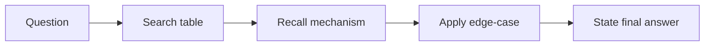

# Chapter 18: Revision Cheat Sheet

## Why This Matters

A compact sheet improves recall under pressure.

## Learning Objectives

- Review core concepts quickly.
- Tie theory to likely interview prompts.
- Spot cross-topic relationships.

## Core Concept

This chapter is a fast-recall layer for the first 18 chapters and should be used before and after coding sessions.

## Internal Working

Use the tables as a retrieval map: identify a keyword, then recall the mechanism and a production tie-in.

## Architecture or Memory Diagram

## Code Example

[Code Example 1 in detail (external file)](../examples/java/volume-01-java-fundamentals/18-revision-cheat-sheet-01.java)

## Step-by-Step Execution

1. Select a topic you are weak on.
2. Read the cheat table row.
3. Reconstruct the mechanism from memory.
4. Validate with one worked interview style example.

## Interviewer Perspective

Interviewers test retention and transfer, not only understanding. Revision sheets should help you retrieve answers with confidence under pressure.

## Common Mistakes

- Reading a sheet passively without retrieval attempts.
- Ignoring production trade-offs while memorizing terms.
- Confusing similar concepts (JMM vs synchronization, JIT vs interpreter).

## Production Perspective

Translate every row into a practical symptom: slow startup, latency spikes, memory growth, visibility bugs.

## Must Know for DSA

Use this sheet to connect primitives, loops, recursion, collections, and memory constraints with algorithmic trade-offs.

## Cheat Sheet Tables

| Topic | Core points | Interview focus |
|---|---|---|
| JDK vs JRE vs JVM | JDK builds/runs, JRE runs, JVM executes bytecode | Runtime ownership and deployment |
| JVM Architecture | Class loading, data areas, execution engine, GC threads | Explain startup/throughput/latency |
| Class loading | Bootstrap, platform, app + delegation | CNFE / NoClassDefFoundError |
| Heap vs Stack | Heap shared objects, stack is frame-based | Memory bug debugging |
| JIT | Interpreter + compiler tiers + warm-up | Performance behavior |
| GC | Young/old, roots, minor/full, stop-the-world | Latency and retention reasoning |
| JMM | Volatile, happens-before, synchronized | Concurrency correctness |
| Primitives | Width/range/overflow | Correctness in arithmetic |
| Operators | Precedence and short-circuit | Conditions and guards |
| Strings | Immutable, StringBuilder/Buffer | Concatenation efficiency |
| Arrays | Indexing and memory layout | Off-by-one and speed |
| Collections | List/Set/Map trade-offs | API and algorithm design |
| Pitfalls | `==` on wrappers, unboxing NPE, loops, recursion overflow | Common interviews traps |

## Quick revision by area

### Execution model
- Source -> bytecode -> class loading/linking -> interpretation/JIT -> execution.
- Warm-up affects first-run latency.

### JVM internals
- Three loader levels with parent-first delegation.
- Execution engine tiers and code cache behavior.

### Memory and GC
- Thread stack and shared heap.
- Minor GC for young gen; full GC for broad cleanup.
- GC tuning by footprint, allocation, pause goal.

### Concurrency
- Volatile guarantees visibility and ordering, not atomicity.
- Happens-before through synchronized/volatile/thread start/join.

### Java core coding
- Prefer explicit complexity in each solution.
- Keep null and boundary checks explicit.
- Choose collections by operation profile.

## Final one-page checklist

- [ ] Can explain JVM execution and class loading.
- [ ] Can explain stack-heap behavior in interviews.
- [ ] Can compare two collectors in one sentence.
- [ ] Can answer one concurrency visibility question confidently.
- [ ] Can implement at least five warm-up exercises from memory.

## Interview Questions and Answers

- **Question:** How would you summarize your JVM revision in 60 seconds?
  - **Answer:** Start with execution pipeline, then memory model, then one GC and one DSA example.
- **Question:** What is the most common interview follow-up for these topics?
  - **Answer:** "When does this fail in production?" and concrete mitigations.

## Practice Exercises

1. Convert this cheat sheet into oral recall cards.
2. For each row, write one production incident that matches.

## Revision Checklist

- [ ] Complete all rows once without references.
- [ ] Add one production tie-in per row.
- [ ] Record weak rows and rework them after 48 hours.

## One-Page Summary

Use this sheet as a decision map: mechanism → symptom → trade-off.
