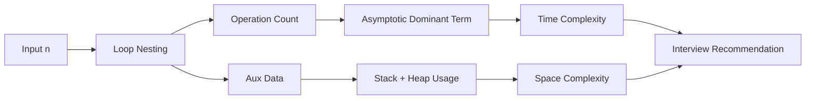

# Chapter 1: Time and Space Analysis Framework

## Why This Matters

Interviewers often ask for an algorithm and then challenge you on why a naïve idea is too slow. Correct complexity analysis proves you can predict behavior without running code.

## Learning Objectives

- Convert nested loops, recursion, and data structure operations into tight Big-O expressions.
- Distinguish asymptotic complexity from absolute runtime.
- Model memory growth from local variables, recursion depth, and auxiliary data structures.
- Explain best/average/worst cases with example-driven trade-offs.
- Translate complexity language into architecture-aware recommendations.

## Core Concept

Algorithm complexity uses input size `n` as a variable and expresses growth as `n` changes.

- **Big-O**: upper bound (never slower than this beyond some point).
- **Omega**: lower bound.
- **Theta**: both same order.

In interviews, Big-O dominates unless the prompt explicitly asks for average-case analysis.

A practical way to reason: count *dominant operations* and *dominating memory*:

- If runtime is `n^2 + 10n + 7`, the dominant term is `n^2`.
- For nested loops, multiply loop ranges (careful with shrinking ranges).
- For recursion, derive recurrence relations, then solve using expansion or Master Theorem.

## Internal Working

Complexity calculation is not guessing; it is a deterministic walk over control flow:

1. Identify base operations (assignments, comparisons, map lookups, recursive calls).
2. Expand loops and recursive tree branches into symbolic counts.
3. Drop constants and lower-order terms for asymptotic simplification.
4. Check edge cases where early exit reduces effective runtime.

## Architecture or Memory Diagram

## Code Example

[Code Example 1 in detail (external file)](https://github.com/vinayreddykalluri/SDE2-Interview-Handbook/blob/master/examples/java/src/main/java/io/github/vinayreddykalluri/interviewhandbook/volume02/ComplexityDemo.java)

## Step-by-Step Execution

1. Outer loop runs `n` times.
2. Inner loop runs an average of `n/2` times, so total about `n^2/2`.
3. Multiplication by constants (`/2`, assignments, comparisons) does not change asymptotics.
4. Dominant term becomes `O(n^2)`; space stays `O(1)`.

## Interviewer Perspective

Common follow-ups:

- "Could there be a better average-case bound?" -> mention input ordering and branch conditions.
- "What if memory is constrained?" -> state space reduction options and streaming alternatives.
- "Why not call it O(n^2) in the worst case and O(n) best case?" -> discuss when early break/conditions happen.

## Common Mistakes

- Treating each line as constant-time when it is not (e.g., hash table resizing, recursion).
- Forgetting recursion stack in space.
- Ignoring non-polynomial operations hidden in library calls.
- Confusing input size with input value (a DP with value-based loops can be pseudo-polynomial).

## Production Perspective

In production, complexity informs capacity planning:

- `O(n^2)` on `n=100k` is a latency risk regardless of constants.
- Space blowups (`O(n^2)`) can trigger GC pressure and tail latency.
- Average-case intuition must not override explicit worst-case SLAs.

## Must Know for DSA

Map every solution to:

- Time complexity bound
- Space complexity bound
- Why those bounds hold under the specific constraints

That is the difference between writing code and explaining it under pressure.

## Interview Questions and Answers

- **Q: Why is `O(n^2)` bad for n=1e5 but maybe okay for n=500?**
  - **Answer:** Complexity is growth-based; fixed thresholds matter for real workloads.
  - **Follow-up:** Mention where micro-constraints can justify lower-priority optimization.
- **Q: What is the space complexity of recursion-based merge sort?**
  - **Answer:** `O(log n)` recursion stack plus `O(n)` auxiliary in common implementations.
- **Q: How do you explain amortized cost?**
  - **Answer:** Spread occasional expensive operations across many cheap operations to get average per operation.

## Practice Exercises

1. For each loop, derive exact operation counts and then simplify.
2. Find space complexity of nested DFS recursion with visited set.
3. Convert two algorithm snippets (`HashMap`-heavy and two-loop) into Big-O statements.
4. Compare `O(n^2)` vs `O(n log n)` for `n=1000` and `n=1,000,000` and report growth factor.

## Revision Checklist

- [ ] Can explain difference between Big-O, Omega, and Theta.
- [ ] Can derive recurrence for recursion and solve it quickly.
- [ ] Can report both best/average/worst cases correctly.
- [ ] Can map memory cost to stack, heap, and auxiliary buffers.

## One-Page Summary

Use the operation-count method, simplify to dominant behavior, and state trade-offs clearly: if interviewers hear `O(n log n)` and `O(log n)` memory, they already know you are thinking at SDE-2 depth.
