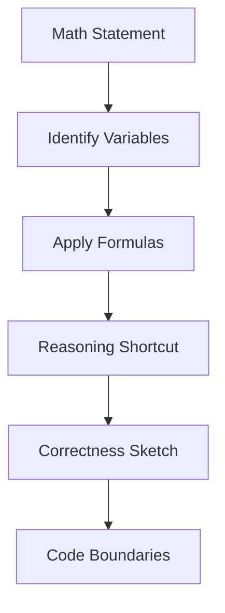

# Chapter 1: Math Foundations for Algorithms

## Why This Matters

Many interview problems look like implementation exercises but are mostly math-structured decompositions of constraints, counting, or modulo behavior.

## Learning Objectives

- Apply Euclid’s algorithm and modular arithmetic confidently.
- Use combinations and permutations for counting states.
- Use number theory checks (gcd, divisibility, parity) in problem pruning.
- Estimate probabilities in random-selection or hashing-style scenarios.

## Core Concept

Three recurring themes:

1. **Divisibility and modular arithmetic**: `a % m` partitions integers into classes.
2. **Combinatorics**: counting valid choices (`nCk`) and arrangements.
3. **GCD/LCM and prime checks**: foundational for reduced complexity and correctness conditions.

A common interview pattern is identifying upper bounds with math formulas before coding.

## Internal Working

For algorithmic problems:

- Determine whether exact counts are needed or only a relation.
- Reduce repeated constraints with modulo operations.
- Convert nested iteration constraints to closed-form counts.
- Use gcd-based simplifications when periodicity or pair reduction appears.

## Architecture or Memory Diagram

## Code Example

[Code Example 1 in detail (external file)](../examples/java/volume-03-math-fundamentals/01-math-foundations-01.java)

## Step-by-Step Execution

1. Read constraints and identify mathematical invariants.
2. Simplify with GCD, modulo, or combinatorial reduction.
3. Avoid over-iterating; replace loops with direct formulas when possible.
4. Validate formula with boundary samples (`n=0`, `n=1`, small n).

## Interviewer Perspective

Expect questions like:
- "Can this be solved without simulating all states?"
- "Where does overflow happen in combinatorial formulas?"
- "Can you justify modulo when value is huge?"

Strong responses mention domain simplification, bounds checks, and safe arithmetic strategy.

## Common Mistakes

- Using floating math for integer exactness.
- Ignoring overflow when using factorial-based formulas.
- Forgetting long casts for large intermediate values.
- Applying probability assumptions without independence clarity.

## Production Perspective

Math correctness influences production risk:

- Hash partitioning and load balancing rely on modular consistency.
- Recommendation engines and counters depend on probabilistic reasoning for confidence bounds.

## Must Know for DSA

If you can reason with formulas early, you avoid unnecessary loops and get both correctness and efficiency.

## Interview Questions and Answers

- **Q: Why is Euclid faster than brute factoring?**
  - **Answer:** It repeatedly reduces to smaller remainders (`O(log min(a,b))`).
- **Q: Why use long in combinatorics?**
  - **Answer:** to avoid intermediate overflow before final divisibility reduction.
- **Q: Is modulo distribution over addition always safe?**
  - **Answer:** Yes, `(a+b) mod m` can be reduced stepwise due to associativity.

## Practice Exercises

1. Implement gcd and prove loop termination.
2. Compute combinations for a small board placement problem without brute force.
3. Identify which parts of a candidate formula can overflow.
4. Use modular arithmetic to solve a circular indexing bug.

## Revision Checklist

- [ ] Can do `gcd` and modular reduction in interview speed.
- [ ] Can explain why factorial overflow is avoided.
- [ ] Can translate counting constraints to formulas.
- [ ] Can check edge cases for small n before optimization.

## One-Page Summary

Math-heavy interviews test your ability to compress search space mathematically. Precision with formulas is a direct path to simpler, faster, safer code.
