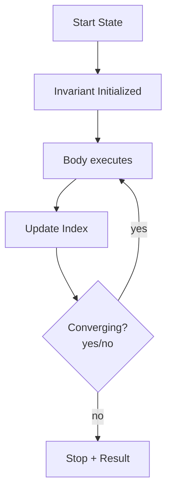

# Chapter 1: Loop Patterns and Pitfalls

## Why This Matters

In interviews, loops are where correctness mistakes and complexity bugs are introduced. Loop mastery means you can reason about behavior, proof, and termination confidently.

## Learning Objectives

- Build loop invariants and use them in correctness proofs.
- Choose between `for`, `while`, and nested loops based on readability and boundaries.
- Use two-pointer movement and step-size changes correctly.
- Analyze runtime from loop invariants.
- Avoid infinite loops and off-by-one errors.

## Core Concept

A loop is not just repetition; it is a contract between index updates and invariant preservation. Typical interview questions rely on:

- Boundary-safe traversal.
- Controlled loop convergence.
- Short-circuit opportunities.

Your explanation should include what invariant is true at start, every iteration, and at termination.

## Internal Working

1. Establish initialization that satisfies invariant.
2. Execute body preserving invariant.
3. Prove monotonic progress (index moves closer to stop condition).
4. Exit when termination condition guarantees required result.

## Architecture or Memory Diagram

## Code Example

[Code Example 1 in detail (external file)](https://github.com/vinayreddykalluri/SDE2-Interview-Handbook/blob/master/examples/java/src/main/java/io/github/vinayreddykalluri/interviewhandbook/volume04/LoopPatterns.java)

## Step-by-Step Execution

1. `i` starts at 0 and invariant: all indices `< i` are non-positive.
2. Each pass checks one index.
3. If positive found, return immediately with proof that first index is correct.
4. If loop ends, all checked and invariant implies none positive.

## Interviewer Perspective

Follow-up often checks termination proof:
- "Why won’t this loop run forever?"
- "What is the invariant at each step?"
- "How do you avoid off-by-one?"

Answer with explicit boundary and invariant language.

## Common Mistakes

- Forgetting loop variable updates.
- Using strict vs non-strict bounds incorrectly.
- Mutating collections while iterating without safe iterators.
- Ignoring integer overflow in index arithmetic.

## Production Perspective

Loop-heavy backend code can be hot-path expensive; invariants help optimize safely and avoid accidental O(n^2) degradations.

## Must Know for DSA

Every complexity discussion starts with the outer loop count and whether inner loop length changes.

## Interview Questions and Answers

- **Q: Why do some loops need `while (l < r)` instead of `<=`?**
  - **Answer:** To avoid processing crossed pointers and duplicate/invalid comparisons.
- **Q: How do you prove termination in while-based scans?**
  - **Answer:** Show loop variable strictly decreases or increases each step.
- **Q: Can a `continue` improve complexity?**
  - **Answer:** It can improve clarity and skip expensive steps but not asymptotic cost.

## Practice Exercises

1. Rewrite a triple loop as two nested loops if constraints allow.
2. Correct off-by-one for range sum prefix generation.
3. Replace recursion with an explicit loop and state invariants.
4. Add early break proof to a scanning task.

## Revision Checklist

- [ ] Can write loop invariants for any interview loop.
- [ ] Can explain initialization, maintenance, termination.
- [ ] Can state exact loop bound complexity.
- [ ] Can spot infinite and skipped-iteration bugs quickly.

## One-Page Summary

Loop mastery is the bridge between syntax and proof. State invariants clearly and you can both solve and explain every scanning/iteration task.
