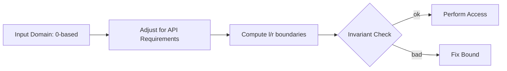

# Chapter 1: Indexing and Offset Reasoning

## Why This Matters

Most coding mistakes in arrays and strings are boundary mistakes. Mastering offsets lets you reason with confidence across 0-based arrays, 1-based external APIs, and matrix flattening.

## Learning Objectives

- Convert between 0-based and 1-based indexing safely.
- Build correct start/end boundaries for subarrays and windows.
- Use prefix formulas for index remapping in flattened grids.
- Prevent off-by-one regressions in iterative loops.

## Core Concept

Most indexing tasks can be expressed with half-open intervals:

- `[l, r)` means inclusive start, exclusive end.
- Length formula: `len = r - l`.

This convention avoids many edge bugs for slicing and prefix-based formulas.

## Internal Working

1. Define interval convention before coding.
2. Ensure update rules keep boundaries monotonic.
3. Validate invariant on empty interval (`l == r`).
4. Convert results to expected output representation only at the end.

## Architecture or Memory Diagram

## Code Example

[Code Example 1 in detail (external file)](https://github.com/vinayreddykalluri/SDE2-Interview-Handbook/blob/master/examples/java/src/main/java/io/github/vinayreddykalluri/interviewhandbook/volume05/Indexing.java)

## Step-by-Step Execution

1. Keep `l` and `r` as exclusive/inclusive depending on your contract.
2. For each access, ensure `0 <= i < nums.length`.
3. At loop condition `i < r`, index `r` is never accessed.
4. Return result only when boundaries are validated.

## Interviewer Perspective

Interviewers check:
- Why use half-open intervals?
- How do you handle empty and single-element windows?
- Can you prove `r` never overflows during increments?

## Common Mistakes

- Treating prefix sum formula as 1-based in 0-based arrays.
- Using `<=` when using `[l, r)` semantics.
- Forgetting bounds when flattening 2D arrays.

## Production Perspective

Index correctness prevents runtime errors and subtle data corruption in high-frequency loops and streaming parsers.

## Must Know for DSA

Correct indexing often converts a problem from 2D confusion into direct arithmetic.

## Interview Questions and Answers

- **Q: Why prefer `[l, r)` over `[l, r]`?**
  - **Answer:** avoids special handling for single-index and empty ranges.
- **Q: How do you detect overflow in `mid = (l+r)/2`?**
  - **Answer:** use `mid = l + (r - l) / 2`.
- **Q: When flattening matrix `(i,j)` to index `k`, what is k?**
  - **Answer:** `k = i * cols + j` with row-major indexing.

## Practice Exercises

1. Rewrite an off-by-one bug in a sliding window helper.
2. Convert inclusive range pseudocode to exclusive range and test with edge cases.
3. Implement both 0-based and 1-based binary search helpers.

## Revision Checklist

- [ ] Use one indexing convention per function.
- [ ] Validate boundaries before array access.
- [ ] Use stable middle computation.
- [ ] Can convert between 1D and 2D index maps.

## One-Page Summary

Indexing discipline is a high-leverage interview trait: clear interval definitions plus tested boundaries avoid the most common production and coding test failures.
