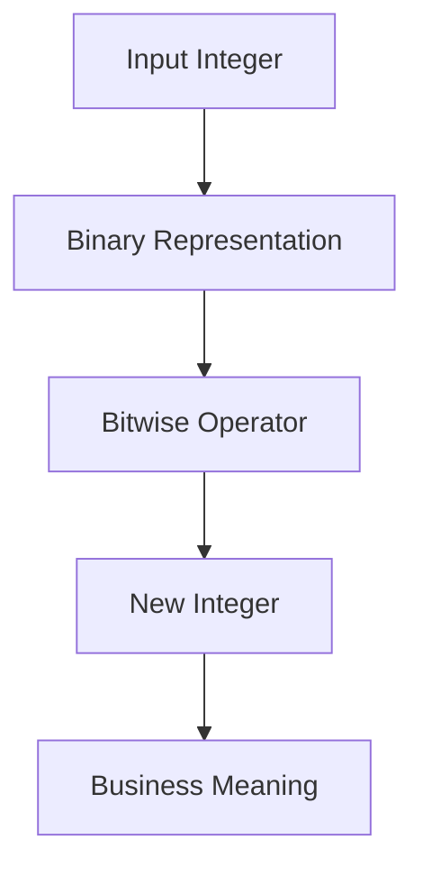

# Chapter 1: Bitwise Fundamentals and Patterns

## Why This Matters

Bit manipulation questions assess comfort with low-level representations, constant-factor tricks, and concise state compression.

## Learning Objectives

- Use `&`, `|`, `^`, `~`, `<<`, `>>`, `>>>` correctly.
- Turn parity, uniqueness, and power-of-two checks into concise checks.
- Count bits and manipulate masks for subsets.
- Handle negative numbers with Java signed-shift semantics.

## Core Concept

Java integers are two’s-complement 32-bit signed values. Bitwise operators work per bit and allow compact checks:

- power of two: `(x & (x - 1)) == 0`
- odd/even: `(x & 1) == 1`
- mask toggling and subset iteration via bit operations

## Internal Working

Use bit operations where algebraic alternatives are slower or more complex:

1. Choose a mask representing state.
2. Apply operator for test or mutation.
3. Convert back to logical meaning with explicit assertions and examples.

## Architecture or Memory Diagram

## Code Example

[Code Example 1 in detail (external file)](../examples/java/volume-06-bit-manipulation/01-bitwise-cookbook-01.java)

## Step-by-Step Execution

1. For power-of-two check, `x-1` flips all trailing zeros and rightmost 1.
2. AND with original clears exactly one bit when `x` has a single 1.
3. For toggle, XOR flips one bit position.
4. Return value interpreted against expected mask semantics.

## Interviewer Perspective

Expect "can you do this in O(1)?" follow-ups and negative-number clarifications.

## Common Mistakes

- Using bit tricks without checking constraints on integer range.
- Confusing arithmetic right shift `>>` with unsigned `>>>`.
- Forgetting that `int` is fixed width.

## Production Perspective

Bit operations improve hot-path performance in routing, permissions, and protocol flags when readability remains acceptable.

## Must Know for DSA

Most bit manipulation questions map to constants and state checks and can become trivial once you see the mask model.

## Interview Questions and Answers

- **Q: Why is `x > 0` required in power-of-two check?**
  - **Answer:** Negative numbers and zero break the property.
- **Q: What does `1 << 31` do?**
  - **Answer:** sets sign bit and becomes negative in int.
- **Q: Can XOR both set and clear a bit?**
  - **Answer:** XOR toggles; to clear set use AND with `~mask`, to set use OR.

## Practice Exercises

1. Implement `isOdd`, `isEven`, and unique-element extractor with XOR.
2. Compute `x & -x` and explain rightmost set bit.
3. Write subset iteration for `n <= 4` and compare counts.

## Revision Checklist

- [ ] Can write `isPowerOfTwo`, toggle, set, clear bit operations.
- [ ] Understand signed/unsigned shifts.
- [ ] Can explain `x & (x - 1)` proof.
- [ ] Avoid incorrect assumptions on negative numbers.

## One-Page Summary

Bit tricks are not magic. They are compact arithmetic over fixed-width integers, best used with explicit invariants and boundary checks.
