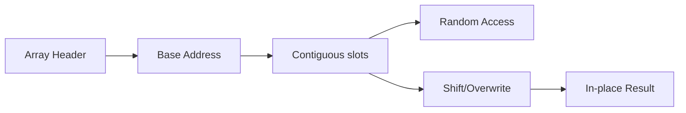

# Chapter 1: Array Mental Model

## Why This Matters

Most interview solutions depend on contiguous storage assumptions and constant-time indexed access. Without this model, optimization discussions become inaccurate.

## Learning Objectives

- Explain contiguous memory and cache locality.
- Build in-place algorithms with constant auxiliary space.
- Reason about mutation safety while retaining order constraints.
- Use two-pointer and partition patterns on arrays.

## Core Concept

An array stores fixed-size elements contiguously. Random access uses index arithmetic; insert/delete from middle are expensive unless moving elements.

Common operations:
- Traversal: O(n)
- Access by index: O(1)
- Search without sorting: O(n)

## Internal Working

Model operations as pointer/index moves over a linear memory region:

1. Validate input length and bounds.
2. Apply transformation in place when order and memory constraints allow.
3. Preserve required invariants (e.g., stable/unstable partition).

## Architecture or Memory Diagram



## Code Example

```java
public class ArrayOps {
    public static void moveZeroes(int[] nums) {
        int write = 0;
        for (int x : nums) {
            if (x != 0) nums[write++] = x;
        }
        while (write < nums.length) nums[write++] = 0;
    }
}
```

## Step-by-Step Execution

1. Scan once and place non-zero values at the `write` position.
2. After scan, suffix is filled with zeros.
3. No new arrays created; space remains O(1).

## Interviewer Perspective

They may ask about stability, one-pass behavior, and whether additional memory is needed.

## Common Mistakes

- Mutating while iterating forward with overlap confusion.
- Forgetting to validate length for write pointer pattern.
- Breaking relative order when order-preserving behavior was required.

## Production Perspective

Array scans and in-place compaction reduce allocations in performance-sensitive services with high request throughput.

## Must Know for DSA

In-place, O(1)-extra-space patterns are expected in many interview coding rounds for array optimization.

## Interview Questions and Answers

- **Q: Why is moving zeros one-pass?**
  - **Answer:** each element processed once and placed deterministically.
- **Q: How to keep order?**
  - **Answer:** this method preserves order by copying only non-zero elements in sequence.
- **Q: Can this be `O(1)`?**
  - **Answer:** yes, writes happen in-place with constant pointers.

## Practice Exercises

1. Implement duplicate removal in sorted array preserving one instance.
2. Rotate array with in-place reversal approach.
3. Detect and fix duplicate index bug in in-place partitioning.

## Revision Checklist

- [ ] Distinguish O(1) random access from O(n) insertion.
- [ ] Explain cache effects of contiguous data.
- [ ] Write in-place two-pass and one-pass patterns.
- [ ] Mention stability constraints explicitly.

## One-Page Summary

Think arrays as linear memory with predictable access patterns and explicit mutation plans. This perspective gives you both optimal complexity and safe correctness arguments.
