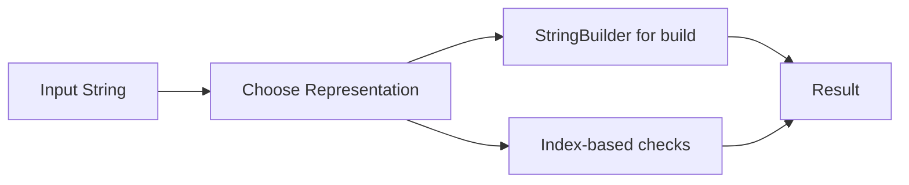

# Chapter 1: String Internals and Processing Patterns

## Why This Matters

Java strings are immutable references with copied semantics in operations. Interviewers check if you can combine algorithmic reasoning with immutable data behavior.

## Learning Objectives

- Understand `String`, `StringBuilder`, and mutable alternatives.
- Analyze palindrome, prefix/suffix, and sliding-window string algorithms.
- Avoid O(n^2) accidental copies.
- Handle Unicode and indexing with clear assumptions.

## Core Concept

In Java, `String` operations like concatenation inside loops can create many temporary objects. Use mutable builders when transformations are incremental.

Pattern choices:
- Compare-based transformations: direct two-pointer traversal.
- Building dynamic results: `StringBuilder`.
- Membership checks: hash set / array frequency.

## Internal Working

1. Choose mutable vs immutable representation early.
2. Precompute helper structures when needed (frequency or prefix).
3. Minimize repeated substring/object creation.
4. Return canonical format with validated boundaries.

## Architecture or Memory Diagram

## Code Example

[Code Example 1 in detail (external file)](https://github.com/vinayreddykalluri/SDE2-Interview-Handbook/blob/master/examples/java/src/main/java/io/github/vinayreddykalluri/interviewhandbook/volume08/StringPatterns.java)

## Step-by-Step Execution

1. Normalize input whitespace.
2. Split to words.
3. Iterate reverse order and rebuild with builder.
4. Return final concatenation with controlled delimiters.

## Interviewer Perspective

Expect trade-off questions:
- "When should I use `StringBuilder`?"
- "What is the cost of repeated concatenation?"
- "Can Unicode change indexing assumptions?"

## Common Mistakes

- Using `+` concatenation in loops.
- Assuming fixed-width characters for all code points.
- Ignoring trailing/leading whitespace constraints.

## Production Perspective

Text parsing pipelines are hot in ingest and indexing paths; mutable buffers and linear passes reduce allocations.

## Must Know for DSA

Most string interview problems reward choosing the right storage and avoiding quadratic rebuilds.

## Interview Questions and Answers

- **Q: Is `split` always safe for large strings?**
  - **Answer:** it allocates an array and regex overhead; for large inputs prefer manual parse.
- **Q: Why choose `StringBuilder`?**
  - **Answer:** linear-time amortized append without repeated temporary strings.
- **Q: Can immutability help correctness?**
  - **Answer:** yes, it removes aliasing bugs but at allocation cost.

## Practice Exercises

1. Reverse words without using `split`.
2. Check if a string is rotation of another using concatenation insight.
3. Implement `isPalindrome` for ASCII letters ignoring punctuation.

## Revision Checklist

- [ ] Explain immutability vs mutable builder choice.
- [ ] Choose linear-time traversal with preallocation.
- [ ] Handle corner-case whitespaces.
- [ ] Avoid unnecessary intermediate strings.

## One-Page Summary

String mastery means balancing readability, immutability safety, and allocation-aware design.
