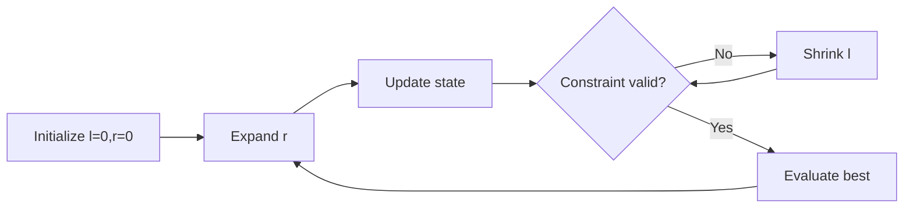

# Chapter 1: Sliding Window Framework

## Why This Matters

Sliding window is a standard interview technique for subarray, substring, and stream-like optimization problems.

## Learning Objectives

- Differentiate fixed-size and variable-size windows.
- Maintain counters incrementally while window boundaries move.
- Detect when to shrink, expand, or reset window.
- Analyze both time and space complexity of windowed solutions.

## Core Concept

A window is a contiguous segment with two boundaries `l` and `r`.

- **Fixed size**: known window length `k`.
- **Variable size**: adjust based on constraint (sum, unique chars, max distinct).

By updating a running state, each element is typically processed once.

## Internal Working

1. Expand `r` and include new value.
2. Update aggregate state.
3. While constraint violated, increment `l` and decrement state.
4. Check answer candidate at valid states.

## Architecture or Memory Diagram

## Code Example

[Code Example 1 in detail (external file)](https://github.com/vinayreddykalluri/SDE2-Interview-Handbook/blob/master/examples/java/src/main/java/io/github/vinayreddykalluri/interviewhandbook/volume10/SlidingWindow.java)

## Step-by-Step Execution

1. Expand right pointer and insert current element.
2. Remove from left until window again satisfies unique constraint.
3. Update maximum length with current valid window size.

## Interviewer Perspective

Focus on proof and boundary correctness:
- Why each element enters/leaves limited times.
- How `while` loop ensures validity.
- Why this is O(n).

## Common Mistakes

- Forgetting to remove counts on `while` shrink step.
- Off-by-one when calculating length (`r-l+1` vs `r-l`).
- Using hash operations inside nested loops unnecessarily.

## Production Perspective

Window techniques apply to rate-limits and streaming validations; they reduce CPU and memory under real-time constraints.

## Must Know for DSA

Most interview window solutions are direct applications of stateful two-end updates and constraint check cycles.

## Interview Questions and Answers

- **Q: Why linear despite nested loops?**
  - **Answer:** each pointer moves forward at most n times.
- **Q: How to choose variable vs fixed window?**
  - **Answer:** if target size known, fixed is simpler; if constraint-driven, variable needed.
- **Q: What data structure updates state?**
  - **Answer:** counters/hash map/set for O(1) updates.

## Practice Exercises

1. Longest subarray with sum <= K using prefix and shrink.
2. Longest substring with at most 2 distinct chars.
3. Count windows with exactly K odd numbers.

## Revision Checklist

- [ ] Can write two-pointer window pseudocode quickly.
- [ ] Keep validity invariant after each shrink.
- [ ] Compute window size formulas exactly.
- [ ] Show O(n) pointer-advance argument.

## One-Page Summary

A reliable sliding-window solution is boundary-safe, state-efficient, and explainable by pointer monotonicity.
