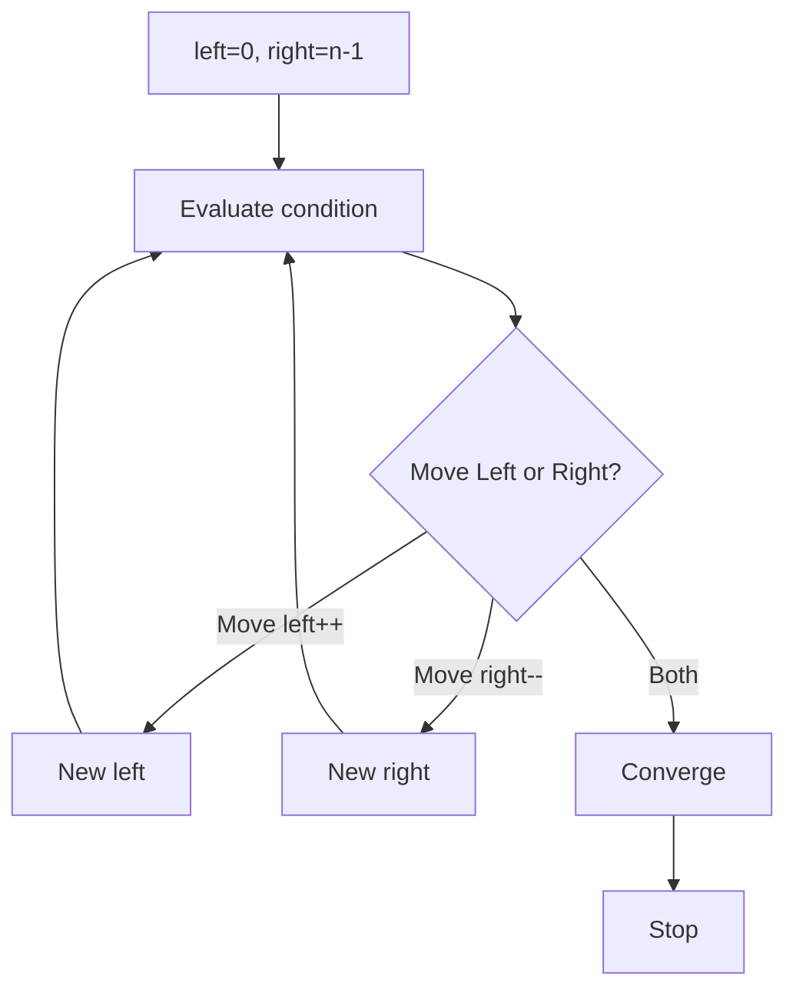

# Chapter 1: Two-Pointer Patterns and Correctness

## Why This Matters

Two-pointer is a frequent baseline for in-place and linear-time optimization. It also demonstrates reasoning discipline.

## Learning Objectives

- Distinguish opposing-end vs same-direction pointers.
- Preserve invariants with each move.
- Handle collisions/overlap correctly.
- Convert two-pointer patterns to O(1) extra space solutions.

## Core Concept

Common forms:
- Opposite ends for sorted pairs/sums.
- Slow-fast for duplicate removal.
- Front-back expansion for palindrome-like checks.

The core principle is monotonic movement: pointers only move forward (or inward), never backward in standard forms.

## Internal Working

1. Initialize pointer states.
2. Evaluate condition at current pair/state.
3. Move one or both pointers by proof-driven rules.
4. Maintain invariant and stop when they cross.

## Architecture or Memory Diagram

## Code Example

[Code Example 1 in detail (external file)](../examples/java/volume-11-two-pointers/01-two-pointers-patterns-01.java)

## Step-by-Step Execution

1. Start sorted array at both ends.
2. Sum boundary values and compare to target.
3. Move inward from side that increases chance of reaching target.
4. Repeat until valid pair found or pointers cross.

## Interviewer Perspective

Often asked:
- "Why sorted first?" and "Why move only one pointer at a time?"

A clear response ties to monotonic sum behavior.

## Common Mistakes

- Moving both pointers without proof.
- Not sorting when required by algorithm assumptions.
- Using wrong termination condition.

## Production Perspective

Two-pointer avoids extra space and fits high-throughput tasks like dedup checks and partition operations.

## Must Know for DSA

Two-pointer is often a cleaner constant-space alternative to hash-heavy solutions.

## Interview Questions and Answers

- **Q: Can this be O(n) with unsorted data?**
  - **Answer:** no, this form assumes sorting for monotonic progression.
- **Q: Why cannot pointer skip random steps?**
  - **Answer:** may skip candidates and break correctness.
- **Q: What is invariant at any time?**
  - **Answer:** all pairs outside current range cannot satisfy current target condition after movement rule.

## Practice Exercises

1. Move zeroes with two pointers without order changes.
2. Check palindrome after preprocessing with only O(1) space.
3. Implement remove duplicates from sorted array with l/r.

## Revision Checklist

- [ ] Choose pointer movement rule based on invariant.
- [ ] Provide termination proof.
- [ ] State space complexity as O(1).
- [ ] Mention sorting prerequisite when applicable.

## One-Page Summary

Two-pointer is a movement proof game: monotonicity gives correctness and linear complexity.
