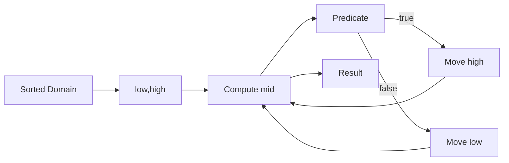

# Chapter 1: Binary Search Framework

## Why This Matters

Binary search is one of the most tested patterns due to its generality in sorted-array and monotonic predicate tasks.

## Learning Objectives

- Implement classic and lower-bound/upper-bound variants.
- Avoid overflow in midpoint calculation.
- Solve search-on-answer problems.
- Handle boundary conditions with clean loop invariants.

## Core Concept

Binary search narrows range by comparing midpoint to a target condition.

- Standard search: compare with exact target.
- Lower bound: first position satisfying predicate.
- Search on answer: predicate returns feasibility monotonic over domain.

## Internal Working

1. Maintain search interval `[l, r]` (inclusive) or `[l, r)` (exclusive).
2. Calculate `mid = l + (r - l) / 2`.
3. Keep half interval using condition outcome.
4. Converge to target or insertion position.

## Architecture or Memory Diagram

## Code Example

[Code Example 1 in detail (external file)](https://github.com/vinayreddykalluri/SDE2-Interview-Handbook/blob/master/examples/java/src/main/java/io/github/vinayreddykalluri/interviewhandbook/volume13/BinarySearch.java)

## Step-by-Step Execution

1. Start with full range.
2. Recompute middle safely to avoid overflow.
3. Move left/right boundary based on comparison.
4. Return first index with `nums[i] >= target`.

## Interviewer Perspective

They check if you can adapt generic search logic to:
- exact key
- first/last occurrence
- monotonic feasibility (counting, resource allocation)

## Common Mistakes

- Mixing inclusive/exclusive boundaries.
- Forgetting to adjust one bound correctly leading to infinite loops.
- Returning wrong index when all values < target.

## Production Perspective

Binary search is used in service configurations (rate caps, thresholds) where monotonic assumptions are explicit.

## Must Know for DSA

This pattern is a standard baseline for optimization and search tasks. Correct boundary handling is key.

## Interview Questions and Answers

- **Q: Why `mid = l + (r-l)/2`?**
  - **Answer:** prevents integer overflow from `(l+r)/2`.
- **Q: How do you know which search space is right?**
  - **Answer:** keep invariant: answer always in current interval.
- **Q: What is upper-bound search style?**
  - **Answer:** return first index where condition is false/true depending on contract.

## Practice Exercises

1. Implement exact search, lower bound, and upper bound.
2. Solve minimum capacity with feasibility predicate.
3. Find peak element in an array using binary approach.

## Revision Checklist

- [ ] Choose interval convention and stay consistent.
- [ ] Compute mid safely.
- [ ] Handle empty and single-element arrays.
- [ ] State loop invariant explicitly.

## One-Page Summary

Binary search compresses decision space by half each step; correctness is purely an invariant discipline problem.
