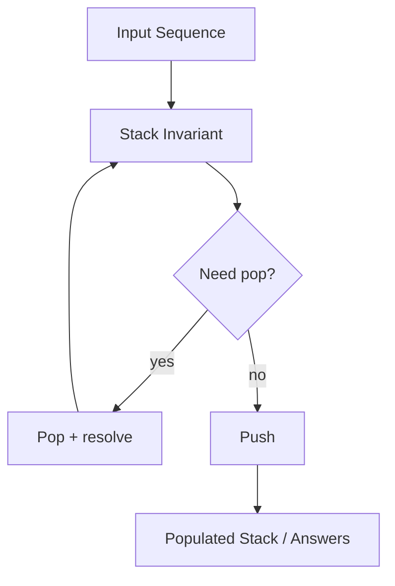

# Chapter 1: Stack and Recursion Mapping

## Why This Matters

Stacks are the first-choice model for matching delimiters, evaluating expressions, and replicating recursion behavior in iterative form.

## Learning Objectives

- Use LIFO behavior for parsing problems.
- Simulate recursion with explicit stack where recursion depth is constrained.
- Build monotonic stack solutions for next-greater queries.
- Estimate amortized complexity of push/pop operations.

## Core Concept

A stack supports:
- `push` at top
- `pop` from top
- `peek` top inspection

Monotonic stacks maintain increasing/decreasing order to support fast previous/next greater lookups.

## Internal Working

1. On each element, pop while invariant is violated.
2. The top maintains ordered candidates.
3. Push current element; maybe use answers from popped elements.
4. Repeat through sequence.

## Architecture or Memory Diagram



## Code Example

```java
import java.util.ArrayDeque;

public class StackPatterns {
    public static boolean isBalanced(String s) {
        ArrayDeque<Character> st = new ArrayDeque<>();
        for (char ch : s.toCharArray()) {
            if (ch == '(' || ch == '{' || ch == '[') st.push(ch);
            else {
                if (st.isEmpty()) return false;
                char p = st.pop();
                if ((ch == ')' && p != '(') || (ch == '}' && p != '{') || (ch == ']' && p != '[')) {
                    return false;
                }
            }
        }
        return st.isEmpty();
    }
}
```

## Step-by-Step Execution

1. Push opening brackets with expected closing pairing.
2. For each closing bracket, pop and validate.
3. Any mismatch fails.
4. Balanced only if stack empty at end.

## Interviewer Perspective

Interviewers test invariants:
- "What does stack store at each step?"
- "Why this is O(n)?"

Answer by bounded pushes/pops (each element pushed/popped once).

## Common Mistakes

- Using `Stack` class instead of `ArrayDeque`.
- Forgetting empty checks before pop.
- Not verifying final empty state.

## Production Perspective

Stacks model parser contexts, undo logic, and navigation histories where LIFO semantics are natural.

## Must Know for DSA

Monotonic stack appears in many stock/span and histogram problems.

## Interview Questions and Answers

- **Q: Why is this O(n)?**
  - **Answer:** each element pushed and popped at most once.
- **Q: Can we solve this recursively?**
  - **Answer:** yes, but iterative avoids call-stack limits.
- **Q: Why pop loop?**
  - **Answer:** maintains monotonic invariant for efficient nearest greater answers.

## Practice Exercises

1. Implement next greater element.
2. Convert recursive DFS to iterative using explicit stack.
3. Validate parentheses with any bracket types.

## Revision Checklist

- [ ] Explain LIFO and invariant.
- [ ] Use `ArrayDeque` in Java.
- [ ] Include empty/edge-case checks.
- [ ] Analyze each element pop/push count.

## One-Page Summary

Stacks capture nested and directional constraints efficiently, especially when each element contributes limited times.
