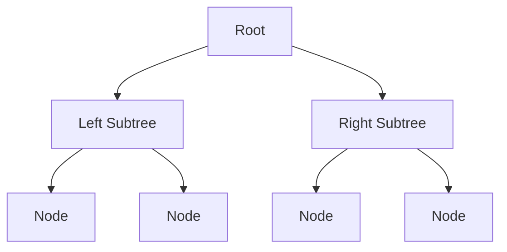

# Chapter 1: Tree Mental Model and Traversals

## Why This Matters

Tree questions appear in almost every SDE-2 round because they test recursive thinking, state propagation, and balance-aware logic.

## Learning Objectives

- Differentiate preorder/inorder/postorder/level-order.
- Trace recursive state with depth, path sums, and subtree properties.
- Evaluate BST and balanced-tree constraints.
- Understand iterative alternatives.

## Core Concept

A tree node has children and recursive decomposition:

- Traversal order encodes when parent/children are processed.
- DFS recursion is natural for subtree aggregation.
- BFS (queue) is natural for level-wise processing.

## Internal Working

1. Base case on `null`.
2. Recurse/iterate children with state passed down.
3. Combine sub-results and return to parent.
4. Apply constraints for valid BST/order checks.

## Architecture or Memory Diagram

## Code Example

[Code Example 1 in detail (external file)](../examples/java/volume-17-trees/01-trees-and-recursive-structure-01.java)

## Step-by-Step Execution

1. On each node, compute left and right depths.
2. Return `1 + max(left, right)`.
3. Base case returns 0 at null.
4. Final value is tree height in nodes.

## Interviewer Perspective

They ask proof questions:
- "What is recursion complexity?"
- "Can you do iterative DFS if recursion is disallowed?"

You should explain visit count and stack depth.

## Common Mistakes

- Confusing node count vs edge count in depth definitions.
- Not handling unbalanced recursion depth and stack limits.
- Mishandling null checks.

## Production Perspective

Tree traversals model hierarchical permissions, org charts, and nested resources.

## Must Know for DSA

Depth-first and breadth-first patterns are foundational and repeatedly reused with dynamic programming on trees.

## Interview Questions and Answers

- **Q: Why recursion can stack overflow?**
  - **Answer:** deep skewed trees can reach O(n) depth.
- **Q: Why BST search is O(h)?**
  - **Answer:** one branch per comparison, where `h` is height.
- **Q: How to make traversal iterative?**
  - **Answer:** use explicit stack or queue and push children in order.

## Practice Exercises

1. Compute diameter with one DFS pass.
2. Validate BST with lower/upper bounds.
3. Perform level order with queue.

## Revision Checklist

- [ ] Explain traversal semantics clearly.
- [ ] Mention base case and combine step in recursion.
- [ ] Differentiate node depth vs edge depth.
- [ ] Understand balanced vs skewed complexity.

## One-Page Summary

Tree correctness depends on clean recursive decomposition and explicit base cases. Traversal order maps directly to solution strategy.
