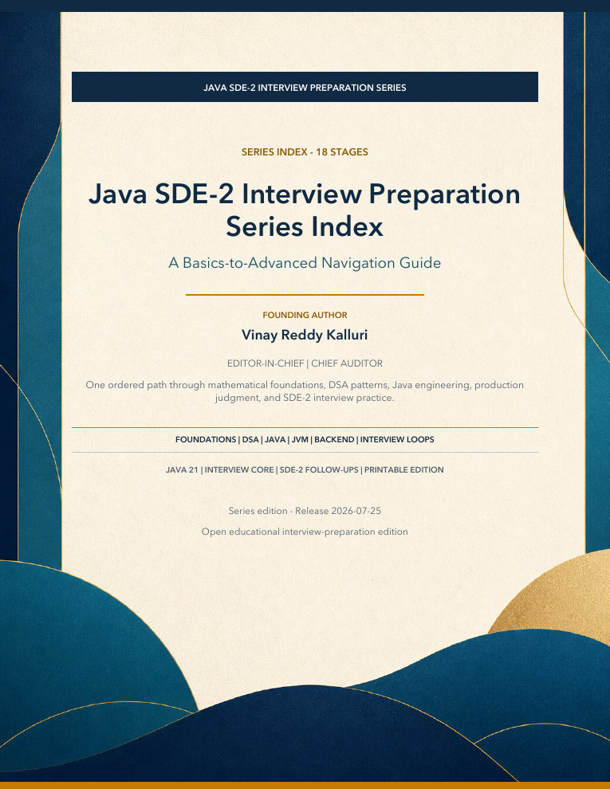

# Java SDE-2 Interview Preparation Series

[](https://openjdk.org/projects/jdk/21/)
[](../../LICENSE-CONTENT.md)
[](../../LICENSE)
[](https://github.com/vinayreddykalluri/SDE2-Interview-Handbook/releases/latest)

This is the canonical book workspace inside the consolidated [SDE2 Interview Handbook](https://github.com/vinayreddykalluri/SDE2-Interview-Handbook). It contains the editable Markdown, Java 21 companions, diagrams, publishing configuration, validation evidence, and reviewed release PDFs.

[](dist/Java-SDE2-Interview-Preparation-Series-Index.pdf)

> Choose Java Engineering, Data Structures and Algorithms, or System Design and Backend. Start at Book 01 inside that segment and continue in order.

## Read or download

The library contains 40 focused books (2,386 pages), one 17-page series index, and one 616-page master book: 42 PDFs and 3,019 pages in total. Eleven clearly marked roadmap editions establish the sequence and intended depth for topics that will be expanded one by one. JAVA 02 - Git and GitHub is now a 127-page publication edition with executable labs and interview simulations.

- [Download the complete release](https://github.com/vinayreddykalluri/SDE2-Interview-Handbook/releases/latest)
- [Open the series index](dist/Java-SDE2-Interview-Preparation-Series-Index.pdf)
- [Open the complete individual-PDF reading order](dist/00-START-HERE.md)
- [Start with Java Foundations](dist/Java-SDE2-DSA-03-Java-Foundations-for-Problem-Solving.pdf)
- [Continue to Time and Space Complexity](dist/Java-SDE2-DSA-02-Time-and-Space-Complexity.pdf)
- [Study Number Systems](dist/Java-SDE2-DSA-01-Number-Systems-and-Math-Foundations.pdf)
- [Open the Number Systems workbook](dist/Java-SDE2-DSA-01B-Number-Systems-Interview-Workbook.pdf)
- [Study Bit Manipulation](dist/Java-SDE2-DSA-04-Bit-Manipulation-in-Java.pdf)
- [Study Loop Mastery](dist/Java-SDE2-DSA-05-Loop-Mastery-and-Index-Calculations.pdf)
- [Study Arrays](dist/Java-SDE2-DSA-06-Arrays-and-Array-Patterns.pdf)
- [Study Strings](dist/Java-SDE2-DSA-07-Strings-and-String-Patterns.pdf)
- [Open the complete master book](dist/java-sde2-interview-book.pdf)

The three segment sequences, prerequisites, and completion gates are in [the series roadmap](docs/roadmap.md). To create actual segment-prefixed folders containing all 42 PDFs, see [PDF library organization](docs/pdf-library-organization.md) or run `python3 scripts/organize_pdf_library.py`.

## Directory map

```text
.
|-- content/
|   |-- master/             Master-book chapters and appendices
|   +-- volumes/            Focused books with chapters, exercises, solutions, code, and assets
|-- examples/java/          Maven-based Java 21 examples used by the master book
|-- assets/
|   |-- covers/             Reader-facing cover previews
|   +-- diagrams/           Reproducible master-book diagrams
|-- publishing/
|   |-- series.json         Canonical learning order and physical-PDF manifest
|   +-- assets/             Shared publishing artwork
|-- dist/                   Reviewed PDFs, master DOCX/Markdown, and integrity manifest
|-- reports/                Audits, coverage, validation, build evidence, and change logs
|-- docs/                   Editorial standard and series roadmap
|-- scripts/                Existing build, diagram, validation, and visual-QA tools
|-- CHANGELOG.md            Release-level changes
+-- README.md               This entry point
```

The three Java locations have distinct ownership:

- repository examples under [`../../examples/java/`](../../examples/java/) support the searchable website;
- [`examples/java/`](examples/java/) validates the master book as a Java 21 project; and
- `content/volumes/<volume>/code/` keeps a focused standalone companion beside the book that publishes it.

Do not copy a class between those locations merely to make it easier to find. Link to the canonical implementation or deliberately adapt it for a different educational contract.

## Build

Create a Python environment and install `requirements.txt`, then run the existing publishing commands:

```bash
python3 scripts/build_series.py
python3 scripts/build_series.py --volume 05 --skip-index
python3 scripts/generate_diagrams.py
python3 scripts/build_book.py
python3 scripts/organize_pdf_library.py --check
```

Generated working directories remain under ignored `build/`, `tmp/`, and `output/` paths. Reviewed release artifacts are written to `dist/`.

## Validate

```bash
python3 scripts/validate_book.py --source-only
python3 scripts/validate_series.py --source-only
python3 scripts/qa_semantic_layout.py
```

Compile the master-book Java project:

```bash
mkdir -p examples/java/build/classes
find examples/java/src/main/java -name '*.java' -print0 \
  | xargs -0 javac --release 21 -Xlint:all -Werror -d examples/java/build/classes
java -cp examples/java/build/classes com.interviewbook.examples.AllExamplesSmokeTest
```

## Contribute

Repository-wide policies are canonical; the book workspace does not maintain competing copies.

- [Contribution guide](../../.github/CONTRIBUTING.md)
- [Authors and individual credit](../../docs/community/authors.md)
- [Governance](../../docs/community/governance.md)
- [Code of Conduct](../../.github/CODE_OF_CONDUCT.md)
- [Security policy](../../.github/SECURITY.md)
- [Support](../../.github/SUPPORT.md)
- [Citation metadata](../../CITATION.cff)
- [Content license](../../LICENSE-CONTENT.md) and [code license](../../LICENSE)

Useful contributions include accuracy corrections, prerequisite-first rewrites, runnable edge cases, diagrams, exercises, solution explanations, accessibility improvements, and PDF layout reports. Start from a `help wanted`, `good first issue`, or `book` issue so parallel work stays coordinated.

The current expansion campaign is tracked in [issue #27](https://github.com/vinayreddykalluri/SDE2-Interview-Handbook/issues/27). Individual issues [#16](https://github.com/vinayreddykalluri/SDE2-Interview-Handbook/issues/16) through [#26](https://github.com/vinayreddykalluri/SDE2-Interview-Handbook/issues/26) cover Strings, Hashing, Recursion, Linked Lists, Stacks and Queues, Binary Search, Trees, Heaps, Graphs, Greedy, and Dynamic Programming.

## Editorial responsibility

Vinay Reddy Kalluri is the series creator, founding author, Editor-in-Chief, and Chief Auditor. Individual contributors retain credit for accepted original work through the [repository authorship record](../../docs/community/authors.md), Git history, and pull requests.
