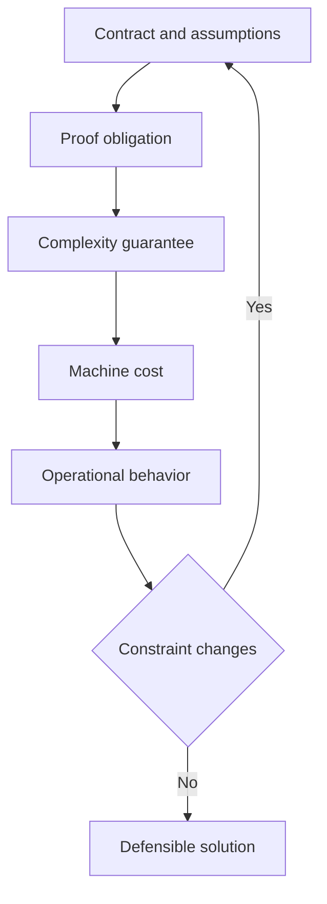
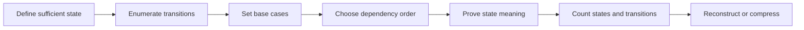

# Advanced Review: Algorithms and Performance

Advanced preparation is not a contest to memorize obscure algorithms. It is the ability to defend a solution when an interviewer asks why it works, how its guarantees were derived, and what happens when the operating model changes.

<nav class="module-flow" aria-label="Programming problem solving modules">
  <a class="module-flow__link" href="../">Overview</a>
  <a class="module-flow__link" href="../problem-solving-framework/">Framework</a>
  <a class="module-flow__link" href="../patterns-and-performance/">Patterns</a>
  <a class="module-flow__link" href="../advanced-review/" aria-current="page">Advanced</a>
  <a class="module-flow__link" href="../#compilable-java-examples">Java examples</a>
</nav>

!!! abstract "SDE-2 depth standard"
    Move fluently between four layers: contract, correctness proof, complexity guarantee, and machine or production behavior. State which layer each claim belongs to.

## Advanced reasoning map

## Correctness proof toolkit

Choose the proof technique that matches the algorithm's irreversible decision.

| Technique | Use when | Proof structure | Frequent mistake |
| --- | --- | --- | --- |
| Loop invariant | Iterative state evolves through bounded transitions | Initialization, maintenance, termination, result | Stating a goal instead of a repeated property |
| Induction | Recursive or indexed states depend on smaller states | Base case, inductive hypothesis, inductive step | Assuming the exact claim that must be proved |
| Strong induction | A state depends on several smaller states | Assume all prior cases, prove the next | Failing to establish a well-founded order |
| Contradiction | An ignored candidate or alternative is claimed impossible | Assume a better counterexample exists, derive conflict | Contradiction does not use the algorithm's assumptions |
| Exchange argument | Greedy choice should appear in some optimum | Replace the first differing choice without worsening value | Exchange breaks feasibility or changes later options |
| Staying ahead | Greedy partial solution should dominate every competitor | Compare prefixes after every decision | Comparing only final totals |
| Cut or cycle property | Graph choice separates processed and unprocessed structure | Show a safe minimum crossing edge or removable maximum cycle edge | Applying MST logic to shortest paths |
| Monotone predicate | Search removes half of an ordered answer domain | Prove one-direction truth transition and preserved bounds | Testing examples instead of proving monotonicity |
| Potential function | Expensive operations are paid by accumulated cheap work | Define non-negative potential and bound amortized cost | Choosing a potential unrelated to future expense |

### Proof review checklist

- Are all assumptions stated, including positivity, acyclicity, uniqueness, or non-negative weights?
- Is the invariant tied to a precise program point?
- Does every branch preserve it?
- Is there a bounded progress measure?
- Does termination plus the invariant imply the exact tie and output rule?
- Does the proof cover failure or no-solution behavior?

## Amortized analysis

Amortized analysis bounds a sequence of operations without assuming a probability distribution. A single operation may still be expensive.

### Dynamic-array example

Suppose capacity starts at 1 and doubles whenever full. Across `n` appends:

- Each append performs one element write, for `n` writes total.
- Resize copies form `1 + 2 + 4 + ...`, whose sum is less than `2n`.
- Total work is therefore less than a constant multiple of `n`.

The sequence costs `O(n)`, so append is `O(1)` amortized. The particular append that triggers a resize remains `O(n)` worst-case.

### Three valid methods

| Method | Idea | Useful when |
| --- | --- | --- |
| Aggregate | Bound total cost of `n` operations, then divide by `n` | Expansion schedules and simple sequences |
| Accounting | Charge cheap operations extra credit that pays future expensive work | Stack variants and deferred cleanup |
| Potential | Track stored work using a non-negative potential function | State-dependent structures and more complex sequences |

!!! warning "Amortized is not average-case"
    Average-case analysis depends on an input distribution. Amortized analysis provides a sequence guarantee and uses no randomness.

## Randomization and probabilistic guarantees

State what is random and what kind of guarantee is claimed.

| Algorithm or structure | Guarantee to communicate | Adversarial concern |
| --- | --- | --- |
| Randomized quickselect | Expected linear time over pivot randomness; quadratic worst case | Consistently unbalanced partitions |
| Hash table | Expected constant lookup under suitable hashing and load assumptions | Collision-heavy keys, poor equality, resizing spikes |
| Reservoir sampling | Uniform sample of fixed size from a stream of unknown length | Incorrect replacement probability biases the sample |
| Bloom filter | No false negatives after standard inserts; false positives are possible | Saturation raises false-positive rate; deletion needs a different design |

"Expected `O(n)`" is not the same as "always `O(n)`." For reliability-sensitive paths, discuss tail probability, deterministic alternatives, or input hardening.

## Lower bounds and impossibility intuition

Advanced reasoning includes recognizing when the target cannot be reached under the model.

- Comparison-based sorting requires `Omega(n log n)` comparisons in the general case because a decision tree must distinguish `n!` orders.
- Materializing `k` outputs requires at least `Omega(k)` output work.
- Exact answers over an unbounded stream may require state proportional to the distinct information retained.
- A single pass with sublinear memory cannot solve every exact frequency or ordering problem without additional assumptions.

Use lower bounds carefully. Counting sort can beat comparison sorting because it uses bounded integer keys, a stronger model.

## Streaming and approximation

Streaming changes the contract from "all data is available" to "events arrive over time, often in one pass, with bounded state."

Ask four questions:

1. Is one pass required?
2. How much state may grow with input or key cardinality?
3. Must the answer be exact?
4. Is the query needed continuously or only at the end?

| Technique | Answers | Memory shape | Guarantee |
| --- | --- | --- | --- |
| Reservoir sampling | Uniform sample from unknown-length stream | `O(k)` | Exact uniform inclusion probability when implemented correctly |
| Bloom filter | Approximate membership | Fixed bit array | False positives possible; standard form has no false negatives |
| Count-Min Sketch | Approximate item frequency | Fixed counters by error target | Overestimates with probabilistic additive-error bound |
| HyperLogLog | Approximate distinct count | Fixed register set | Probabilistic relative-error estimate |
| Misra-Gries | Frequent-item candidates | `O(k)` counters | Every item above the configured frequency threshold is retained as a candidate |

Approximation is operationally better when the exact state is too large and the business contract can express error, confidence, and bias. "Approximately correct" without those terms is not a specification.

## Binary search on the answer

Optimization problems can become decision problems.

For candidate value `x`, define a feasibility predicate `P(x)`. Then prove:

1. `P(x)` is computable within the required cost.
2. Feasibility is monotone: for example, once capacity `x` is sufficient, every larger capacity is sufficient.
3. Initial bounds contain the transition.
4. Interval updates preserve the answer and strictly shrink the domain.
5. The final index matches minimum-feasible or maximum-feasible semantics.

The total cost is `O(cost(P) * log(domain size))`. Include numeric-domain width, not only input length, and calculate the midpoint without overflow.

## Dynamic programming as dependency design

Dynamic programming applies when subproblems repeat and a state can summarize all history relevant to future decisions.

### DP design checklist

1. **State meaning:** write one sentence defining exactly what `dp[state]` returns.
2. **Sufficiency:** prove two histories mapped to the same state have identical future options.
3. **Transition completeness:** every valid solution is represented by some transition.
4. **Transition safety:** every transition produces a valid candidate.
5. **Base cases:** cover states with no remaining decision.
6. **Order:** evaluate dependencies before consumers, explicitly or through memoized recursion.
7. **Answer location:** identify which state or aggregate answers the original contract.
8. **Complexity:** count reachable states and work per state.
9. **Reconstruction:** retain parent choices if the actual solution, not only its value, is required.
10. **Compression:** discard history only when no future transition reads it.

### Minimal-state test

Try removing each state component. If two prefixes with different future possibilities collapse into one key, that component is necessary. If future transitions and result are unchanged, it may be redundant.

Memoization does not repair an invalid state definition. It only caches the wrong recurrence faster.

## Greedy and backtracking depth

### Greedy proof choices

- **Exchange:** transform an optimal solution to use the greedy choice without worsening it.
- **Staying ahead:** after each step, the greedy prefix is no worse than any competing prefix.
- **Cut property:** the selected element is safe across a partition of the remaining problem.
- **Dominance:** one partial state is never worse and is at least as flexible as another.

If none of these can be established, retain alternatives with DP, search, or another representation.

### Backtracking correctness

A backtracking solver needs two distinct arguments:

1. The choice tree generates every valid candidate exactly as required by the contract.
2. Each pruning rule is sound: every removed branch is impossible or cannot beat the incumbent.

Ordering promising choices first can improve observed runtime but does not change worst-case complexity. Branch and bound needs a valid optimistic bound; an aggressive guess can silently remove the optimum.

## Concurrency reasoning

Concurrency is a contract change, not a decorator applied to a sequential algorithm.

| Concept | Precise meaning | Interview evidence |
| --- | --- | --- |
| Race condition | Correctness depends on an uncontrolled interleaving | Show the conflicting reads and writes |
| Atomicity | An operation appears indivisible with respect to relevant observers | Identify the state transition that must not be split |
| Linearizability | Each operation appears to occur at one instant between invocation and response | Name a valid linearization point for every path |
| Safety | Nothing bad happens, such as violating a data invariant | State the invariant protected across threads |
| Liveness | Something good eventually happens, such as completion or progress | Discuss deadlock, starvation, and retry behavior |
| Lock-free | System-wide progress is guaranteed | One thread may still starve |
| Wait-free | Every operation completes in a bounded number of its own steps | Stronger and usually more expensive than lock-free |
| Ownership | One thread or partition is responsible for mutable state | Can remove sharing and simplify proof |

### Linearization-point exercise

For a concurrent operation, identify:

- The exact read, write, compare-and-set, or locked transition at which the result takes effect.
- Why operations can be ordered consistently around that point.
- What happens on retry, timeout, cancellation, and failure paths.

Atomic fields do not automatically protect a compound invariant across multiple fields. Conversely, adding one global lock may preserve safety while destroying useful concurrency or causing tail-latency spikes.

## Practical performance investigation

Performance claims should be measured as hypotheses, not asserted from style preferences.

### Experiment protocol

1. Define the claim and workload, such as primitive array scan versus boxed collection scan at specific sizes.
2. Confirm both implementations have identical observable behavior.
3. Use representative data distributions, including skew and worst-shape cases.
4. For JVM microbenchmarks, use JMH with warmup, multiple measurement iterations, and appropriate forks.
5. Ensure results are consumed so dead-code elimination cannot remove the work.
6. Measure allocation as well as elapsed time when representation differs.
7. Report a distribution or confidence information, not one stopwatch sample.
8. Profile before attributing the difference to CPU, GC, cache, locking, or I/O.
9. Record JVM, hardware, flags, input generation, and benchmark configuration.

### Interpretation checklist

- Did JIT compilation or class loading contaminate early measurements?
- Is the benchmark measuring setup or the target operation?
- Did the faster version change semantics, ordering, or precision?
- Is throughput hiding p95 or p99 latency?
- Does allocation move cost into later garbage collection?
- Is the observed difference large enough to matter at production scale?

## Adversarial robustness review

Before calling a solution production-aware, test the assumptions most likely to fail under hostile or skewed input.

| Risk | Example consequence | Mitigation discussion |
| --- | --- | --- |
| Collision-heavy keys | Hash operations degrade and latency becomes uneven | Key design, hashing assumptions, alternate ordered structure |
| Deep chain | Recursive traversal overflows stack | Iterative traversal or explicit depth control |
| Numeric overflow | Ordering, count, or distance silently becomes invalid | Derived bounds, wider type, checked arithmetic when required |
| Duplicate-heavy data | State growth or tie behavior differs from unique samples | Explicit equality and deduplication contract |
| Dense graph | `O(V + E)` approaches quadratic in `V` | Representation and memory budget |
| Skewed partition | One worker or bucket dominates tail latency | Better partitioning, work stealing, hot-key strategy |
| Unbounded queue | Load becomes memory exhaustion | Capacity, backpressure, rejection, or shedding policy |

## Constraint transformation drills

Take one solved problem and apply each transformation without looking at the prior answer.

| Transformation | Required analysis |
| --- | --- |
| Batch to stream | Identify future information, state growth, and exactness trade-off |
| Exact to approximate | Define error, confidence, bias, and operational benefit |
| Positive to signed values | Re-check monotonicity and discarded-candidate proof |
| Static to update-heavy | Re-evaluate preprocessing and dynamic data structures |
| Single-threaded to concurrent | Define ownership, atomic operation, and linearization point |
| Average to tail-sensitive | Identify skew, worst case, allocation spikes, and contention |
| Memory-rich to bounded memory | Separate essential state from recomputable or approximate state |

## Retrieval questions with answer standard

| Question | A complete answer must include |
| --- | --- |
| When does sliding window fail despite a contiguous range? | The missing monotone boundary property and a concrete signed-value counterexample |
| How do you prove a greedy choice is safe? | A named proof structure, usually exchange or staying ahead, preserving feasibility and value |
| What distinguishes amortized from average-case cost? | Sequence guarantee without probability versus expectation under a distribution |
| How can a nested loop still be `O(n)`? | A global bound on monotone pointer movement or per-element transitions |
| When is BFS a shortest-path algorithm? | Unweighted or equal-weight edges and FIFO frontier distance order |
| Why can DP state compression fail? | A future transition still depends on discarded history |
| Where is the linearization point? | One atomic event between invocation and response for every operation path |
| When is approximation better than exactness? | Bounded resources plus an explicit error/confidence contract that meets the use case |
| Why is one benchmark number weak evidence? | Warmup, variance, dead-code elimination, workload, allocation, and environment concerns |
| How do you detect hidden quadratic work? | Count copies, immutable concatenations, repeated scans, rebalancing, and transitions per element |

## Advanced mock rubric

Score each area from 0 to 2.

| Area | 0 - missing | 1 - developing | 2 - strong SDE-2 |
| --- | --- | --- | --- |
| Proof | Examples only | Informal invariant | Complete proof tied to contract |
| Complexity | Big-O guess | Correct primary bound | Case, derivation, space, and lower-bound awareness |
| Pattern judgment | Template recall | Correct choice | Choice plus rejection and invalidation conditions |
| Adaptation | Patches old code | Finds broken assumption | Re-derives state and guarantee cleanly |
| Java performance | No practical model | Names one implementation cost | Connects representation, allocation, locality, and tail behavior |
| Reliability | Happy path | Adds edge cases | Tests adversarial input and failure semantics |
| Concurrency or streaming | Adds tools mechanically | Understands basic change | Defines new contract, guarantees, and bounded state |

Target at least 12 out of 14 with no zero before treating this stage as complete.

## Exit criteria

You have completed advanced review when you can:

- Solve two unseen medium problems in 70 minutes and prove both.
- Derive an amortized bound without calling it average-case.
- Convert an optimization problem into a monotone decision problem when appropriate.
- Define a minimal DP state and justify its evaluation order and compression.
- Explain one exact-to-approximate streaming redesign with an error contract.
- Identify the linearization point and progress guarantee in a concurrent follow-up.
- Design a credible Java performance experiment and reject misleading benchmark evidence.
- Explain how adversarial or skewed input changes correctness, complexity, or tail behavior.

**Return to:** [Programming Problem Solving stage overview](index.md).
