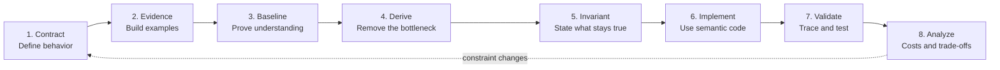

# 01. Programming Problem Solving

Programming interviews test engineering judgment under a time limit, not syntax recall. A strong SDE-2 candidate converts an ambiguous prompt into a precise contract, derives an algorithm from constraints, explains why it is correct, implements it cleanly, and adapts when the interviewer changes an assumption.

!!! abstract "Stage outcome"
    You should be able to solve an unfamiliar medium problem in 35 minutes while making your reasoning inspectable. The interviewer should hear the contract, baseline, bottleneck, selected pattern, invariant, validation plan, and trade-offs before having to ask for them.

## The complete solving loop

The loop is deliberately circular. A changed constraint can invalidate the representation, invariant, or complexity target, so return to the contract instead of patching the existing solution blindly.

## What an SDE-2 coding round measures

| Dimension | What strong performance looks like | Common weak signal |
| --- | --- | --- |
| Contract control | Clarifies valid input, output semantics, ties, mutation, scale, and failure behavior | Starts coding while behavior is still ambiguous |
| Algorithmic derivation | Begins with a correct baseline and removes a named source of repeated work | Announces a memorized pattern from a keyword |
| Correctness | States an invariant or other proof argument and connects it to the result | Relies only on sample cases |
| Implementation quality | Uses cohesive state, precise names, safe arithmetic, and small logical steps | Produces clever code that is difficult to audit |
| Validation | Traces adversarial cases and tests boundaries derived from the contract | Says "it should work" after one happy path |
| Cost analysis | Distinguishes worst, expected, amortized, auxiliary, and output costs | Recites Big-O without deriving it |
| Adaptability | Re-evaluates assumptions when data shape, memory, latency, or concurrency changes | Forces the original pattern onto a new contract |
| Communication | Narrates decisions and risks without waiting for interviewer rescue | Is silent while coding or narrates every keystroke |

## Stage map

| Module | Core question | Durable output |
| --- | --- | --- |
| [Problem-solving framework](problem-solving-framework.md) | How do I control an unfamiliar problem from prompt to proof? | A repeatable 35-minute interview script and correctness checklist |
| [Patterns and performance](patterns-and-performance.md) | Which representation and invariant fit these constraints? | A constraint-to-pattern decision map with rejection rules |
| [Advanced review](advanced-review.md) | Can I defend the solution under deeper theory and production follow-ups? | A proof, performance, streaming, and concurrency review sheet |
| [Coding foundations](../../volume-02-time-space-complexity/) | Where do I refresh a specific data structure or algorithm mechanic? | Focused implementation drills from the concept library |

## A practical 35-minute operating model

This is a budget, not a rigid script. Spend more time clarifying when the contract is risky and more time validating when implementation is complex.

| Time | Activity | What must be visible to the interviewer |
| --- | --- | --- |
| 0-4 minutes | Clarify the contract | Assumptions, output rule, scale, and one restatement |
| 4-7 minutes | Build examples and baseline | Normal, boundary, adversarial examples, and a correct direct approach |
| 7-12 minutes | Derive the target approach | Bottleneck, candidate patterns, rejection reason, chosen invariant |
| 12-25 minutes | Implement | Semantic names, controlled state, safe boundary handling |
| 25-31 minutes | Trace and test | At least one adversarial trace and a contract-driven test set |
| 31-35 minutes | Analyze and adapt | Time, space, practical costs, rejected alternative, changed constraint |

!!! tip "If implementation takes the whole round"
    The usual cause is not typing speed. It is an unresolved contract, an unnamed invariant, or state that was not designed before coding. Fix the reasoning bottleneck first.

## How to study this stage repeatedly

Use the same five-pass loop for every problem. Repetition should improve retrieval and explanation, not only increase the number of completed questions.

1. **Learn:** read the pattern's applicability conditions and invariant.
2. **Reconstruct:** close the notes and rebuild the approach from constraints.
3. **Perform:** solve under a 35-minute limit while speaking aloud.
4. **Stress:** change one assumption, such as sorted to unsorted or batch to streaming.
5. **Review:** log the first reasoning failure, not just the final coding bug.

### Review log fields

Record these after each attempt:

- Contract detail you initially missed.
- Baseline and its actual bottleneck.
- Candidate approaches considered and why one was rejected.
- Invariant or proof method used.
- First incorrect decision and its root cause.
- Edge case that exposed the mistake.
- Complexity with clearly defined variables.
- One changed constraint and the resulting design delta.
- Date for the next closed-book reconstruction.

## Required preparation portfolio

Complete at least ten fully explained solutions, distributed across the following families:

| Family | Minimum evidence |
| --- | --- |
| Linear scans and hashing | Two solutions, including duplicates or frequency state |
| Range reasoning | Two solutions across window, prefix sum, or interval sweep |
| Ordered search | One direct binary search and one monotone-answer search |
| Trees and graphs | Two solutions with explicit visited or frontier invariants |
| Selection or optimization | One heap or greedy solution and one DP or backtracking solution |
| Constraint adaptation | Two prior solutions reworked for streaming, memory, or concurrency |

Every portfolio solution must contain:

- A precise input/output contract.
- Three examples, including an adversarial one.
- A correct baseline and identified repeated work.
- The optimized derivation and invariant.
- A correctness argument.
- A trace table and boundary tests.
- Derived time and space costs.
- One rejected alternative and one changed-constraint response.

## Readiness rubric

Score each dimension from 0 to 2. A stage score of at least 12 out of 14, with no zero, is a reasonable signal to begin full mock rounds.

| Dimension | 0 - missing | 1 - partial | 2 - interview ready |
| --- | --- | --- | --- |
| Contract | Codes immediately | Clarifies some assumptions | Defines behavior, scale, ties, and mutation |
| Derivation | Guesses a pattern | Gives a baseline but weak transition | Names bottleneck and derives the optimization |
| Correctness | Uses examples as proof | States an informal idea | Gives invariant and termination argument |
| Code quality | Fragile or opaque | Mostly readable | Cohesive state, semantic names, safe boundaries |
| Validation | Happy path only | Several cases without rationale | Contract-driven tests plus adversarial trace |
| Analysis | Incorrect or memorized | Correct Big-O only | Derived cases, space categories, practical cost |
| Adaptation | Cannot revise | Revises with prompting | Re-derives from changed assumptions |

## Exit criteria

You are ready to leave this stage when you can:

- Complete two unseen medium problems in 70 minutes total.
- State the invariant before implementation for both problems.
- Find and correct your own boundary mistakes during tracing.
- Explain why at least one tempting alternative does not satisfy the constraints.
- Adapt one solution to a changed input model without restarting from a memorized answer.
- Explain one Java-specific practical cost beyond asymptotic complexity.

**Next:** [Build the end-to-end problem-solving framework](problem-solving-framework.md).
