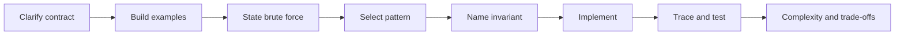

# 01. Programming Problem Solving

The coding round tests more than syntax. An SDE-2 candidate should turn ambiguity into a contract, derive an approach, protect an invariant, produce readable code, and validate it without relying on the interviewer to find mistakes.

## Coverage

- [Problem-solving framework](problem-solving-framework.md)
- [Patterns and performance](patterns-and-performance.md)
- Core handbook volumes 02-19 for complexity and data-structure mechanics

## Required artifacts

- A one-page decision tree mapping constraints to candidate patterns.
- Ten solutions with contracts, invariants, complexity, and tests.
- Two performance investigations showing why asymptotic complexity is not the entire cost model.

## Ready when

You can solve a medium problem in 35 minutes while narrating assumptions, derive rather than guess the pattern, write semantic Java, test edge cases, and adapt when one constraint changes.
