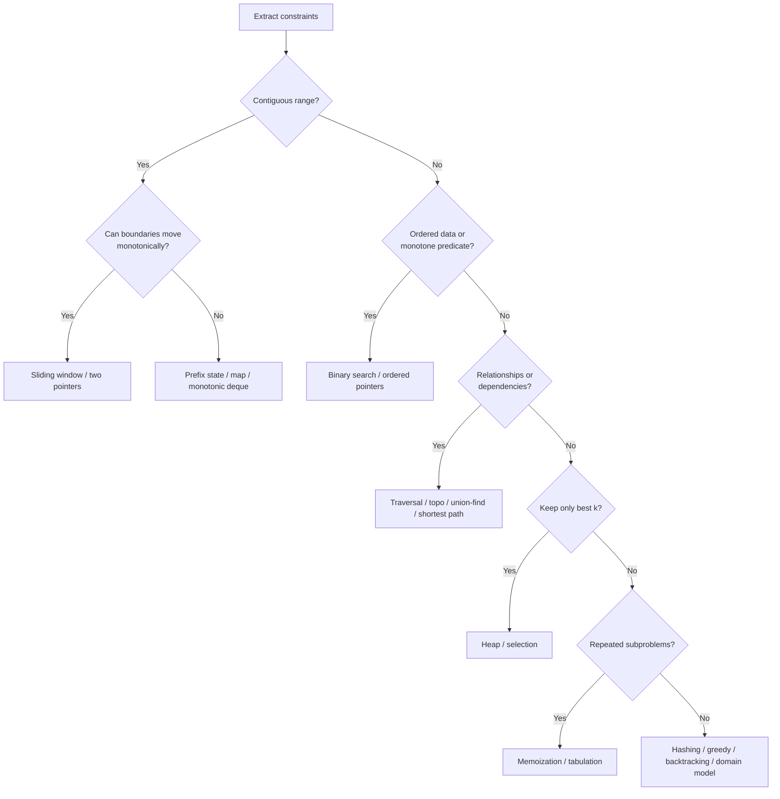

# Coding Patterns and Performance

A coding pattern is a reusable correctness structure, not a keyword-to-template mapping.

> **Pattern = state representation + invariant + transition rule + progress argument.**

Choose a pattern only when the input properties make its transitions safe. Reject it when the required invariant cannot be maintained.

## Constraint-first selection

Extract six dimensions before selecting a data structure:

1. **Shape:** sequence, contiguous range, hierarchy, graph, intervals, stream, or search space.
2. **Operation:** membership, aggregate, rank, shortest path, connectivity, enumeration, or optimization.
3. **Order:** sorted, sortable, stable, cyclic, or irrelevant.
4. **Value behavior:** positive, signed, bounded, unique, duplicated, or monotone.
5. **Workload:** one query, many queries, updates, online events, or concurrent access.
6. **Resource target:** latency, memory, output size, exactness, or implementation risk.

The following tree creates a shortlist. It does not replace proof.

## Linear and range patterns

| Pattern | Fits when | Core invariant | Reject or reconsider when |
| --- | --- | --- | --- |
| Hash set or map | Fast membership, grouping, complement lookup, frequency, last-seen state | Structure contains exactly the required facts from processed items | Order or range structure is central; memory is too constrained; key equality is unsafe |
| Two pointers | Ordered search region, partition, pair relation, or in-place compaction | Discarded region cannot contain a required or better answer | Pointer movement cannot be proved safe or data cannot be ordered |
| Fixed sliding window | Every candidate has the same contiguous length | Aggregate equals exactly the current `k` elements | Candidate lengths vary or update is not incremental |
| Variable sliding window | Expanding and shrinking changes feasibility monotonically | Current window state is exact; discarded starts never need reconsideration | Signed values or non-monotone constraints invalidate boundary movement |
| Prefix sum or count | Many immutable range queries or subarray relations can be expressed as prefix differences | Prefix at `i` summarizes exactly `[0, i)` | Updates dominate unless a dynamic range structure is added |
| Difference array | Many offline range updates followed by reconstruction | Difference entries encode boundary changes | Online point queries are needed before reconstruction |
| Binary search | Data is ordered or a Boolean feasibility predicate is monotone | The answer remains inside the maintained half-open or closed interval | Predicate can switch truth value more than once |
| Stack | Nested scopes, matching, undo, or unresolved previous work | Stack holds exactly unfinished items in valid nesting order | Processing order is not last-in-first-out |
| Monotonic stack | Nearest greater/smaller boundary or contribution range | Stack values or indices remain monotone; popped items are permanently resolved | A popped item may become relevant again |
| Deque | Both-end processing or candidates expire by position and dominance | Deque contains only unexpired, competitive candidates in order | Dominance or expiry cannot be proved |
| Sort and sweep | Intervals or events become manageable in endpoint order | Processed events have a finalized merged or active-state interpretation | Original order must remain and cannot be recovered; online updates dominate |

### Sliding window versus prefix state

These are often confused because both concern contiguous ranges.

- Use a **sliding window** when a boundary can move forward without later regret. Positivity, bounded distinct counts, or another monotone feasibility property often enables this.
- Use a **prefix representation** when the relation is algebraic, such as `prefix[j] - prefix[i]`, and valid starts cannot be discarded monotonically.
- With signed values, exact-sum subarrays often use prefix sums plus a frequency or first-position map.
- For a threshold objective with signed values, a monotonic deque may be needed to compare prefix candidates.

!!! warning "Contiguous does not imply sliding window"
    The word "subarray" identifies shape, not the algorithm. You still need a proof that expansion and shrinking preserve all candidates.

### Binary search is about monotonicity

Binary search applies to more than sorted arrays. It requires:

1. A search domain with an order.
2. A predicate `P(x)` that changes direction at most once.
3. Bounds known to contain the transition.
4. An interval update that always makes progress.
5. A postcondition that identifies the first true, last false, minimum feasible, or maximum feasible value.

State the interval convention before coding. Mixing closed `[lo, hi]` and half-open `[lo, hi)` rules is a common source of infinite loops and off-by-one errors.

## Hierarchy and graph patterns

| Pattern | Fits when | Core invariant | Critical precondition or risk |
| --- | --- | --- | --- |
| DFS | Reachability, component exploration, path state, subtree aggregation | Current path and visited state represent exactly explored depth-first work | Recursive depth can overflow; cycles require visited state |
| BFS | Minimum edge count in unweighted or equal-weight graphs; level processing | Queue holds the frontier in nondecreasing distance | Weighted edges invalidate shortest-path guarantee |
| Multi-source BFS | Distance to the nearest source under equal edge costs | All sources begin at distance zero; frontier remains distance ordered | Source initialization must be simultaneous, not sequential |
| Topological sort | Dependency ordering in a directed acyclic graph | Emitted nodes have no unresolved prerequisite | If fewer than `V` nodes are emitted, a cycle exists |
| Union-find | Incremental connectivity and component merging | Each set has one representative; finds preserve partition membership | Does not recover paths or handle arbitrary deletions naturally |
| Dijkstra | Single-source shortest paths with non-negative edge weights | A finalized minimum-distance vertex cannot later improve | Negative edges invalidate finalization |
| Minimum spanning tree | Connect all vertices with minimum total undirected edge weight | Chosen edges remain extendable to an MST under cut/cycle property | It does not solve shortest path between vertices |

### BFS versus Dijkstra

- BFS is Dijkstra specialized to equal edge cost, where a FIFO queue preserves distance order.
- Dijkstra needs a priority queue because candidate distances differ.
- Neither handles negative cycles; Dijkstra also fails with any negative edge assumption used for finalization.
- In Java's `PriorityQueue`, a common approach is to insert an improved distance and skip stale entries when removed, because there is no built-in decrease-key operation.

## Selection, search, and optimization patterns

| Pattern | Fits when | Proof obligation | Typical cost shape |
| --- | --- | --- | --- |
| Heap | Repeatedly need the current min/max or retain top `k` | Heap root is the next required item; discarded candidates cannot enter top `k` | Often `O(n log k)` with `O(k)` space |
| Quickselect | Need one rank statistic without total order | Partition places pivot in final rank and excludes one side | Expected `O(n)`, worst `O(n^2)` unless strengthened |
| Greedy | A locally best safe choice extends to a global optimum | Exchange, staying-ahead, cut, or dominance proof | Commonly sort plus scan |
| Backtracking | Need to enumerate choices under constraints | Every valid solution is reachable; pruning removes only impossible branches | Exponential in the worst case, reduced by pruning |
| Branch and bound | Optimization search has a valid optimistic bound | Prune only when a branch cannot beat the incumbent | Worst case remains exponential |
| Memoization | Recursive states repeat and dependencies can be cached | State key is sufficient; cached result has no hidden path dependence | Reachable states times transitions |
| Tabulation | State dependencies have a known evaluation order | Every dependency is computed before its consumer | Table size times transition cost |
| Binary search on answer | Feasibility changes monotonically with candidate answer | Predicate is correct and monotone | Predicate cost times logarithm of domain |
| Meet in the middle | Exponential choices split into two manageable halves | Combined half-results cover all full choices | Often around `O(2^(n/2))` time and space |

### Greedy versus dynamic programming

Both optimize over choices, but their proof obligations differ.

- A greedy algorithm commits to one choice and never revisits it. You must prove an optimal solution can be transformed to include that choice without becoming worse.
- Dynamic programming preserves multiple distinguishable states because a local choice can affect future value.
- If the only greedy justification is "it chooses the best available option," the proof is incomplete.
- If a DP state contains history that cannot affect future transitions, the state is larger than necessary.

### Heap versus sorting versus selection

| Requirement | Usually prefer | Reason |
| --- | --- | --- |
| All items in order | Sorting | Produces total order in `O(n log n)` |
| Top `k` while scanning | Size-`k` heap | Keeps only competitive candidates in `O(n log k)` |
| One kth statistic, order unnecessary | Quickselect or deterministic selection | Avoids total sorting work |
| Repeated online min/max removal | Heap | Supports incremental insert and remove |
| Small bounded value domain | Counting or buckets | Domain bound may beat comparison-based methods |

## Analyze performance with the correct vocabulary

Big-O describes growth, but the case and resource must be named.

| Term | Meaning | Example |
| --- | --- | --- |
| Worst-case | Maximum cost over inputs of a given size | Quicksort with consistently poor pivots can take `O(n^2)` |
| Average-case | Expected cost under a stated input distribution | Requires a distribution assumption |
| Expected | Expectation over algorithmic randomness or stated randomness | Randomized quickselect is expected `O(n)` |
| Amortized | Average per operation over any valid sequence, without probability | Dynamic-array append is amortized `O(1)` |
| Output-sensitive | Cost includes the number of produced results | Reporting `k` matches cannot cost less than `Omega(k)` to materialize |

Do not use "average" and "amortized" interchangeably. Amortized analysis can guarantee a sequence bound even for adversarial operation order.

## Performance beyond asymptotic complexity

A useful latency model is:

> total work = algorithmic operations + allocation and collection + memory access + copying + synchronization + I/O

Big-O intentionally hides constants and machine behavior. SDE-2 explanations should surface them when two asymptotically similar designs differ materially.

### Java-specific cost model

| Choice | Hidden cost or risk | Better reasoning |
| --- | --- | --- |
| `int[]` versus `List<Integer>` | Boxing adds objects or references, indirection, and memory pressure | Prefer primitives for fixed numeric hot paths; use collections when flexibility matters |
| `ArrayDeque` versus `LinkedList` | Linked nodes add allocation and poor locality | Prefer `ArrayDeque` for queue/deque operations unless node semantics are required |
| `HashMap` | Expected constant operations depend on hashing, load, and key equality | Use stable keys, consider capacity, and acknowledge collision behavior |
| String concatenation in a loop | Repeated immutable copies can create quadratic character work | Use `StringBuilder` when constructing incrementally |
| Recursive traversal | Call frames consume stack and can fail on deep chains | Use an explicit stack when depth is input-controlled |
| Comparator subtraction | Arithmetic overflow can reverse ordering | Use `Integer.compare` or `Long.compare` |
| `int` aggregate | Valid elements can still produce an overflowing sum or product | Derive numeric bounds and promote to `long` when required |
| Primitive sort versus boxed sort | Boxing, comparator calls, and object access change constants | Preserve semantics first, then choose the cheaper representation |
| Streams in a hot path | Pipeline and allocation behavior may obscure costs | Prefer clarity; benchmark before claiming either style is faster |
| Priority queue updates | Java has no decrease-key operation | Insert the improved entry and reject stale removals when appropriate |

!!! note "Do not cargo-cult micro-optimizations"
    A primitive array is not automatically the right design, and streams are not automatically slow. First choose a correct algorithm and representation. Measure realistic workloads before trading clarity for small constant-factor gains.

### Locality, allocation, and tail behavior

- Contiguous arrays usually use cache lines more effectively than pointer-heavy nodes.
- Allocation rate can increase garbage-collection frequency even when peak memory looks acceptable.
- Rehashing, array growth, and queue spikes can create latency outliers hidden by average time.
- Data skew can concentrate work in one bucket, partition, recursion branch, or lock.
- p95 and p99 latency may be controlled by worst-shape inputs rather than typical operation count.

## Space analysis that interviewers can trust

For every solution, separate:

| Category | Include |
| --- | --- |
| Input | Existing input and any defensive copy |
| Auxiliary | Maps, queues, DP tables, temporary buffers, recursion stack |
| Output | Returned elements or paths that the contract requires |
| Peak live | Structures alive at the same time, not just total allocated over execution |

State compression is valid only when future transitions no longer need discarded state. A rolling DP array is not correct merely because only the final row is returned.

## Concurrency changes the contract

Most coding-round algorithms should keep state local and single-threaded. If concurrent updates are introduced, re-derive the semantics.

| Question | Why it matters |
| --- | --- |
| Who owns mutation? | Partitioned or thread-confined state may remove synchronization entirely |
| What must be atomic? | A compound invariant may require more than atomic fields |
| What ordering is promised? | Event order changes observable results and reproducibility |
| Can work be partitioned? | Parallel speedup depends on independence and merge cost |
| How is pressure bounded? | An unbounded queue converts load into memory failure |
| How are cancellation and partial failure represented? | Workers need a consistent completion contract |

Lock-free does not mean wait-free, and neither automatically means faster. The [advanced review](advanced-review.md#concurrency-reasoning) covers the terminology.

## Rejection practice

For each prompt, name a tempting pattern and the condition that rejects it.

| Prompt change | Tempting choice | Required correction |
| --- | --- | --- |
| Longest threshold subarray now permits negatives | Variable window | Monotone boundary movement is lost; use prefix-based reasoning |
| Shortest path now has weights | BFS | Use Dijkstra for non-negative weights or another suitable weighted algorithm |
| Dependency graph may contain cycles | Topological order only | Detect and report a cycle when processed count is below `V` |
| Top `k` becomes all sorted values | Size-`k` heap | Sorting now matches the output requirement |
| Greedy interval choice gains weighted rewards | Earliest finish greedy | Local safety may fail; consider weighted interval DP |
| Recursive tree becomes a million-node chain | Recursive DFS | Use iterative traversal to control stack usage |

## Interview explanation template

1. "The decisive constraints are ...."
2. "Two plausible representations are ... and ...."
3. "I reject ... because its invariant depends on ...."
4. "I choose ...; the maintained state means ...."
5. "Each transition is safe because ...."
6. "The progress measure is ..., so termination follows."
7. "The algorithm costs ... in the ... case and uses ... auxiliary plus ... output space."
8. "In Java, the practical cost to watch is ...."

## Mastery checks

You are ready for advanced review when you can:

- Produce two plausible patterns for an unfamiliar prompt.
- Reject one using a failed precondition, not personal preference.
- State the winning invariant before implementation.
- Explain why a nested-looking loop may still be linear.
- Distinguish worst, expected, amortized, and output-sensitive costs.
- Name one Java representation cost and one tail-latency risk.
- Re-select the approach when one contract assumption changes.

**Next:** [Deepen proofs, optimization, streaming, concurrency, and benchmarking](advanced-review.md).
