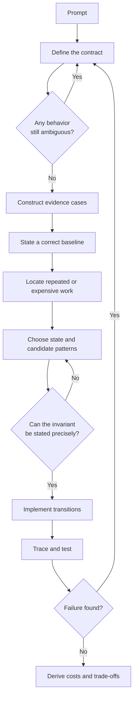
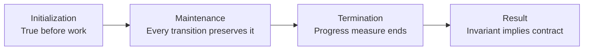

# Problem-Solving Framework

This framework is an operating system for a coding interview. It prevents premature coding, makes correctness reviewable, and gives you a controlled way to respond when requirements change.

!!! abstract "Core model"
    A complete solution is not just an algorithm. It is a contract, representation, invariant, transition, progress argument, implementation, validation plan, and cost model.

## Interview control loop

## 1. Convert the prompt into a contract

Natural-language prompts often omit details that change the correct algorithm. Clarification is not ceremony. It identifies the behavior your proof and tests must cover.

| Contract dimension | Questions to resolve | Why it changes the solution |
| --- | --- | --- |
| Input domain | Can input be empty, null, negative, duplicated, malformed, or cyclic? | Determines legal states and edge handling |
| Ordering | Is order meaningful, already sorted, or safe to reorder? | Controls whether sorting, two pointers, or binary search is valid |
| Output semantics | Return one answer, all answers, a count, indices, values, or any valid answer? | Changes state, tie handling, and output complexity |
| Ties | First, smallest, lexicographic, stable, or arbitrary? | Can invalidate an otherwise correct optimization |
| Mutation | May the input be modified? Must relative order be preserved? | Determines in-place options and auxiliary space |
| Scale | What are `n`, value bounds, memory limits, and call frequency? | Establishes a realistic complexity budget |
| Numeric behavior | Can sums, products, or index arithmetic exceed 32-bit range? | Determines types and comparison strategy |
| Failure behavior | What represents no solution? Can a valid solution be assumed? | Defines termination and result construction |

### Contract statement template

Before proposing an algorithm, say a one-sentence contract:

> Given **[valid input and constraints]**, return **[exact output and tie rule]**. I will **[preserve or mutate]** the input, use **[failure representation]** when no answer exists, and optimize for **[relevant scale or resource]**.

If the interviewer does not answer a low-risk detail, state a reasonable assumption and continue. Do not spend five minutes interrogating every hypothetical case.

## 2. Build examples as evidence

Examples expose ambiguity and falsify weak ideas. They do not prove correctness.

Construct cases deliberately:

| Case | Purpose |
| --- | --- |
| Normal | Confirms the basic interpretation of the contract |
| Smallest valid | Exposes initialization and termination errors |
| Boundary | Exercises the first or last index, capacity, or numeric limit |
| Duplicate or tie | Validates equality and output-selection rules |
| No solution | Verifies failure behavior |
| Adversarial | Attacks the assumption behind the likely optimization |

Write the expected output before tracing the algorithm. Otherwise, it is easy to change the expected result to match a faulty implementation.

## 3. State a correct baseline

The direct solution has three jobs:

1. Demonstrate that the contract is understood.
2. Provide a correctness oracle for small tests.
3. Reveal the work an optimized solution must avoid.

Do not dismiss the baseline with "brute force is `O(n^2)`." Describe exactly what it enumerates and why that enumeration is complete.

### Find the bottleneck, not a keyword

Ask which operation is repeated and whether its result can be retained or avoided.

| Repeated work | Likely representation change |
| --- | --- |
| Re-scanning for membership or frequency | Hash set or map |
| Recomputing a range aggregate | Prefix state, rolling state, or segment structure |
| Comparing ordered candidates already ruled out | Two pointers or binary search |
| Solving the same subproblem | Memoization or tabulation |
| Repeatedly finding the best remaining candidate | Heap or ordered structure |
| Exploring partial choices that are already impossible | Backtracking with sound pruning |
| Revisiting graph nodes or dependencies | Visited state, indegree, or disjoint-set state |

Optimization usually exchanges one resource for another: memory for time, preprocessing for query speed, exactness for bounded error, or simplicity for lower latency. Name the exchange.

## 4. Design state before code

Every iterative or recursive algorithm should answer five questions.

| Element | Required explanation |
| --- | --- |
| State | What information summarizes all processed work? |
| Invariant | What proposition remains true at a defined program point? |
| Transition | How does one step update state while preserving the invariant? |
| Progress measure | What strictly moves toward completion? |
| Result link | Why does the invariant imply the required output at termination? |

An invariant is not a vague intention such as "the window is valid." It must define validity precisely and identify when it holds.

### Invariant examples

- **Hash scan:** before processing index `i`, the map contains exactly the required facts from indices `[0, i)`.
- **Two pointers:** every pair outside the remaining search region has been proved incapable of improving the answer.
- **Sliding window:** at the chosen program point, the maintained aggregate equals exactly the elements in `[left, right]`, and all discarded starts are permanently irrelevant.
- **BFS:** when a vertex leaves the queue in an unweighted graph, its recorded distance is the minimum number of edges from the source.
- **Dynamic programming:** after state `s` is evaluated, it equals the optimum for the subproblem defined by `s`.

!!! warning "Invariant versus postcondition"
    "The answer is correct when the loop ends" is a postcondition, not an invariant. The invariant must hold repeatedly and explain why each transition is safe.

## 5. Prove correctness

For most interview loops, use initialization, maintenance, and termination.

### Loop-proof template

1. **Invariant:** state the proposition and the exact point where it holds.
2. **Initialization:** show it is true before the first iteration.
3. **Maintenance:** assume it is true before a step, then show every branch preserves it.
4. **Termination:** identify a bounded progress measure that changes on every path.
5. **Result:** combine the invariant and exit condition to derive the contract.

Other proof techniques belong in your toolkit:

| Technique | Best fit |
| --- | --- |
| Structural or mathematical induction | Recursive structures and DP state order |
| Exchange argument | Greedy choices that can replace part of an optimal solution |
| Contradiction | Showing a discarded region or alternative cannot contain a better answer |
| Monotone predicate | Binary search over values or feasibility thresholds |
| Cut argument | Minimum spanning tree and some graph choices |

The [advanced review](advanced-review.md) develops these proof methods in detail.

## 6. Implement as an auditable translation

Implementation should translate the designed state and transitions, not discover them through trial and error.

### Java implementation standard

- Use names that expose roles, such as `left`, `remainingDependencies`, or `bestLength`.
- Keep one source of truth for each fact; avoid parallel variables that can disagree.
- Separate state update from result update when their conditions differ.
- Use `long` when sums, products, or midpoint calculations can exceed `int`.
- Use `Integer.compare(a, b)` instead of subtraction in comparators.
- Prefer `ArrayDeque` for stack and queue behavior; avoid legacy `Stack` and pointer-heavy `LinkedList` by default.
- Treat input mutation as part of the contract, not an invisible optimization.
- Replace deep recursion when input depth can exceed the JVM stack.
- Avoid abstractions that hide the invariant or allocate inside a hot loop without benefit.

Narrate decisions, not keystrokes. Useful narration sounds like: "I update the answer before shrinking because this is the point at which the window is known to satisfy the threshold."

## 7. Validate from the contract

Testing is a search for counterexamples. Derive tests from contract clauses and algorithm assumptions.

| Risk | Targeted test |
| --- | --- |
| Initialization | Empty or smallest valid input |
| Boundary movement | Answer starts at index 0 or ends at `n - 1` |
| Equality | Duplicate values, equal priorities, exact threshold |
| Failure path | No valid answer, disconnected target, impossible capacity |
| Multiple answers | Tie rule and deterministic selection |
| Numeric safety | Values near type limits and large aggregate |
| Performance | Worst-shape input, skew, repeated values, deep chain |
| Assumption | Unsorted data, negative value, cycle, or repeated edge when relevant |

### Trace table template

| Step | State before | Input or decision | State after | Invariant check | Result update |
| --- | --- | --- | --- | --- | --- |
| 0 | Initial state | First transition | Updated state | Why still true | If applicable |

A trace is most useful when it attacks the optimization assumption. Tracing another easy sample often creates false confidence.

## 8. Derive complexity instead of reciting it

Define variables first. Use `n` and `m` for different input sizes, `V` and `E` for graphs, and `k` for retained candidates or output size.

### Time analysis rules

- Sequential phases add: `O(n) + O(n log n)` becomes `O(n log n)`.
- Nested syntax does not automatically multiply. If two pointers each move only forward at most `n` times, total movement is `O(n)`.
- A loop with a logarithmic data-structure operation is often `O(n log k)`, not `O(n)`.
- Graph traversal is `O(V + E)` only with an adjacency representation that visits each vertex and edge a bounded number of times.
- Memoization cost is reachable states multiplied by transitions per state, not automatically `O(n)`.
- Include sorting, preprocessing, result construction, copying, and serialization when they occur.
- State whether a bound is worst-case, expected, amortized, or output-sensitive.

### Space analysis rules

Report categories separately:

- **Input storage:** usually excluded unless copied or transformed.
- **Auxiliary space:** maps, queues, tables, temporary arrays, and recursion stack.
- **Output space:** unavoidable returned data, especially when output can be large.
- **Peak live memory:** important when phases allocate different structures concurrently.

An in-place algorithm can still use `O(log n)` recursion stack. A returned list of `k` answers has `O(k)` output space even if auxiliary work is `O(1)`.

## 9. Adapt through delta analysis

When a requirement changes, do not throw away the solution immediately. Identify the exact broken assumption.

| Change | Questions to ask |
| --- | --- |
| Sorted becomes unsorted | Can order be restored? Must original indices be retained? Would hashing replace order? |
| Batch becomes streaming | Which future information was required? Can state be bounded or approximated? |
| Exact becomes approximate | What error, confidence, and bias are acceptable? |
| Memory becomes constrained | Can state be compressed, externalized, recomputed, or processed in passes? |
| Single-threaded becomes concurrent | Who owns mutation? What operation must be atomic? Where is the linearization point? |
| Static becomes update-heavy | Is preprocessing still worthwhile? Is a dynamic index required? |
| Average latency becomes tail-sensitive | Which allocation, contention, skew, or worst case controls p95/p99? |

State the delta explicitly: "The old approach depended on X. The new contract removes X, so invariant Y no longer holds. I will replace state Z with ..."

## Worked derivation: minimum-length threshold window

### Contract

Given a non-empty array of **positive** integers and a positive target, return the minimum length of a contiguous subarray whose sum is at least the target. Return `0` if no such subarray exists. Do not modify the input.

The positivity assumption is essential, not decorative.

### Baseline

Enumerate every start index, extend every end index, and track the shortest qualifying range. This is complete because every contiguous subarray has one start and end. It takes `O(n^2)` time if the running sum is reused for each start and `O(1)` auxiliary space.

### Bottleneck and derivation

The baseline revisits elements across overlapping ranges. Because every value is positive:

- Extending the right boundary can only increase the sum.
- Removing the left boundary can only decrease the sum.

This monotonicity permits a sliding window. Once a window qualifies, moving `left` forward is the only way to find a shorter window ending at the same `right`.

### Invariant

During processing, `sum` equals exactly the values in `[left, right]`. Each time `sum >= target`, the current length is considered before removing the left value. After the shrink loop, `sum < target`, and every qualifying window ending at `right` with a discarded start has already been considered.

### Trace

For target `7` and input `[2, 3, 1, 2, 4, 3]`:

| `right` | Added | Sum before shrinking | Qualifying lengths recorded | `left` after shrinking | Sum after shrinking | Best |
| ---: | ---: | ---: | --- | ---: | ---: | ---: |
| 0 | 2 | 2 | None | 0 | 2 | None |
| 1 | 3 | 5 | None | 0 | 5 | None |
| 2 | 1 | 6 | None | 0 | 6 | None |
| 3 | 2 | 8 | 4 | 1 | 6 | 4 |
| 4 | 4 | 10 | 4, 3 | 3 | 6 | 3 |
| 5 | 3 | 9 | 3, 2 | 5 | 3 | 2 |

### Correctness and cost

Initialization holds for an empty window with sum zero. Adding `right` and removing `left` preserve exact window sum. Positivity guarantees that shrinking cannot hide a better start that must be revisited later. Both pointers move forward at most `n` times, so total time is `O(n)`, despite the nested `while` loop. Auxiliary space is `O(1)`.

### Constraint change

If negative values are allowed, removing the left element can increase the sum and extending right can decrease it. The monotone shrink argument fails, so this sliding-window invariant is insufficient. The general shortest-subarray-at-least-target problem requires a different representation, commonly prefix sums with a monotonic deque.

## Communication script

Use these checkpoints without sounding rehearsed:

1. "I will restate the contract and confirm the details that affect the algorithm."
2. "A direct solution enumerates ..., which is correct because ..., but repeats ...."
3. "The constraint that enables improvement is .... I considered ..., but reject it because ...."
4. "My state is .... The invariant at the top of the loop is ...."
5. "Before coding, I will trace the adversarial case to confirm the transition."
6. "Each pointer or state advances ..., so the total cost is ...."
7. "If we change ..., the assumption that breaks is ..., and I would replace ... with ...."

## Failure modes and corrections

| Failure mode | Why it happens | Correction |
| --- | --- | --- |
| Pattern announced immediately | Keyword recognition replaced derivation | State the baseline and bottleneck first |
| Invariant remains vague | State was designed during coding | Define state, program point, and exact proposition |
| Samples treated as proof | Testing and proof were conflated | Add initialization, maintenance, termination, and result link |
| Complexity is wrong for nested loops | Syntax was counted instead of total transitions | Bound movement or operations per element |
| Edge cases are random | Tests were not derived from assumptions | Map each contract clause to a counterexample |
| Changed constraint causes patching | Dependency on the old assumption was hidden | Perform delta analysis before modifying code |
| Java code overflows or allocates heavily | Machine-level representation was ignored | Discuss numeric ranges, boxing, locality, and stack depth |

## Deliberate practice ladder

1. Solve one array problem with a written contract and baseline only.
2. Solve it again and state the invariant before implementation.
3. Reconstruct the proof and complexity from a blank page the next day.
4. Change one core assumption and write the design delta without coding.
5. Run a 35-minute mock and score it with the [stage rubric](index.md#readiness-rubric).

**Next:** [Learn constraint-driven pattern selection and performance](patterns-and-performance.md).
