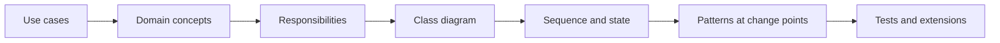

# 02. Low-Level Design

LLD evaluates whether requirements become a maintainable object model and executable collaboration. The goal is not maximum pattern usage; it is stable responsibilities, explicit invariants, testable behavior, and controlled change.

## Coverage

- [Modeling and design patterns](modeling-and-patterns.md)
- [LLD case-study catalog](case-studies.md)

## Required artifacts

- Class diagram showing ownership, cardinality, and dependency direction.
- Sequence diagram for the primary use case and one failure path.
- State machine for lifecycle-heavy entities.
- Runnable core implementation with unit tests and one extension.

## Ready when

You can move from requirements to code in 45 minutes, explain every class responsibility, avoid god objects, locate change points, and handle invalid state and concurrent access.
