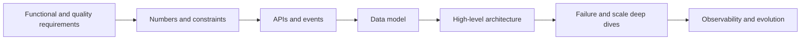

# 03. High-Level System Design

HLD evaluates structured decision-making under ambiguity. A strong answer is a traceable chain from requirements and scale to interfaces, data, topology, bottlenecks, failure behavior, and operations.

## Coverage

- [Design framework and capacity estimation](design-framework-and-estimation.md)
- [Architecture patterns and case studies](architecture-patterns.md)

## Required artifacts

- Requirements table with explicit out-of-scope decisions.
- Traffic, storage, bandwidth, and concurrency estimates.
- API/event contracts and logical data model.
- Architecture diagram with synchronous and asynchronous boundaries.
- Failure-mode table and at least two alternatives.

## Ready when

You can lead a 45-minute design, quantify important decisions, adapt to follow-ups, and discuss consistency, reliability, security, observability, cost, and migration.
