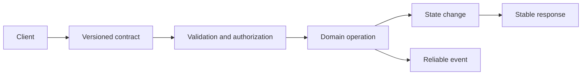

# 04. API and Service Design

Backend interfaces are long-lived contracts. This module covers APIs and service boundaries that remain understandable under retries, partial failure, versioning, and organizational change.

## Coverage

- [Contracts and reliability semantics](contracts-and-reliability.md)
- [Service boundaries and evolution](service-boundaries.md)

## Required artifacts

- Resource model and endpoint or RPC contract.
- Error taxonomy, idempotency, pagination, and compatibility rules.
- Service dependency diagram and ownership map.
- Sequence diagram for success, retry, timeout, and partial failure.

## Ready when

You can defend REST, gRPC, asynchronous event, and batch choices; define retry-safe semantics; and evolve a contract without breaking clients.
