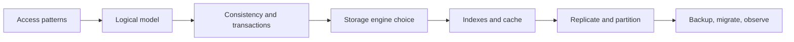

# 05. Data and Storage

Storage selection starts with access patterns and correctness, not product familiarity. This module covers data modeling, transactions, indexes, caching, replication, partitioning, and operational trade-offs.

## Coverage

- [Storage selection and consistency](storage-and-consistency.md)
- [Indexes, caching, replication, and partitioning](scaling-data.md)

## Required artifacts

- Logical schema and access-pattern table.
- Transaction boundary and consistency decision.
- Index plan with write and storage costs.
- Partition key, replication, backup, and migration strategy.

## Ready when

You can select storage from workload evidence, explain anomalies and isolation, diagnose a slow query, and evolve the data layer under growth.
