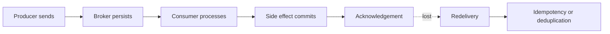

# 06. Distributed Systems

Distributed-system interviews test reasoning when messages are delayed, duplicated, reordered, or lost and nodes disagree. Replace claims such as "exactly once" with explicit mechanisms and assumptions.

## Coverage

- [Coordination, consistency, and messaging](coordination-and-messaging.md)
- [Resilience patterns and failure analysis](resilience-patterns.md)

## Required artifacts

- Delivery and ordering contract for one workflow.
- State machine covering timeout, retry, duplicate, and compensation.
- Failure-mode and recovery table.
- Explanation of where consensus or coordination is required.

## Ready when

You reason from asynchronous failure assumptions, distinguish safety from liveness, design idempotent processing, and explain operational recovery.
