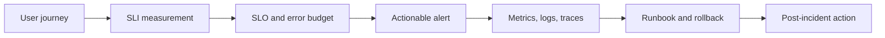

# 07. Production Engineering

SDE-2 design answers should be operable. This module adds service-level objectives, telemetry, testing strategy, delivery safety, incident response, and security to every backend design.

## Coverage

- [Observability, SLOs, testing, and delivery](observability-and-testing.md)
- [Backend security and abuse resistance](security.md)

## Required artifacts

- SLI/SLO definition and alert policy.
- Dashboard and structured-log sketch with trace propagation.
- Test pyramid and deployment/rollback strategy.
- Threat model with trust boundaries and mitigations.

## Ready when

Every design answer includes measurable health, safe deployment, diagnosis, rollback, data protection, and clear operational ownership.
